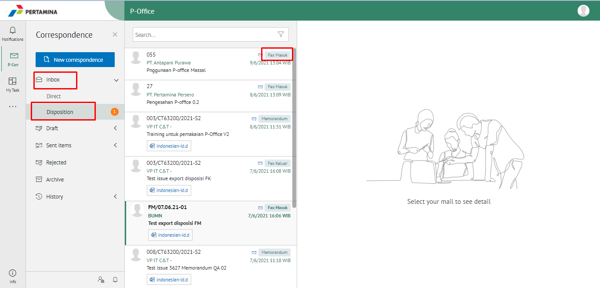
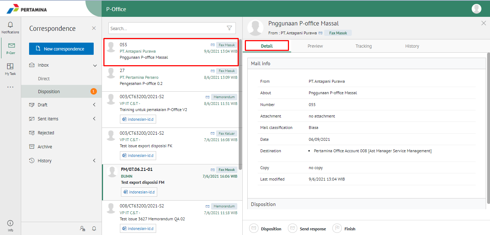
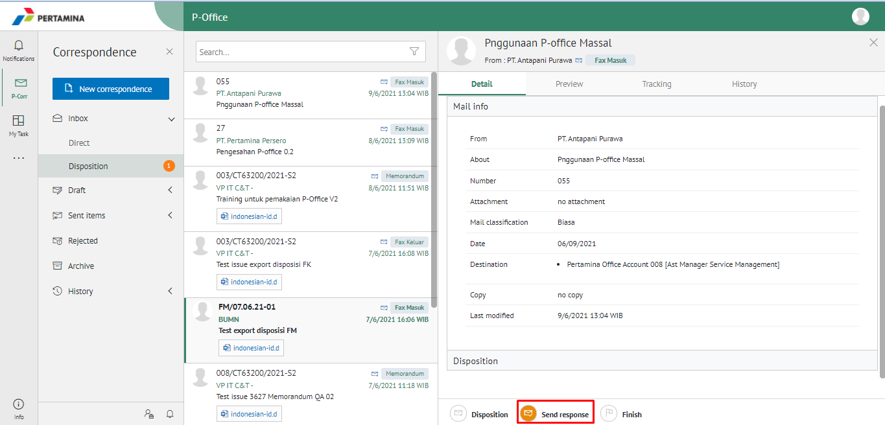
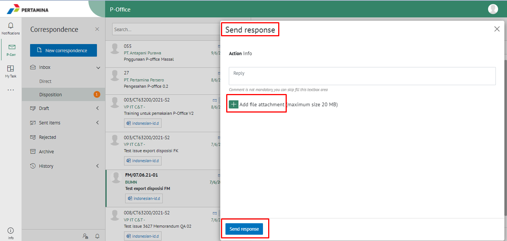
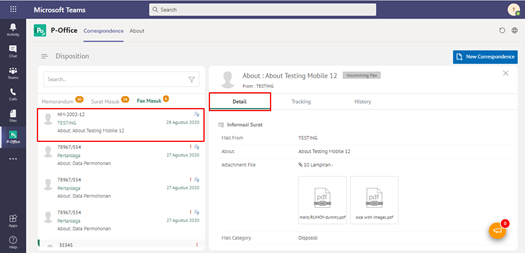
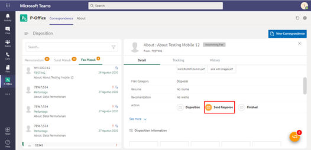
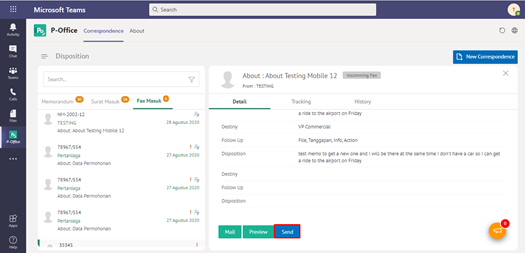
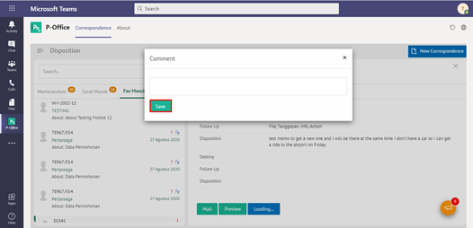

**Role yang sesuai**

- *Approver User*
- *Reviewer User*
- *Member User* (Pekerja)
- Sekretaris

*User* dapat mengirim tanggapan disposisi fax masuk yang ditujukan untuk pejabat pengirim disposisi.

## **E-Corr Versi Web**

Langkah - langkah untuk kirim tanggapan disposisi fax masuk via Web adalah sebagai berikut :

1. Klik menu **Inbox - Disposisi** dan pilih berlabel **Fax Masuk**

 

2. Pilih disposisi yang akan dikirim tanggapan kemudian pilih tab **Detail**
   
 

3. Pilih tombol **Send Response**.

 

4. Sistem menampilkan pop up konfirmasi dan *user* harus mengisi keterangan kirim tanggapan disposisi dan *user* dapat menambahkan lampiran jika diinginkan, kemudian klik **Save Respon**.
   
 

5. Sistem menyimpan perubahan dan informasi tanggapan disposisi akan tersimpan di **History** disposisi.

## **E-Corr Versi Teams**

Langkah - langkah untuk kirim tanggapan fax masuk via Teams adalah sebagai berikut:

1. Klik menu **Disposition** dan pilih tab **Fax Masuk**

2. Pilih disposisi yang akan dikirim tanggapan kemudian pilih tab **Detail**

3. Pilih tombol **Send Response** kemudian klik **Send**

4. Sistem menampilkan pop up konfirmasi dan *user* harus mengisi keterangan kirim tanggapan disposisi kemudian klik **Simpan**.

5. Sistem menyimpan perubahan dan informasi tanggapan disposisi akan tersimpan di detail disposisi.

## **E-Corr Versi Android dan iOS**

Langkah-langkah untuk kirim tanggapan fax masuk via Android dan iOS adalah sebagai berikut :

1. Klik menu **Inbox - Disposisi** dan pilih berlabel **Fax Masuk**

 

2. Pilih disposisi yang akan dikirim tanggapan kemudian pilih ikon **tombol button**

 

3. Pilih tombol **Send Response** kemudian Sistem menampilkan pop up konfirmasi dan _user_ harus mengisi keterangan atau dapat melampirkan document, lalu kirim tanggapan disposisi kemudian klik **Send**

 

4. Sistem menyimpan perubahan dan informasi tanggapan disposisi akan tersimpan di detail disposisi.

