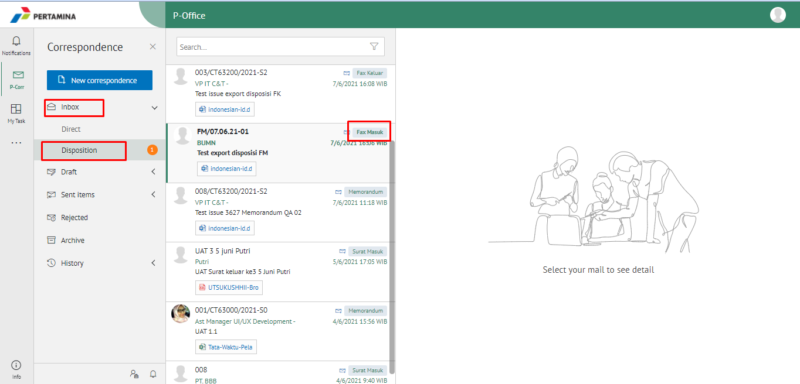
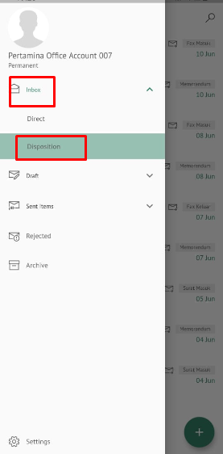
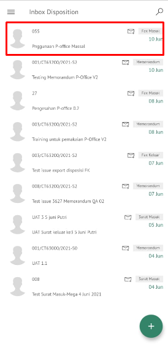

**Role yang sesuai**

- *Approver User*
- *Reviewer User*
- *Member User* (Pekerja)
- Sekretaris

*User* dapat melihat daftar fax masuk pada pada menu **Inbox atau Disposisi** pada masing - masing akun. 

## **E-Corr Versi Web**

Langkah - langkah untuk melihat daftar disposisi fax masuk via Web adalah sebagai berikut :

1. Klik menu **Inbox - Disposisi** dan pilih berlable **Fax Masuk**

 

## **E-Corr Versi Android dan iOS**

Langkah-langkah untuk melihat daftar disposisi fax masuk via Android dan iOS adalah sebagai berikut :

1. Klik menu **Inbox - Disposisi** dan pilih berlable **Fax Masuk**

  

