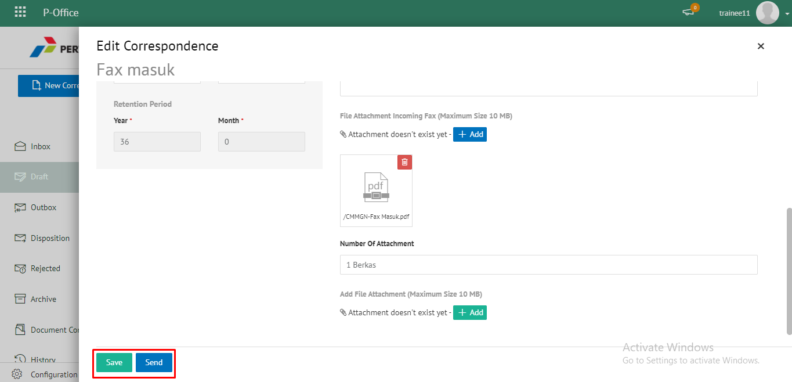
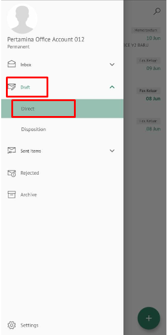
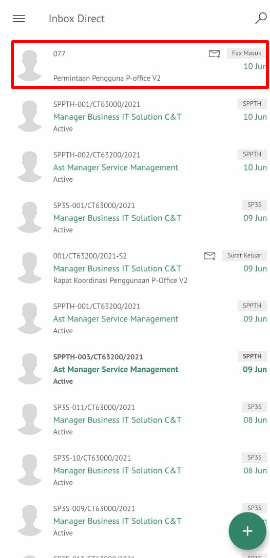

**Role yang sesuai**

- *Approver User*
- *Reviewer User*
- *Member User* (Pekerja)
- Sekretaris

*User* dapat melihat daftar fax masuk yang ditujukan pada sekretaris tersebut. 

## **E-Corr Versi Web**

Langkah - langkah untuk melihat daftar fax masuk via Web adalah sebagai berikut :

1. Klik menu **Inbox - Disosisi/Draft - Disposisi/Sent Item - Disposisi** dan pilih berlable **Fax Masuk**. Sistem akan menampilkan daftar fax masuk yang ditujukan pada sekretaris

 

## **E-Corr Versi Android dan iOS**

Langkah-langkah untuk melihat daftar fax masuk via Android dan iOS adalah sebagai berikut :

1. Klik menu **Inbox-Direct /Draft-Direct/Sent Item-Direct** dan pilih tab **Fax Masuk**.Sistem akan menampilkan daftar fax masuk yang ditujukan pada sekretaris

  
