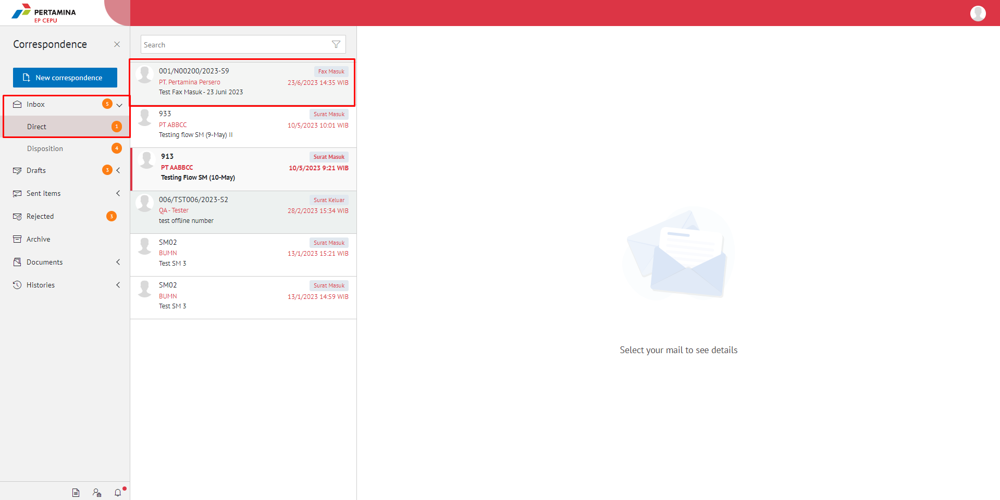

**Role yang sesuai**

- *Approver User*
- *Reviewer User*
- *Member User* (Pekerja)
- Sekretaris

*User* dapat melihat informasi lengkap fax masuk termasuk *preview* fax masuk, lembar penerus disposisi, detail fax masuk, *tracking* fax masuk dan *history* fax masuk.

# **E-Corr Versi Web**

Langkah - langkah untuk melihat informasi disposisi fax masuk via Web adalah sebagai berikut :

1. Klik menu **Inbox - Disposisi** dan pilih label **Fax Masuk.** Pilih salah satu fax masuk yang akan dilihat informasinya

 

#### **Preview Fax Masuk**

Pada label **Fax Masuk - Preview**, ditampilkan informasi fax masuk fisik yang sudah di *scan* dan kemudian diunggah oleh sekretaris / konseptor

 

#### **Preview Lembar Penerus**

Pada tab **History** lalu klik *Download*, ditampilkan informasi lembar penerus disposisi yang berisi informasi daftar nama pejabat dan perintah disposisi yang harus dilakukan oleh pejabat penerima disposisi

 

 

#### **Detail Fax Masuk**

Pada tab **Detail**, terdapat informasi asal surat, perihal, file lampiran, nomor surat, klasifikasi surat, tanggal surat dan tujuan surat serta informasi disposisi yang mencakup lampiran disposisi, tujuan, tindak lanjut dan disposisi permasing-masing pejabat penerima disposisi

 

#### **Tracking Fax Masuk**

Pada tab **Tracking**, ditampilkan informasi *tracking* fax masuk dalam bentuk *chart*

 

#### **History Fax Masuk**

Pada tab **History**, ditampilkan riwayat fax masuk yang terdapat informasi jabatan, tanggal, tindakan dan komentar

 

