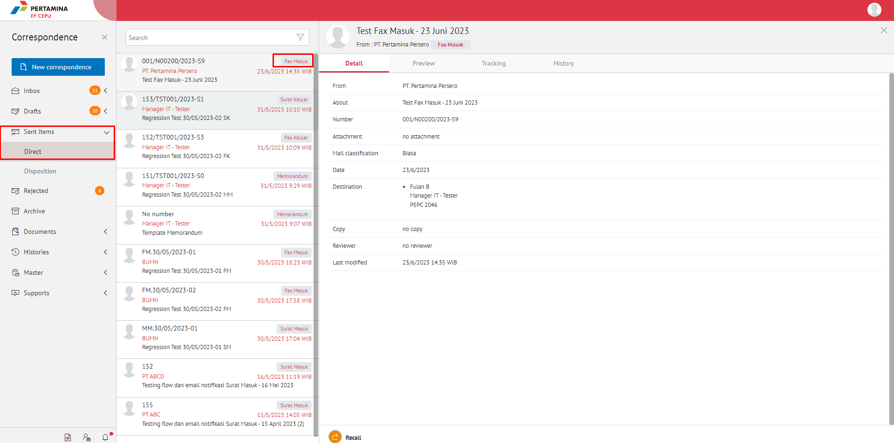
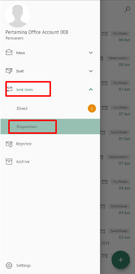
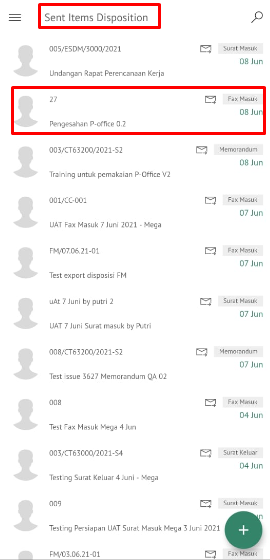
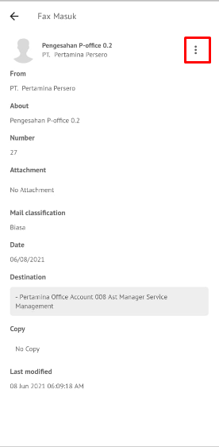
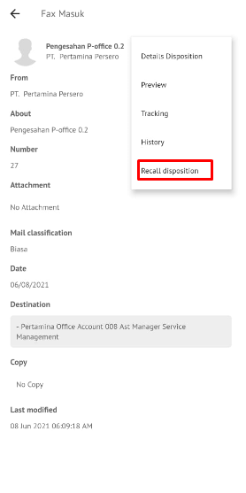

**Role yang sesuai**

- *Approver User*
- *Reviewer User*

*User* dapat melakukan *recall* / tarik disposisi fax masuk yang sudah dikirim kepada pejabat penerima disposisi. Fax masuk yang sudah dikirim ke pejabat penerima disposisi akan tersimpan di menu "**Sent Item - Disposisi**" 

# **E-Corr Versi Web**

Langkah - langkah untuk melakukan recall disposisi fax masuk via Web adalah sebagai berikut :

1. Klik menu **Sent Item** dan pilih tab **Surat** berlabel "**Fax Masuk**" 

  

2. Pilih fax masuk yang akan di-*recall* kemudian klik tab **Detail** kemudian klik **Recall**.
   
  

3. Fax masuk yang sudah di-*recall* akan tersimpan di menu "**Draft - Disposisi**" penerima fax masuk / pendisposisi

## **E-Corr Versi Android dan iOS**

Langkah-langkah untuk Recaall Fax masuk via Android dan iOS adalah sebagai berikut :

1. Klik menu **Sent Item - Disposisi** dan pilih berlabel fax Masuk 

 

2. Pilih fax masuk yang akan di-_recall_ ,pada **Detail** pilih icon **Option** kemudian **_Recall_.**

 

3. Sistem menampilkan pop up **Recall** lalu klik **Recall Disposisi** kemudian Fax masuk yang sudah di-_recall_ akan tersimpan di menu “**Draft - Disposisi**” penerima fax masuk / pendisposisi

