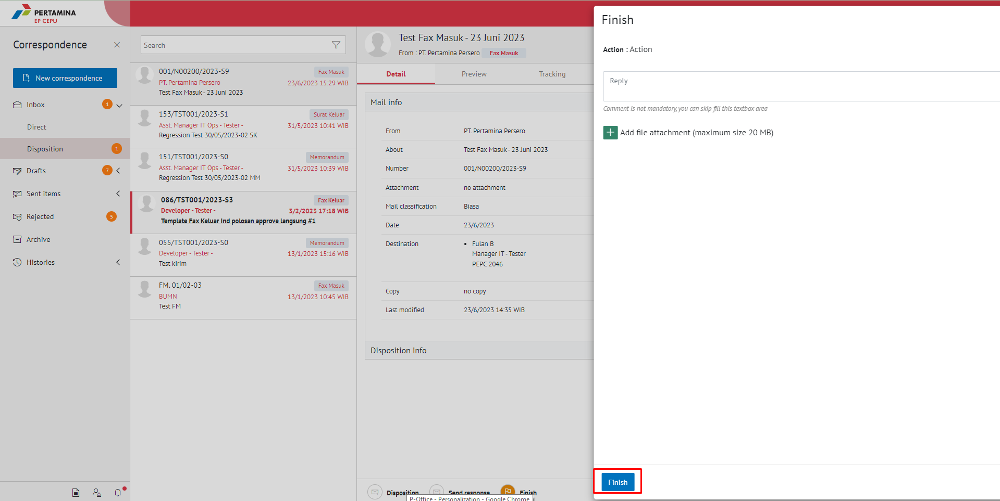
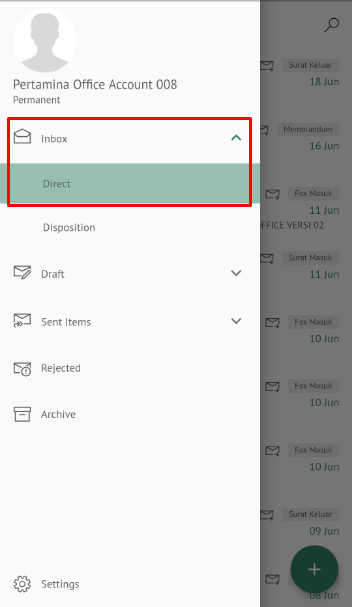
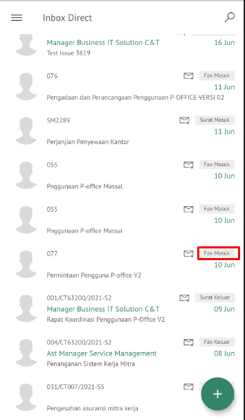
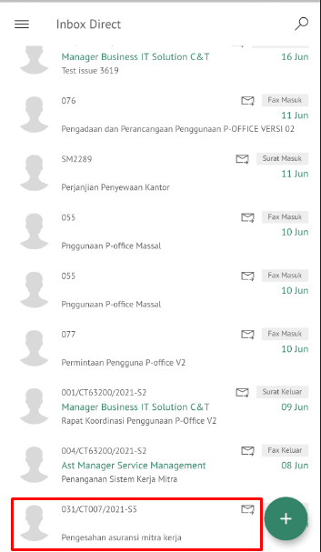
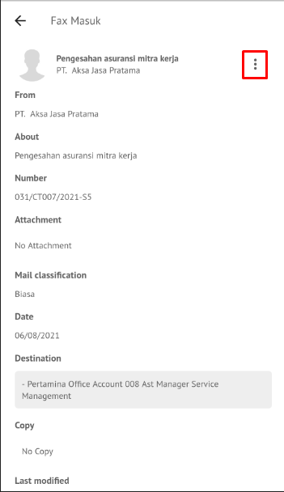
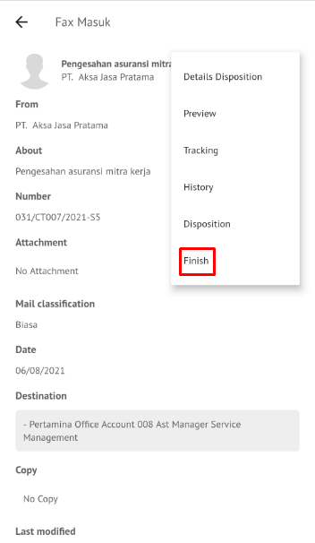
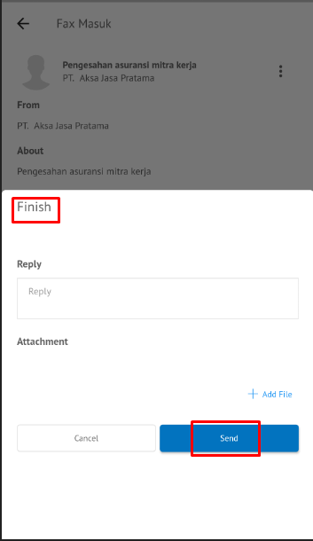

**Role yang sesuai**

- _Approver User_
- _Reviewer User_

_User_ dapat menyelesaikan fax masuk jika _user_ tidak akan melanjutkan untuk mendisposisikan fax masuk ke pejabat lain atau fax masuk selesai pada _user_ tersebut.

## **E-Corr Versi Web**

Langkah-langkah untuk menyelesaikan fax masuk via Web adalah sebagai berikut :

1. Klik menu **Inbox** dan pilih label **Fax Masuk**

2. Pilih fax masuk yang akan diselesaikan kemudian pilih tab **Detail**

3. Pilih tombol **Finish**

4. Sistem menampilkan _pop up_ konfirmasi dan _user_ harus mengisi keterangan selesaikan disposisi kemudian klik **Save**.

5. Sistem menyimpan perubahan dan informasi selesai disposisi akan tersimpan di detail disposisi.

## **E-Corr Versi Android dan iOS**

Langkah-langkah untuk menyelesaikan fax masuk via Android adalah sebagai berikut :

1. Klik menu **Inbox** dan pilih label **Fax Masuk**

 

2. Pilih fax masuk yang akan diselesaikan kemudian pilih icon **Option**

 

4. Pilih tombol **Finish** kemudian sistem menampilkan _pop up_ konfirmasi dan _user_ harus mengisi keterangan selesaikan disposisi kemudian klik **Send**

