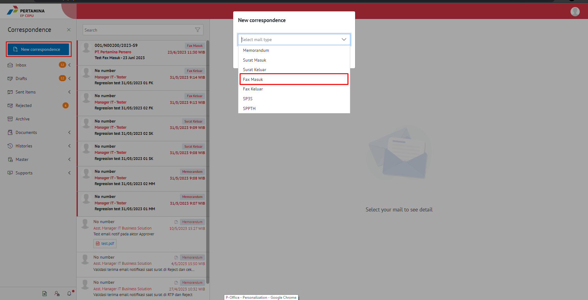
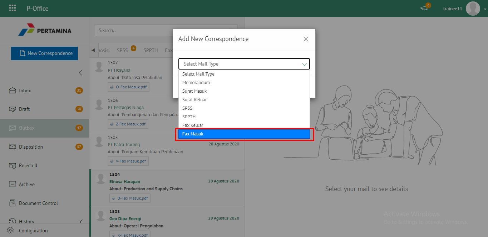
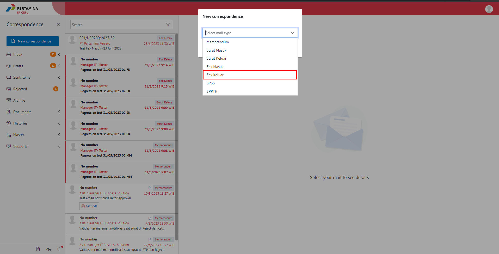

**Role yang sesuai**

- Sekretaris

Sekretaris dapat menambah fax masuk pada aplikasi E-Corr.

## **E-Corr Versi Web**

Langkah - langkah untuk menambah fax masuk via Web adalah sebagai berikut :

1. Klik menu **New Correspondence** dan pilih jenis surat "**Fax Masuk**"

2. Pilih jenis surat "**Fax Masuk**"

3. Isi form tambah fax masuk. Klik **Save** untuk menyimpan form surat dan surat akan tersimpan di menu **"Draft - Fax Masuk"**. Klik **Send** untuk mengirim fax masuk dan fax masuk akan tersimpan di menu **"Sent Item - Fax Masuk"**

 

4. Sistem berhasil menyimpan perubahan

