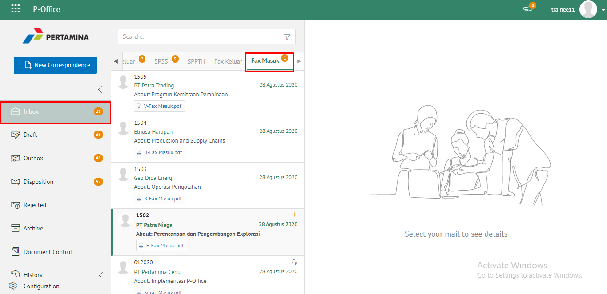
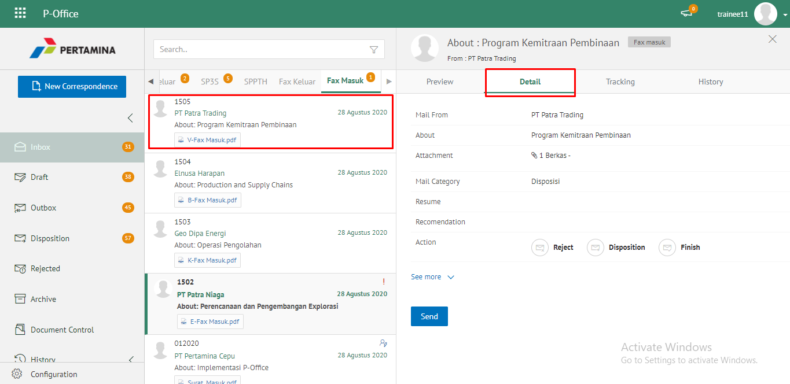
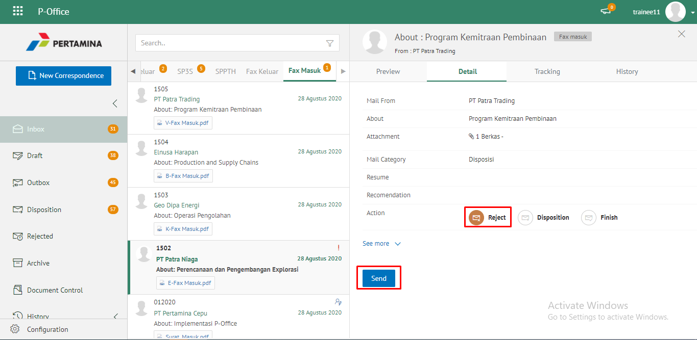
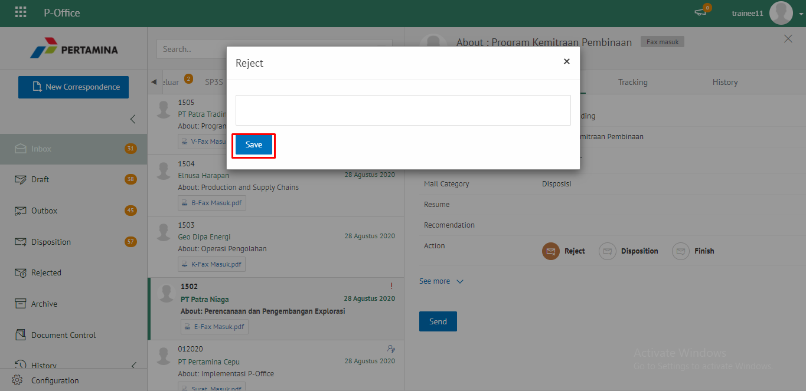
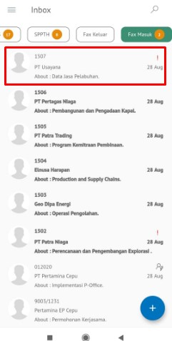
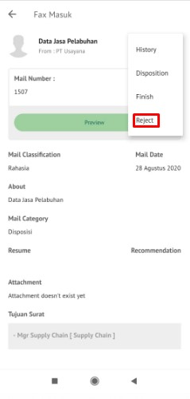
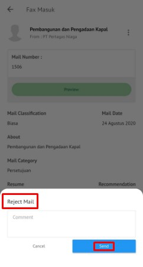

**Role yang sesuai**

- *Approver User* (Pemilik KBO)

## **E-Corr Versi Web**

Langkah - langkah untuk menolak fax masuk via Web adalah sebagai berikut :

1. Klik menu **Inbox** dan pilih tab **Fax Masuk**

 

2. Pilih fax masuk yang akan ditolak kemudian pilih tab **Detail**

 

3. Klik tombol **Reject** dan pilih **Send.** Isikan komentar jika diperlukan

 

4. Sistem menampilkan *pop up* konfirmasi dan *user* harus mengisi keterangan **Reject** fax masuk kemudian klik **Save**.

 

5. Sistem menyimpan perubahan dan informasi tolak fax masuk. Fax masuk yang sudah ditolak akan tersimpan di menu **Rejected - Fax Masuk** user penolak dengan label **Rejected**

## **E-Corr Versi Android dan iOS**

Langkah-langkah untuk menolak fax masuk via Android dan iOS adalah sebagai berikut :

1. Klik menu **Inbox** dan pilih tab **Fax Masuk**

 

2. Pilih fax masuk yang akan ditolak kemudian pilih icon **Option**

 

3. Klik tombol **Reject** kemudian sistem menampilkan _pop up_ konfirmasi dan _user_ harus mengisi keterangan tolak fax masuk kemudian klik **Send**

4. Sistem menyimpan perubahan dan informasi tolak fax masuk. Fax masuk yang sudah ditolak akan akan tersimpan di menu **Rejected - Fax Masuk** user penolak dengan label **Rejected**

