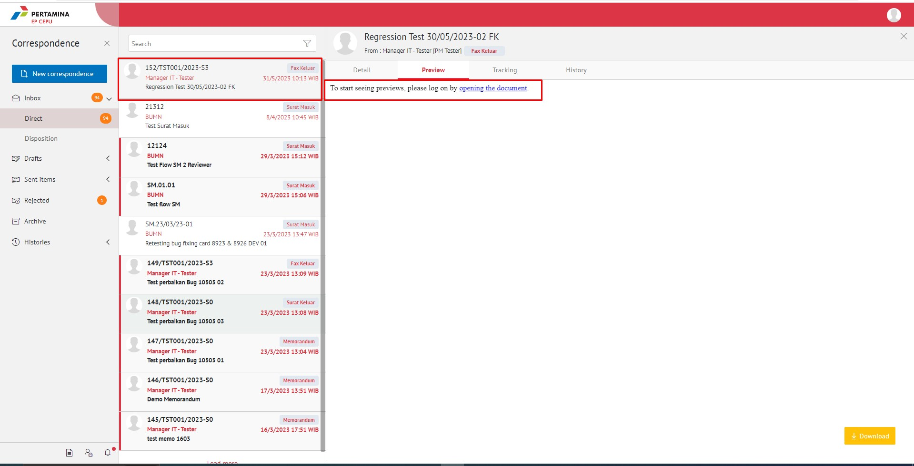
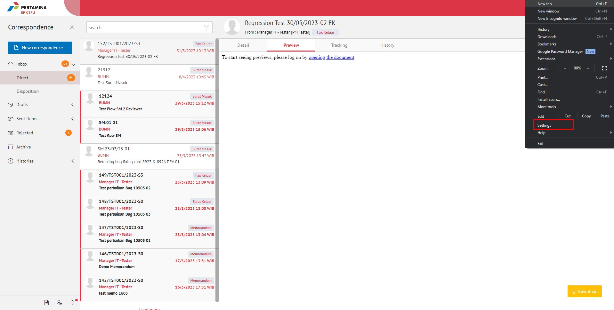
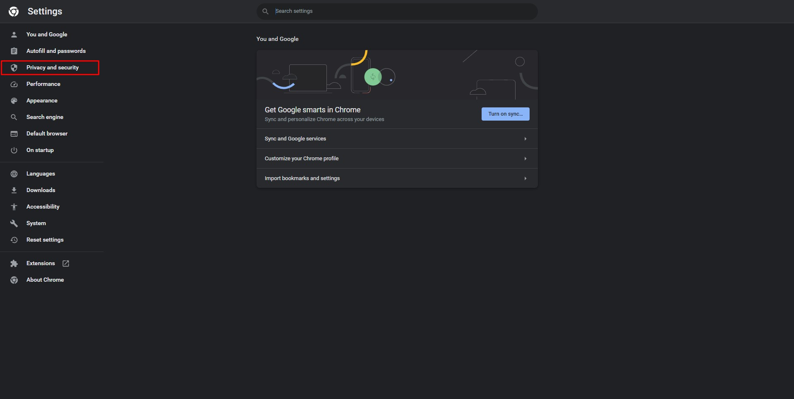
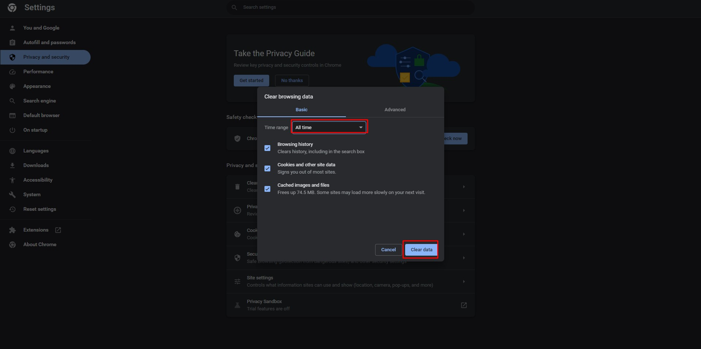
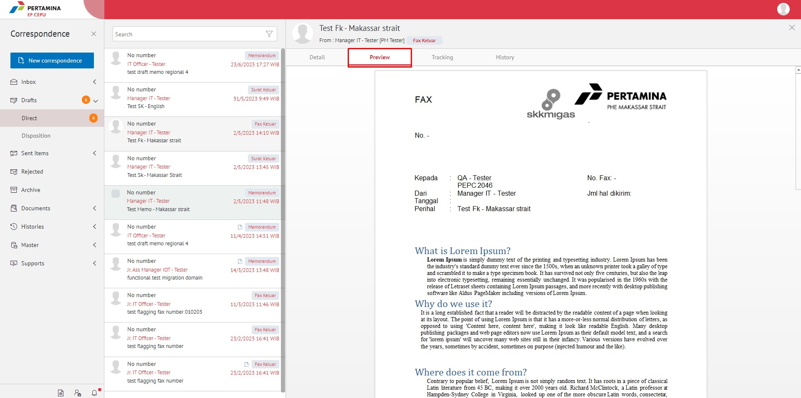

- Ketika Anda membuka preview dan tidak tampil dokumen previewnya dengan tampilan seperti bawah ini

- Lakukan _clear data_ pada browser Anda dengan pilih tab **Option** kemudian pilih **Settings**

- Pada bagian **Privacy and security**, pilih **Clear browsing data**

- Checklist data yang ingin Anda hapus termasuk history, cookies dan cache pada browser Anda, kemudian pilih Clear data

- Pastikan **Ad-Block** Anda sudah di-set menjadi **Allow** untuk dapat menampilkan preview dokumen. Klik _address bar_ dan pilih **Third-party cookie blocking**

- Pilih **site not working?**

- Klik **Allow Cookies**

- Kemudian _refresh_ laman E-Corr Anda dan pilih surat yang akan Anda lihat previewnya

