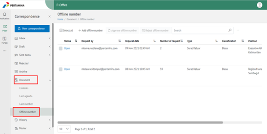
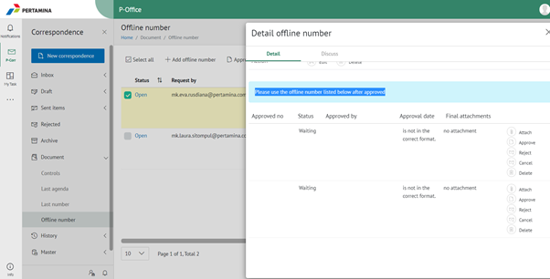
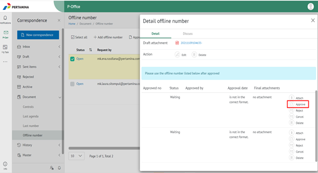

**Approve Request Offline Number**

Permasalahan ini terjadi ketika user telah melakukan Request Offline Number namun statusnya belum closed.

Setelah mengetahui email user yang request, berikut langkah-langkah untuk melakukan approve Request number Offline:

1. Buka Aplikasi E-Corr, lalu klik Menu **Document > Offline Numbers**. Maka akan tampil list Request Offline Number dengan status **Open**.

2. Klik salah satu request offline number tersebut, kemudian akan muncul form Detail Offline number. Lalu pilih tab Detail, silakan scroll ke bawah maka akan terdapat informasi list offline number yang perlu ditindaklanjuti.

3. Klik Approve. Setelah itu pastikan statusnya berubah menjadi Closed.

