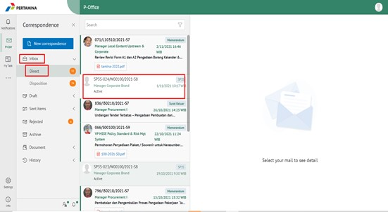
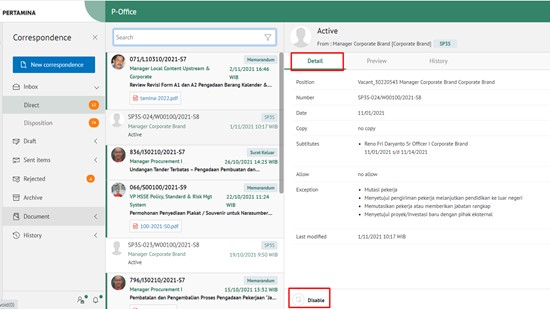
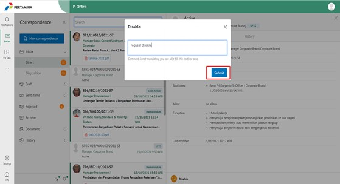
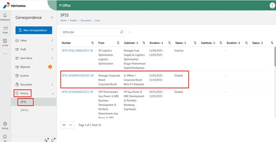

- Login ke **P-Office** pilih Menu **Inbox - Direct**, Pilih dan klik surat SP3S.

- Setelah surat terbuka, klik tab **Detail** dan klik **Disable** yang terdapat dibagian kiri bawah tab Detail.

- Isikan komentar pada **pop up Disable**, lalu klik button **Submit**.

- Cek kembali pada Menu **History - SP3S**, lalu search SP3S dengan nomor SP3S. Pastikan Status SP3S tersebut sudah Disable.

