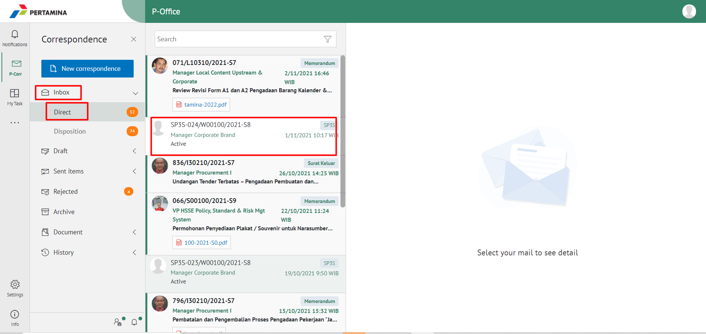
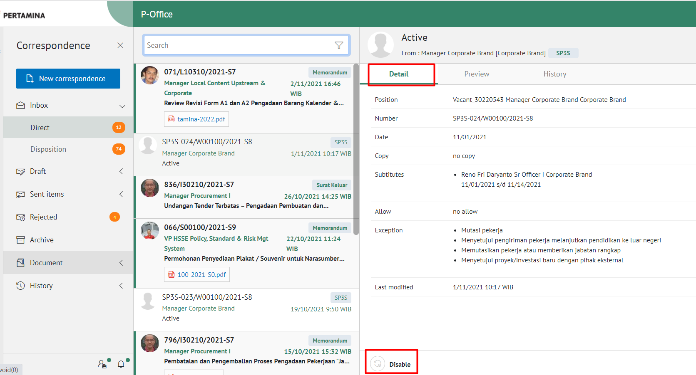
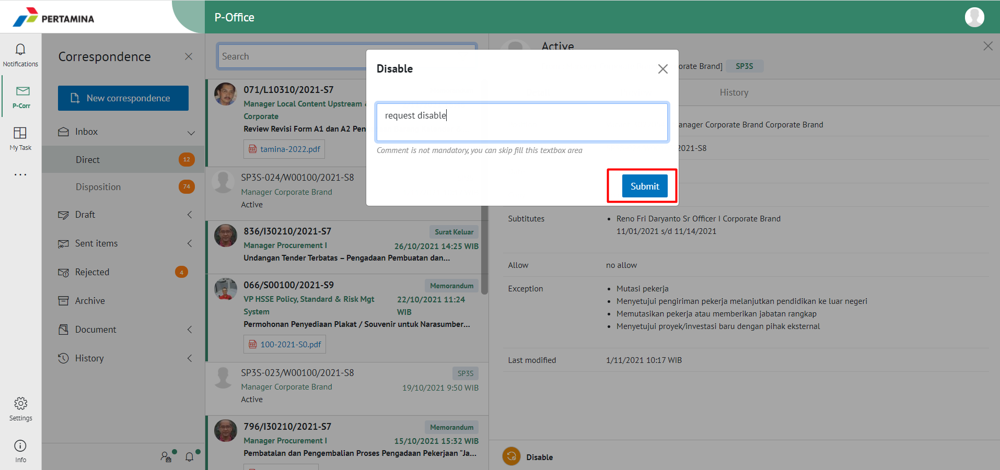

Masa aktif jabatan Pjs pada SP3S masih berlaku sehingga Pjs masih aktif, namun Pejabat Definitifnya sudah aktif kembali, maka diperlukan disable untuk SP3S Pjs tersebut.

- Untuk melakukan disable SP3S Online, pejabat definitif dapat melakukannya dengan mengikuti langkah-langkah sebagai berikut: 
1. Login ke P-Office
2. Kemudian pilih Menu Inbox > Direct, lalu pilih SP3S yang akan di-disable. 

3. Klik SP3S tersebut, jika sudah terbuka, klik tab Detail. Kemudian klik "Disable" yang terdapat dibagian kiri bawah tab Detail.

4. Isikan komentar pada pop up Disable, lalu klik Submit. 

5.	Cek kembali pada Menu History > SP3S, lalu search SP3S dengan nomor SP3S. Status SP3S tersebut sudah Disable.

