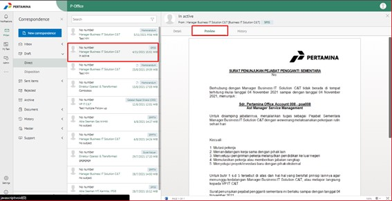
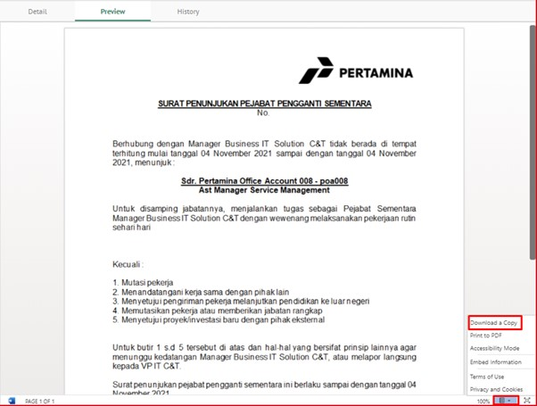

Permasalahan ini terjadi ketika user akan mengunduh surat yang masih belum disetujui dan masih dalam bentuk draft. Pada tab **Preview** tidak ada button untuk mengunduh dokumen (download).

**PERBAIKAN MASALAH**

- Untuk mengatasi permasalahan tersebut, silakan user secara mandiri mengunduh draft surat tersebut dengan langkah-langkah sebagai berikut:

1.	Buka aplikasi **E-Corr**, klik menu **Draft/Sent item – Direct**.

2.	Cari surat yang akan diunduh
3.	Klik surat tersebut lalu pilih tab **Preview**.

4.	Klik icon segitiga terbalik dipojok kanan bawah, lalu pilih **Download a Copy**.

5.	Dokumen sudah berhasil diunduh dan tersimpan pada local PC client

