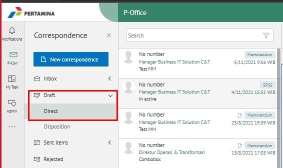
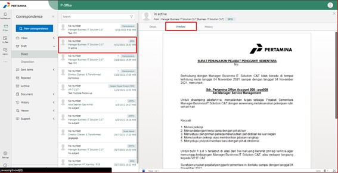
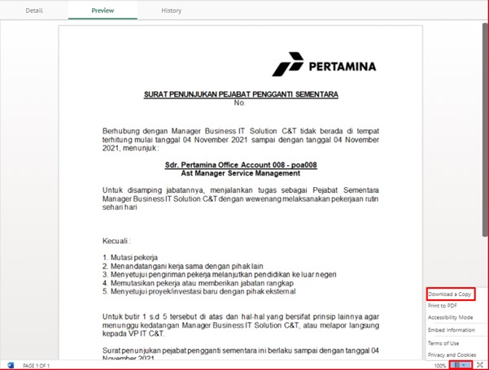
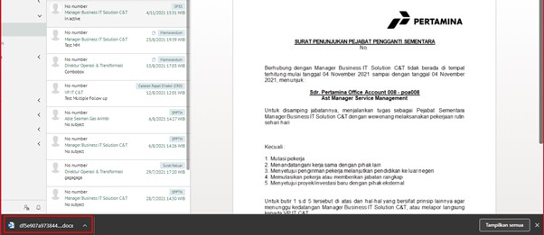

- Login ke **E-Corr** pilih Menu **Draft/Sent item – Direct**.

- Pilih dan klik surat yang akan di download.

- Setelah surat terbuka, klik tab **Preview** 

- Klik **icon segitiga terbalik** dipojok kanan bawah, lalu pilih **Download a Copy**.

- Dokumen sudah berhasil terdownload.

