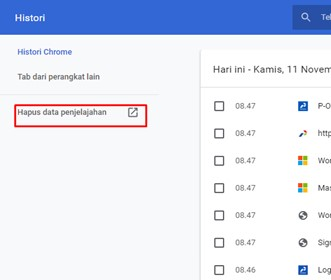
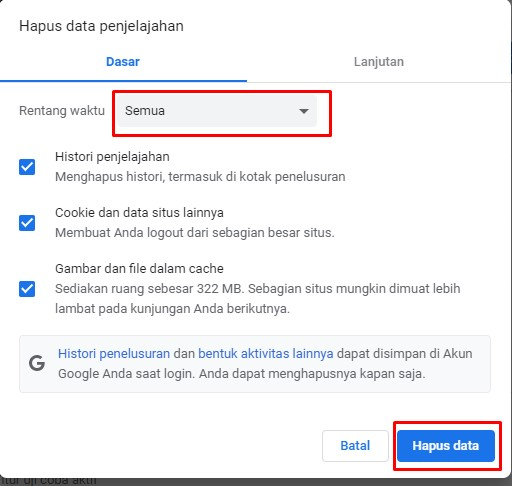
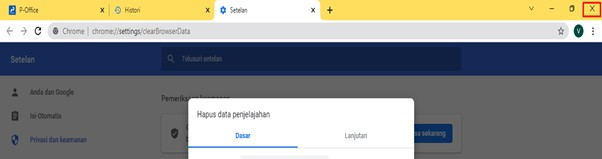
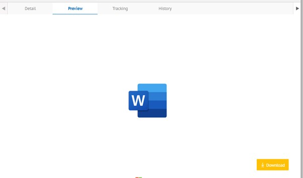

Permasalahan ini terjadi ketika user akan melakukan preview dokumen lalu terdapat
pesan eror **“To start seeing previews, please log on by opening the document“**.

**PERBAIKAN MASALAH**

- Berikut ini langkah-langkah untuk mengatasi eror preview dokumen:

1.	Masuk aplikasi E-Corr, lalu tekan **CTRL+H**, klik **Hapus data penjelajahan**.

2.	Pilih rentang waktu semua dan klik tombol **Hapus data**.

3.	Logout browser dengan menekan tanda X di pojok kanan atas.

4.	Masuk kembali ke browser dan akses E-Corr
5.	Cari kembali surat yang akan di-preview, apabila masih terjadi eror “To start seeing previews, please log on by opening the document“ , silakan klik kanan lalu buka tab baru
6.	Abaikan apabila di tab baru tersebut terdapat informasi “Access Denied “
7.	Refresh tab sebelumnya, lalu preview kembali dokumen tersebut
    
