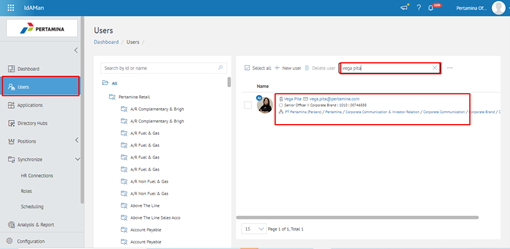
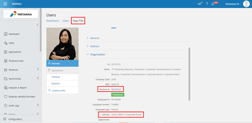
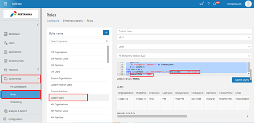
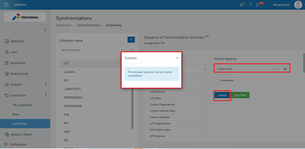
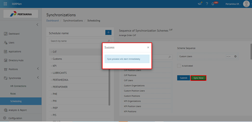
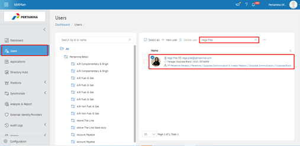
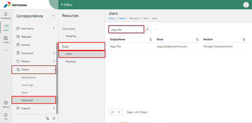

**Jabatan Belum Update diE-Corr**

Permasalahan tersebut terjadi karena faktor user mutasi Jabatan ketika di check data user di IdAman dan E-Corr belum update yang terbaru. Sehingga perlu dilakukan sync parsial di **IdAman – menu Synchronize - Role**.

Untuk mengatasi permasalahan tersebut Admin harus melakukan sync parsial di menu Synchronize – Role – Custom User terlebih dahulu. Berikut ini Langkah-langkah untuk sync parsial di IdAman :

1. Buka aplikasi IdAman – menu User, kemudian search nama user yang akan dicheck dan klik 2x pada bagian nama user.

2. Pada tampilan dashboard – User, silakan check pada bagian Organization untuk memastikan data user tersebut belum update.

3. Pilih menu Synchronize – Roles, pilih Custom Users untuk update data user. Pada bagian sebelah kanan terdapat query untuk sync parsial, silakan isi Employeeid yang berupa employee user dan isi CompanyCode yang berupa company dari user tersebut.

4. Klik button Save Scheme untuk menyimpan data user yang akan di sync parsial.
5. Pilih menu Synchronize – Scheduling, pada Scheme List pilih Custom Users kemudian drag ke Scheme Sequence. Klik button Submit dahulu untuk proses penyimpanan dan pastikan statusnya Success.

6. Kemudian sync parsial dengan klik button Sync Now dan pastikan statusnya Success.

7. Pada menu User, kemudian search nama user yang telah di sync parsial dan klik 2x pada bagian nama user.

8. Pada tampilan dashboard – User, silakan check pada bagian Organization untuk memastikan data user tersebut telah update.

9. Untuk memastikan data user di E-Corr telah update sesuai data IdAman, Silakan buka aplikasi E-Corr – menu Master – Resources, pada tab Data pilih Users dan search nama user tersebut.

