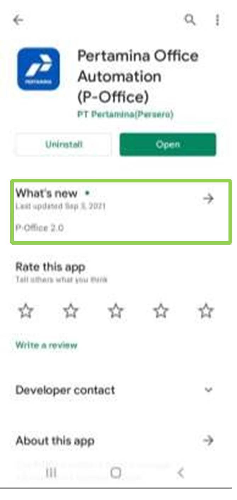
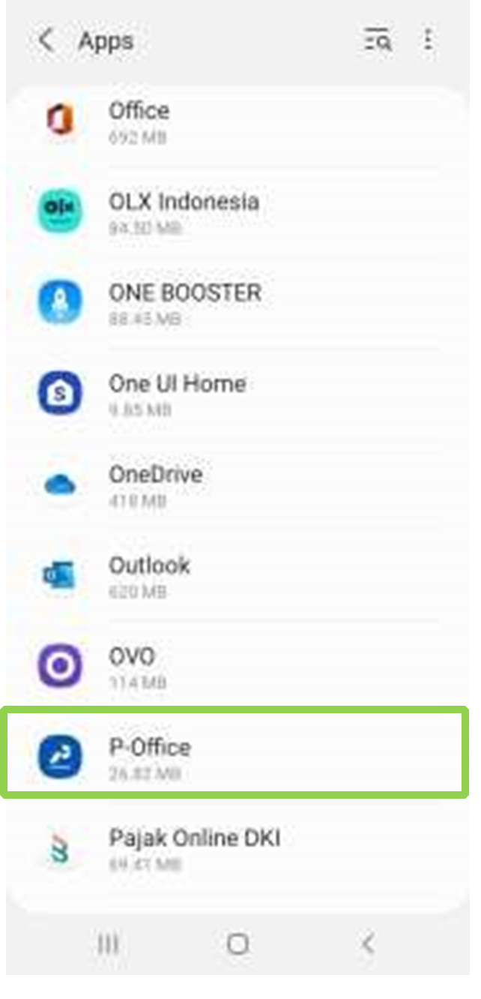
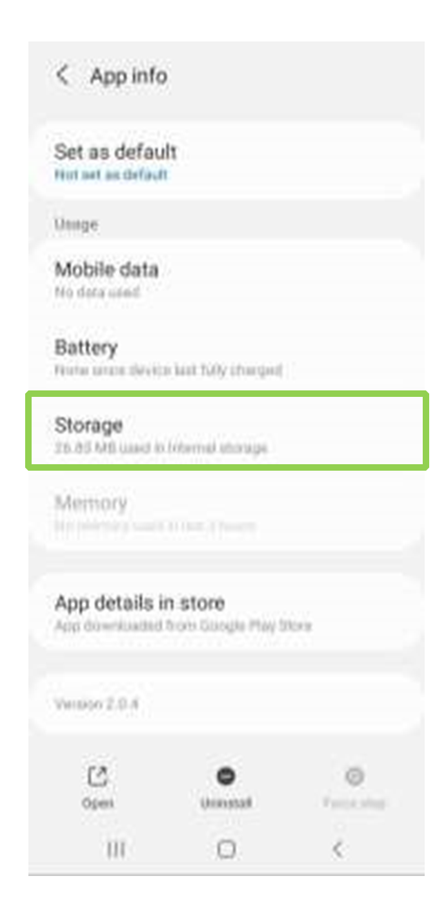
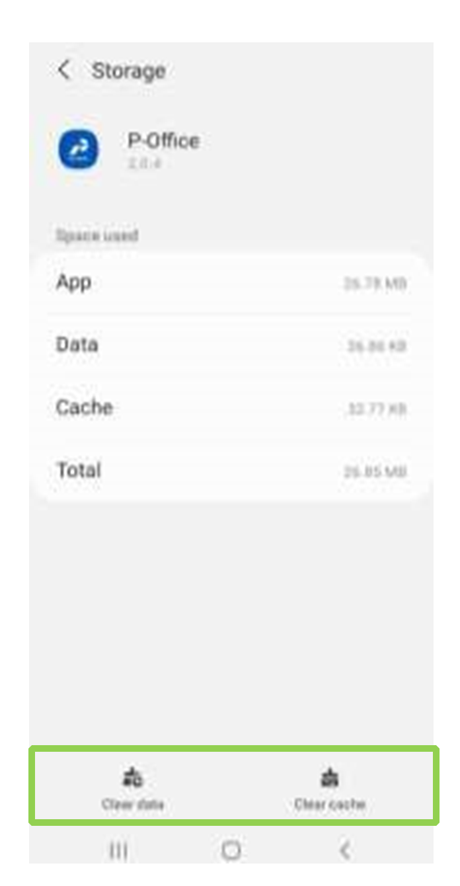

- User tidak dapat login di **E-Corr 2.0 Mobile** di Platform Android karena pada saat membuka aplikasi muncul tampilan halaman blank putih dan tidak redirect ke halaman lainnya seperti tampilan berikut:

- Pastikan aplikasi yang terinstall adalah **E-Corr 2.0 Mobile** dengan **versi 2.0.4** dan tanggal
release 03 September 2021 seperti pada Gambar berikut Aplikasi **E-Corr 2.0** Android di _Play Store_

- Jika versi **E-Corr Mobile** tidak sesuai, maka uninstall aplikasi E-Corr Mobile dan install ulang
dengan **versi 2.0.4** dari _Google Play_

 Langkah Perbaikan

- Buka _Setting – App_, kemudian pilih aplikasi **E-Corr**

- Klik _Storage_

- Klik _Clear Data_ dan _Clear Cache_

- Kemudian buka kembali aplikasi **E-Corr 2.0 Mobile** Android Anda dan Aplikasi sudah
dapat digunakan.

</fontsize>