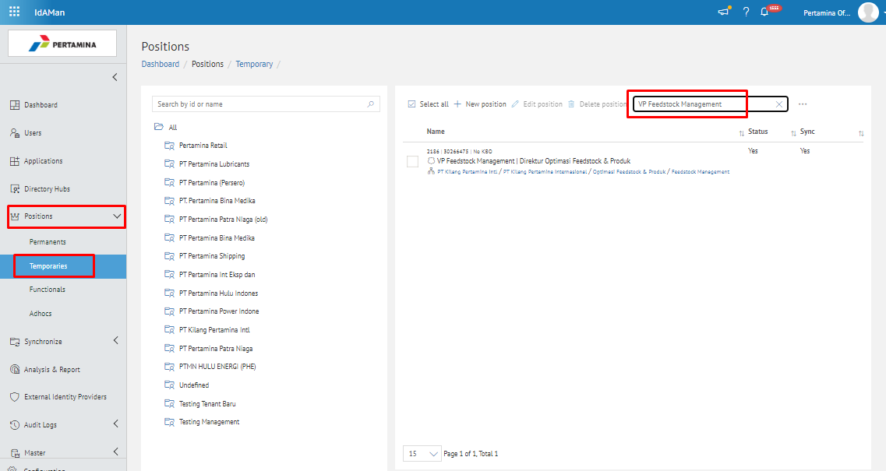
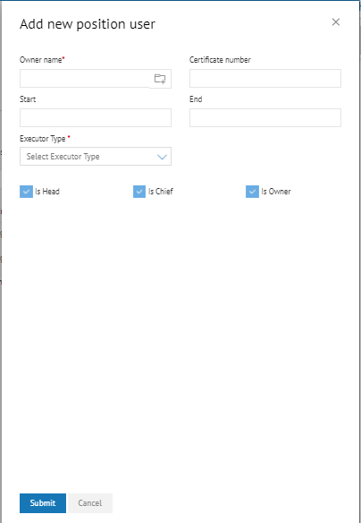
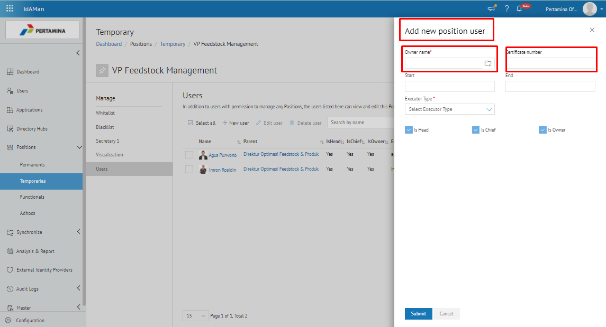
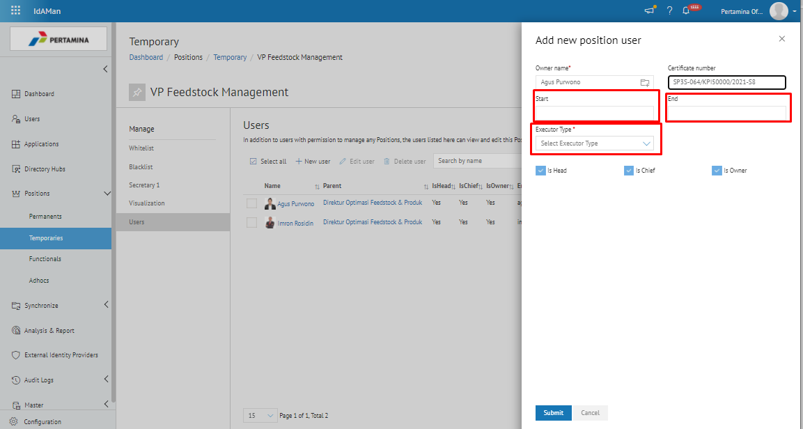
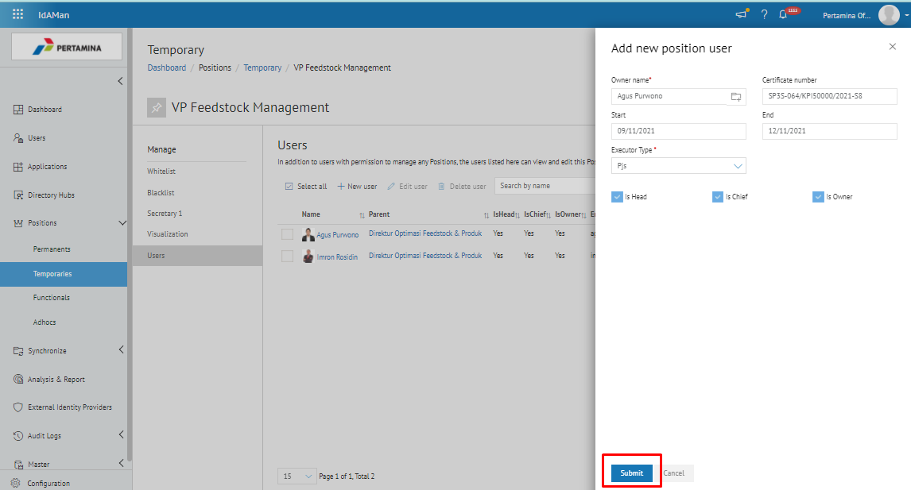
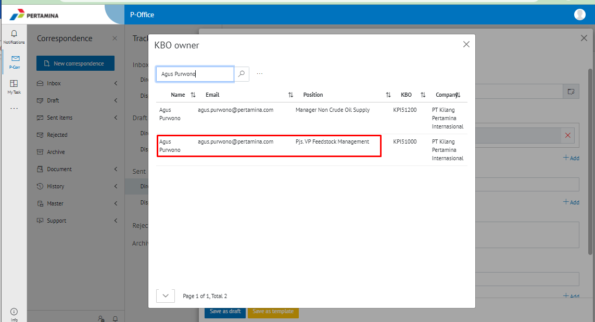

Permasalahan tersebut terjadi karena faktor user melakukan created SP3S secara manual atau tidak created SP3S secara online di P-office 2.0, sehingga setting Pjs secara otomatis belum terdapat di P-offiice 2.0, untuk mengaktifkan SP3S tersebut harus dilakukan secara manual dengan melakukan setting di aplikasi Idaman terlebih dahulu

- Untuk mengatasi pemasalahaan tersebut user harus melakukan setting aktivasi Pjs secara manual di Idaman. Berikut ini langkah – langkah mengaktifkan SP3S manual di Idaman: 

1. Pastikan SP3S sudah bernomor dengan ketentuan tanggal aktif yang sesuai, dan terdapat data seperti, nama Pejabat Sementara (Pjs) yang ingin diaktifkan dan jabatan yang ingin digantikan oleh Pjs tersebut.

2. Buka aplikasi Idaman, kemudian pilih menu *positions - temporaries* dan search jabatan atau position id yang ingin diaktifkan Pjsnya. 

3.	Double klik pada jabatan tersebut, kemudian tab user dan klik add new user

4.	Maka akan muncul popup add new position user

5.	Kemudian isikan data sesuai dengan SP3S yang ingin diaktifkan, untuk Owner Name dapat diisikan nama pejabat sementara (Pjs) - Cartificate Number berisikan nomor SP3S yang ingin diaktifkan.

6.	Kemudian untuk kolom Start berisikan tanggal awal pejabat sementara (Pjs) akan aktif dan kolom End berisikan tanggal berakhirnya masa jabatan Pjs tersebut, lalu Select Executor Type dengan memilih Pjs.

7.	Jangan lupa untuk melakukan ceklis pada is Head – is Chief - is Owner, kemudian Submit

8.	Maka Pejabat tersebut sudah aktif pada P-office sebagai pejabat Pjs.

