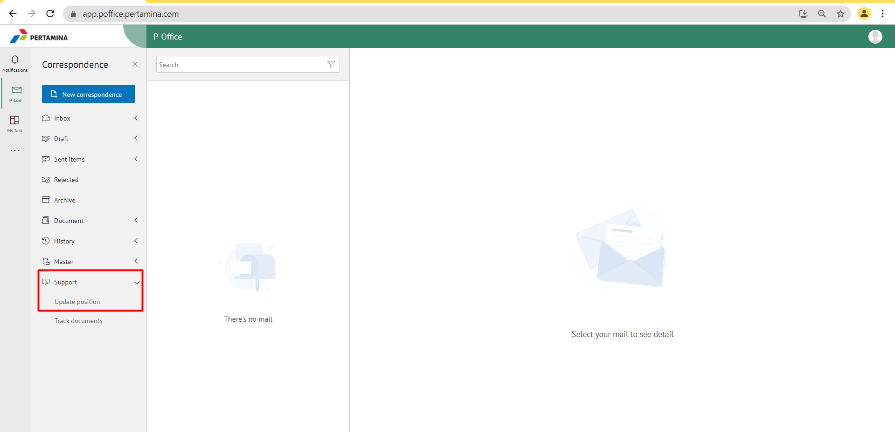
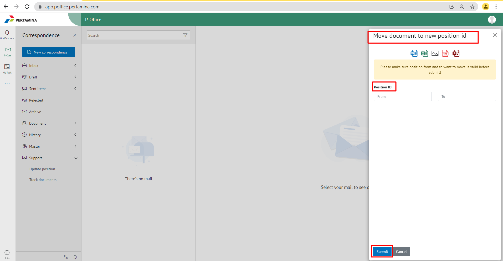

 Permasalahan tersebut terjadi karena user tersebut melakukan mutasi jabatan dan document yang ada di jabatan lama di pindahkan ke jabatan baru.

- Berikut langkah-langkah memindahkan dokumen dari jabatan lama ke jabatan baru:
1.	Pastikan sudah mengetahui position id pada jabatan lama dan jabatan baru sesuai dengan Surat Keterangan Mutasi Jabatan (SKMJ)
2.	Buka aplikasi P-Office lalu pilih menu **Support** kemudian klik **Update Position**

3.	Kemudian muncul pop up **“Move to Document to new postion id”** dan masukkan *Position id* sesuai dengan data user tersebut lalu klik **Submit**

