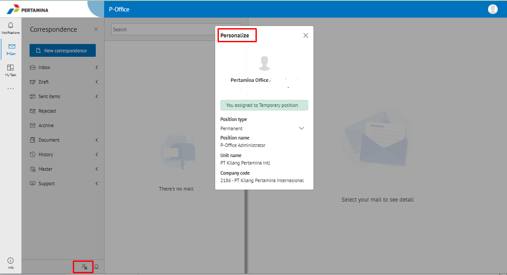
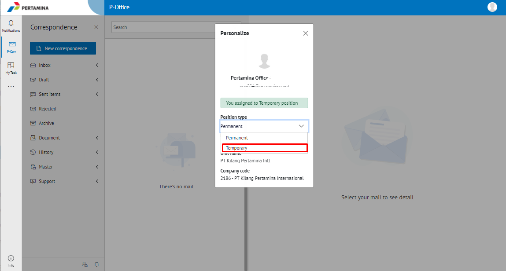
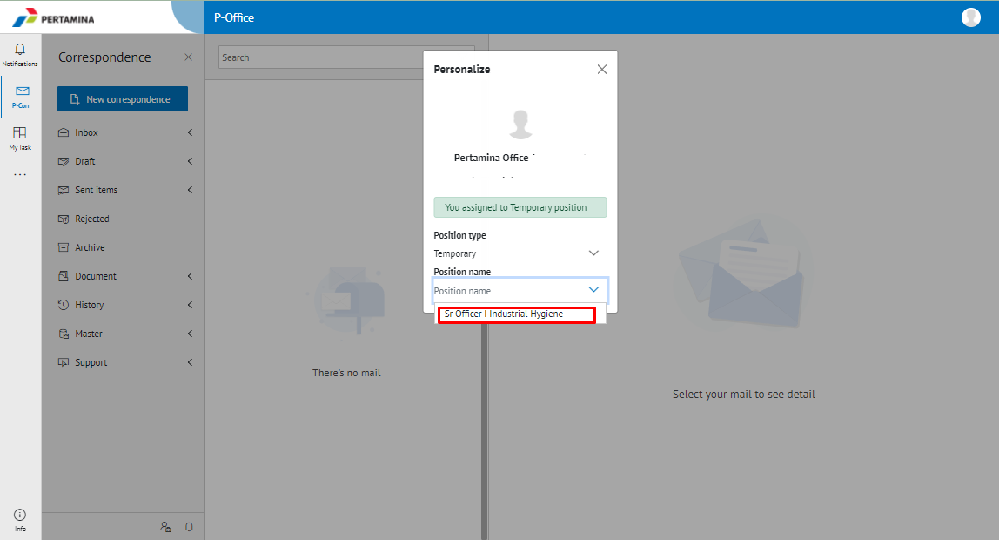

 
 
 Permasalahan terjadi karena faktor user yang diajukan sebagai pejabat sementara (pjs) belum melakukan setting pada P-Office 2.0 melalui menu *personalize - temporary*

- Untuk mengatasi permasalahan tersebut user harus melakukan setting temporary pada P-Office 2.0. Berikut ini langkah – langkah menggunakan P-Office sebagai akun Pejabat Sementara (PJS) :

1.	Pastikan pejabat sementara (Pjs) sudah aktif 
2.	Buka aplikasi P-Office 2.0, klik icon *Personalize* yang terdapat pada bagian kanan bawah, maka akan muncul popup *Personalize*

3.	Kemudian select Position Type dan pilih Temporary

4.	Lalu lanjutkan select pada bagian Position Name, pilih jabatan Pjs yang ingin diakses. 

5.	Setelah itu secara otomatis sistem P-Office 2.0 akan masuk akun Pjs tersebut.
