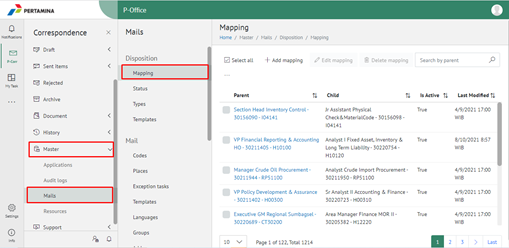
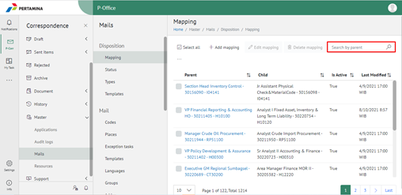
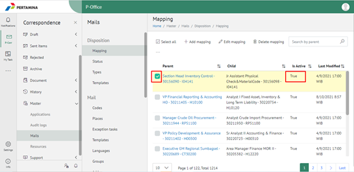
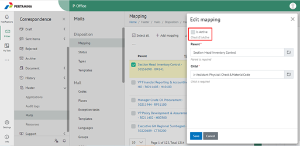
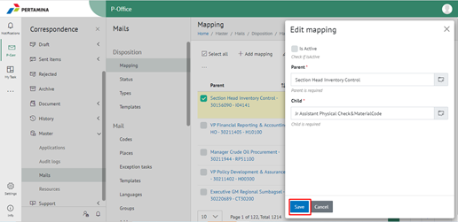
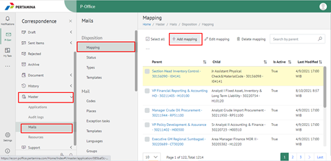
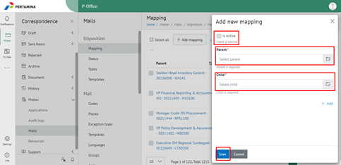
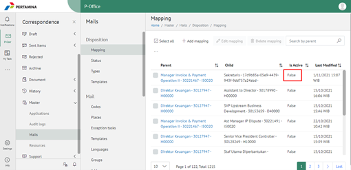

**Menghapus/Menonaktifkan List User di Lembar Disposisi Pejabat Atasan**

Permasalahan tersebut terjadi karena faktor nama user yang tidak akan menerima surat disposisi ada di list lembar disposisinya. Sehingga perlu dilakukan dihapus/dinonaktifkan user tersebut pada E-Corr di menu Master – Mails – Disposition – Mapping.

Untuk mengatasi permasalahan tersebut Admin harus menghapus/menonaktifkan user pada lembar disposisi di menu Master – Mails – Disposition – Mapping terlebih dahulu. Berikut ini langkah-langkah untuk menghapus/menonaktifkan user pada lembar disposisi di E-Corr:

1. Buka aplikasi E-Corr silakan klik menu Master – Mails. Pada tab Disposition pilih menu Mapping.

2. Search nama jabatan yang dicari pada field search.

3. Setelah menentukan nama jabatan yang akan disesuaikan pastikan status di table **is Active** adalah True. Kemudian klik pada kotak di samping nama jabatan sehingga ke checklist.

4. Klik Edit mapping maka akan muncul form edit mapping, pada bagian is Activenya silakan di unchecklist.

5. Klik button save untuk menyimpan perubahan.

6. Jika jabataan user tidak ada di tab Disposition – Mapping, maka untuk menghapus/menonaktifkan user pada lembar disposisi adalah :

a. Klik menu Master – Mails. Pada tab Disposition pilih menu Mapping – klik + Add mapping.

b. Pada form add new mapping silakan isi parent dengan jabatan atasannya dan child dengan jabatan user yang akan di hapus/nonaktifkan, untuk Is Active di unchecklist. Setelah sudah terisi klik button save untuk menyimpan.

c. Setelah disesuaikan pastikan status di table is Active adalah False.

