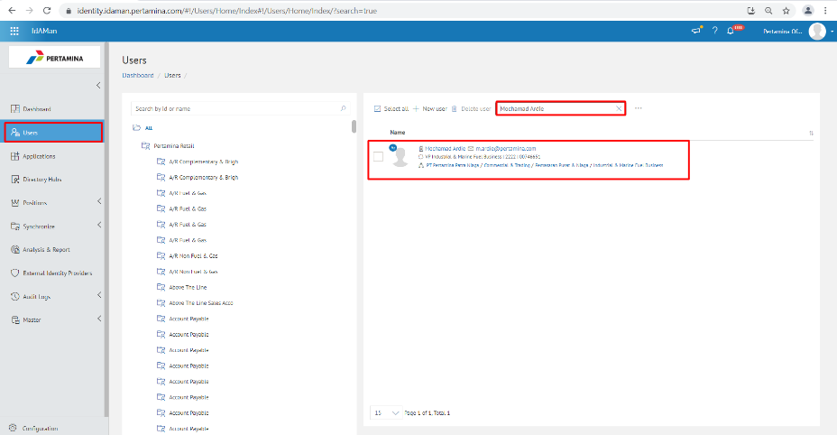
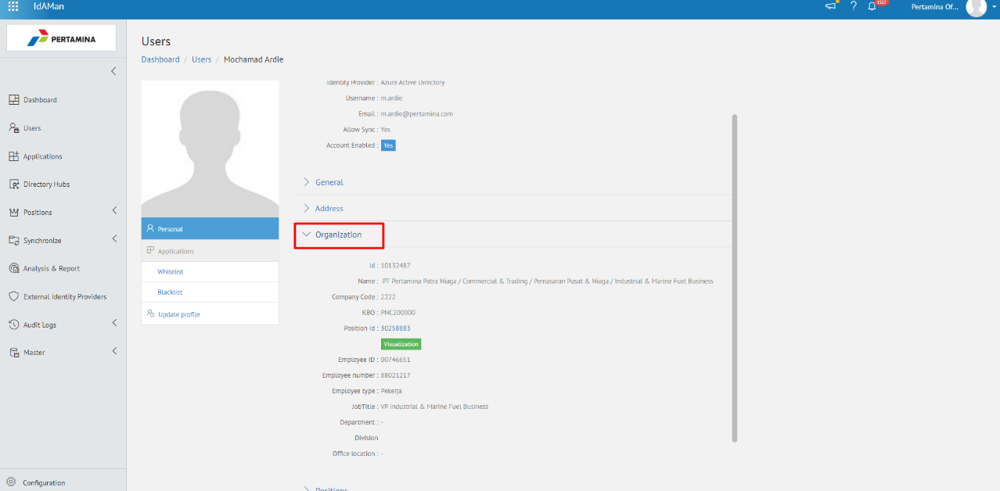
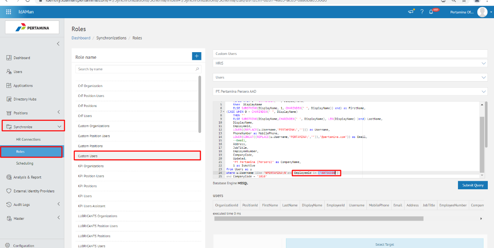
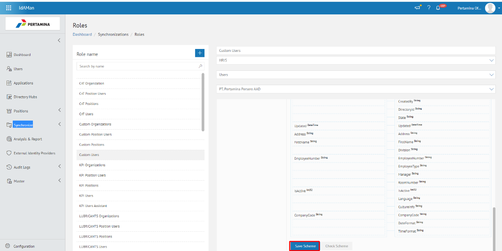
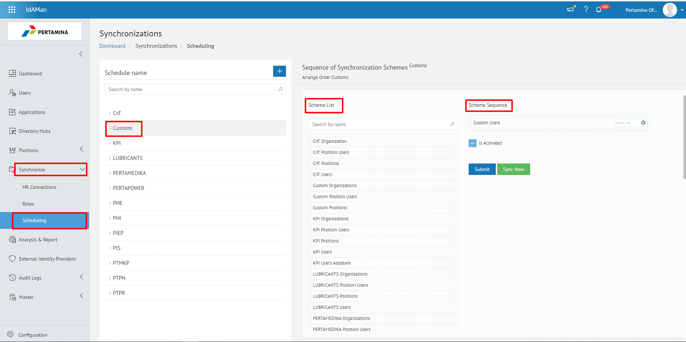
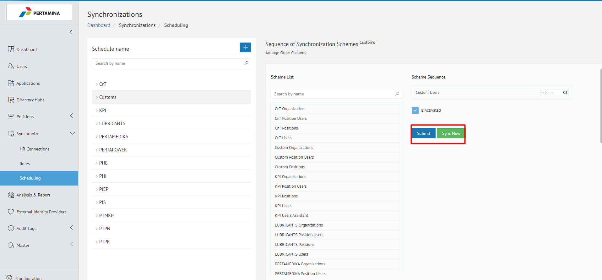
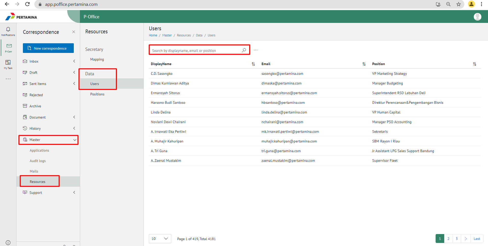
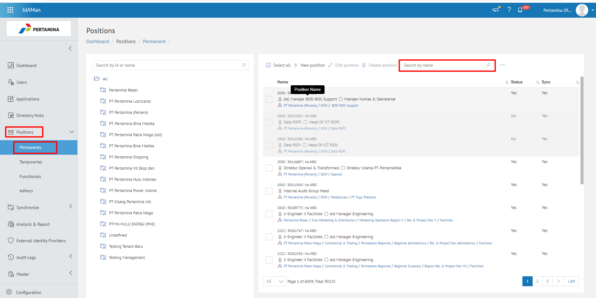
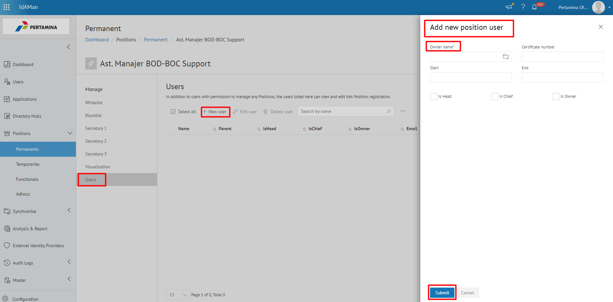

Permasalah tersebut terjadi karena position id pada idaman kosong.
- Terkait Position Id user pekerja kosong terdapat 2 cara untuk melakukan perbaikan, yaitu dengan melakukan sync parsial atau add manual. Berikut langkah-langkah sync parsial :
1.	Buka aplikasi Idaman lalu *check user* dengan pilih menu **User search by name/email** kemudian *double* klik untuk membuka profil *user*

2.	Kemudian pilih **Organization** untuk memastikan data user sudah terupdate 

3.	Lalu pilih menu **Synchronize-Role-Custom User** kemudian isi *employe id* jabatan baru

4.	Kemudian klik **Save Scheme**

5.	Klik kembali menu **Synchronize-Scheduling-Custom** kemudian pindahkan *custom user* ke bagian **Scheme Sequenze**

6.	Klik menu **Submit** setelah itu klik **Sync Now**

7.	Buka aplikasi P-office lalu pilih menu **Master-Resource-Data-User-Search by display name**

8.	Pastikan data user terupdate sesuai dengan idaman

**Berikut langkah – langkah add manual di idaman:**
1.	Pastikan sudah mendapat data user dengan melampirkan data IAM
2.	Buka aplikasi Idaman kemudian pilih menu **Position–Permanent** kemudian search by *Position Id*/Nama jabatan

3.	Klik nama jabatan yang ingin di update kemudian akan muncul detail jabatan lalu pilih **User-New user-add position user** kemudian masukkan nama *user* di kolom owner name dan Submit

4.	Pastikan data sudah terupdate di P-office sesuai dengan data di Idaman

