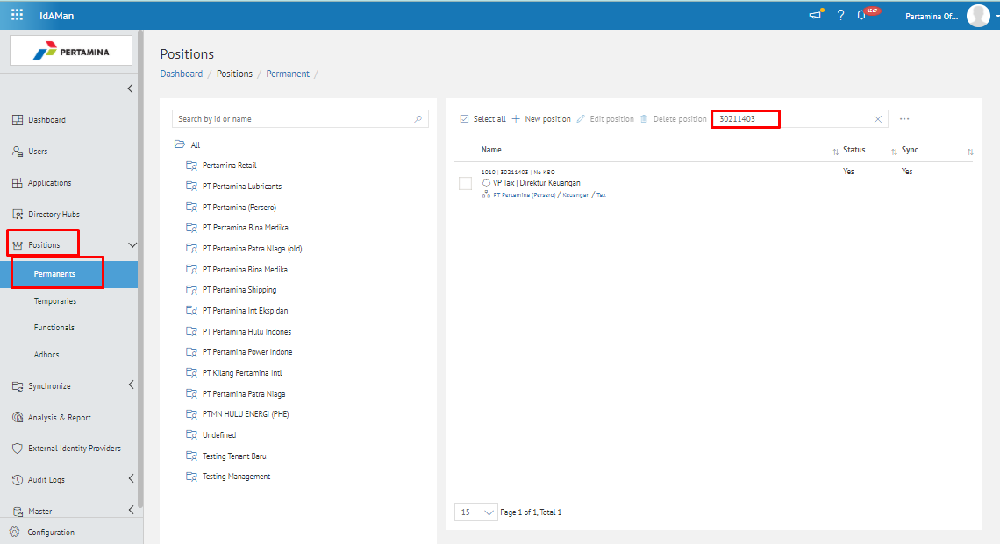
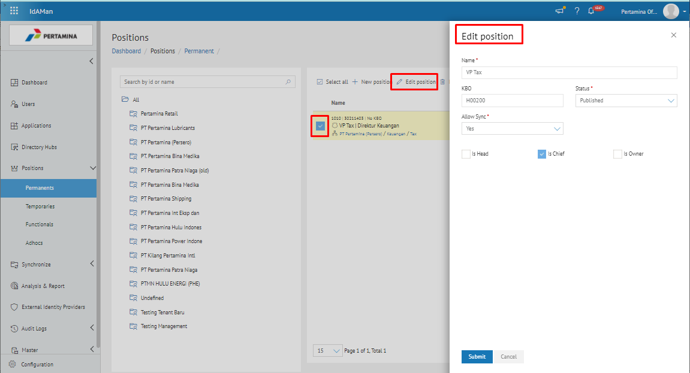
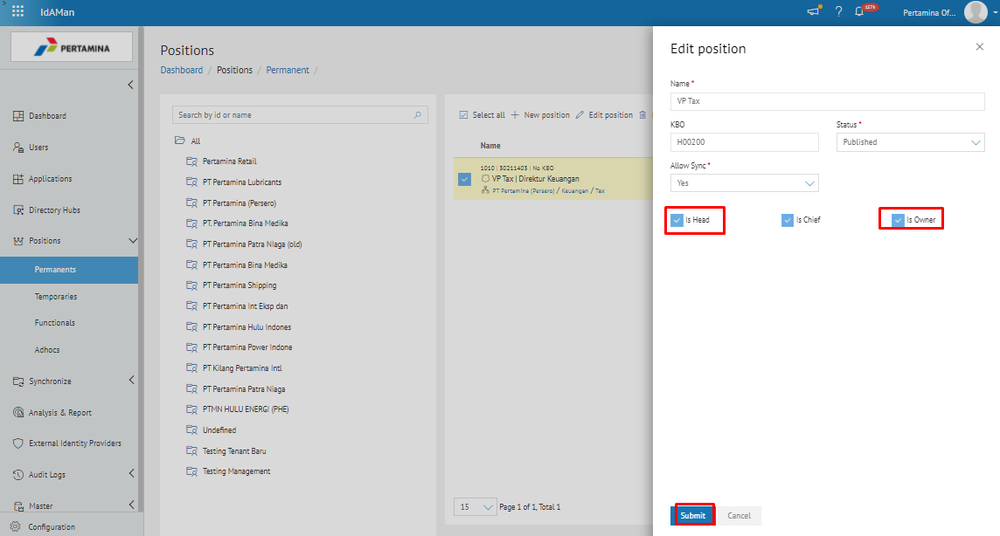
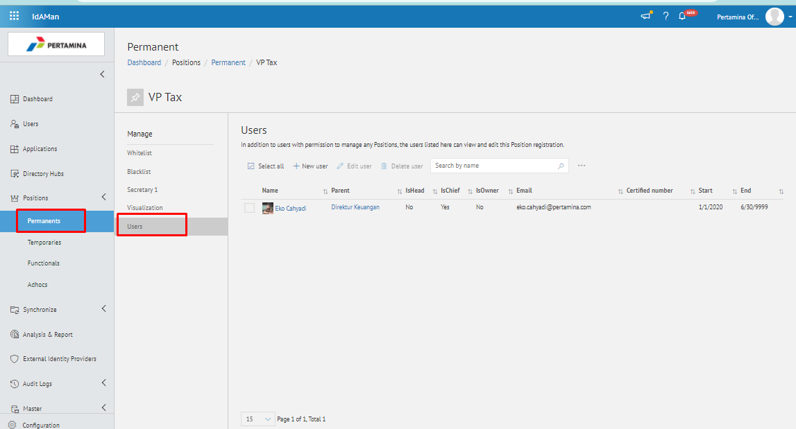
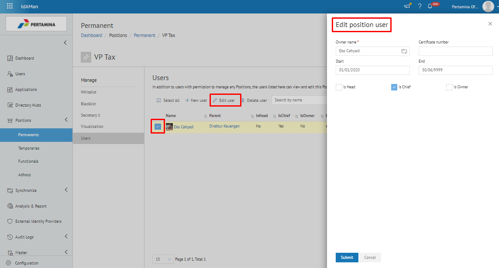
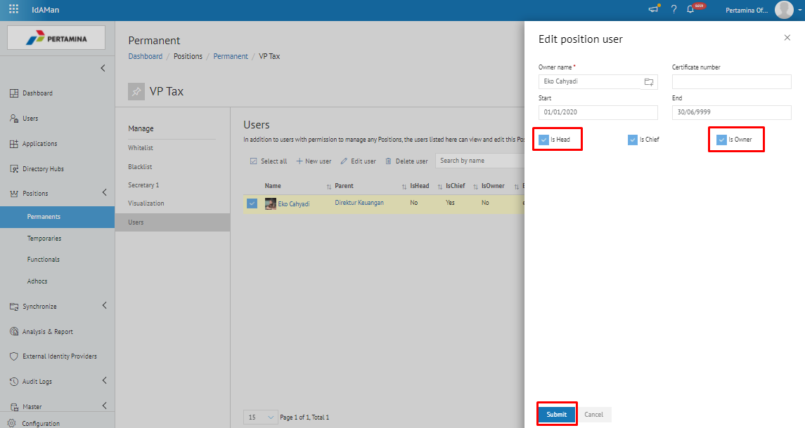

Permasalahan tersebut terjadi karena faktor user telah terdaftar di Digital Sign Admin, namun pada pada Aplikasi Idaman - *Permanents* - *isHead* dan *isOwner* belum terceklis (tercentang).

- Untuk mengatasi permasalahaan tersebut user harus melakukan setting pada aplikasi Idaman - Permanents. Berikut ini langkah – langkah melakukan setting pada aplikasi Idaman :

1.	Pastikan sudah mengetahui nama jabatan atau position id jabatan user tersebut
2.	Buka aplikasi Idaman, pilih menu **Positions** - **Permanents**, Kemudian search menggunakan position id atau nama jabatan

3.	Lalu centang pada bagian kolom jabatan yang terdapat disebelah kanan, dan klik Edit Position, maka akan muncul popup Edit position

4.	Setelah muncul popup Edit Position, lalu centang isHead dan isOwner dan kemudian Submit.

5.	Kemudian double klik pada jabatan tersebut, setelah itu klik tab Users

6.	Lalu centang kolom bagian kanan pada nama pejabat, setelah itu klik Edit User, maka akan muncul popup Edit Position User

7.	Kemudian centang is Head dan is Owner yang terdapat pada popup Edit Position User, lalu Submit

8.	Maka user approver sudah dapat melakukan approve kembali pada surat tersebut.
