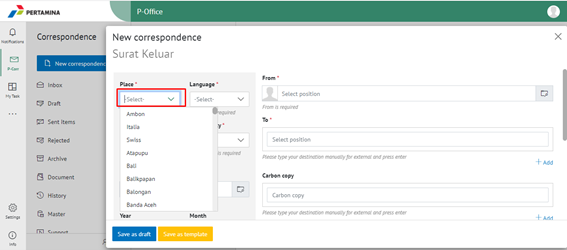
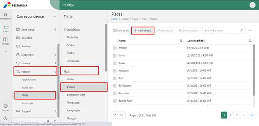
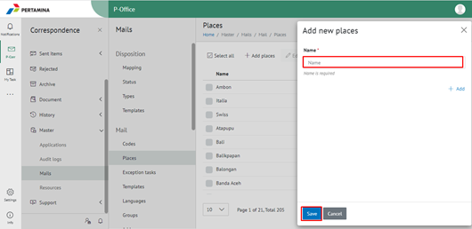

**Penambahan Nama Tempat**

Permasalah tersebut terjadi ketika user akan membuat draft surat pada menu **New Correspondence – pilih mail type** pada bagian form surat pilihan nama tempat yang akan digunakan tidak ada di pilihan **Place**.

1. Pilih menu **Master** pada tab Mail pilih menu **Places**. Untuk menambahkan nama tempat silakan klik button **+Add places**.

2. Pada form Add new places, silakan isi nama tempat kemudian klik button Save.

