\*\* Registasi User Sekertaris (Mitra Kerja)

Untuk permasalahan ini terjadi ketika user akan menambahkan akun E-Corr untuk sekretaris atau mitra kerja baru.

Berikut ini adalah langkah-langkah registrasi user sekretaris atau mitra kerja. Langkah-langkah Register user sekretaris / Mitrakerja:

1. Pastikan user telah mengisi dan melengkapi form registrasi yang diberikan. Setelah itu cek apakah data yang diisikan sudah sesuai. Untuk email user mitrakerja, domain mitrakerja pada email harus dihilangkan. Contohnya sebagai berikut.

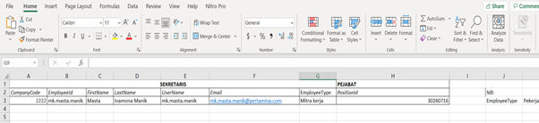

2. Buka Aplikasi Idaman. Klik menu **Directory Hubs** kemudian klik 2 kali pada PT. Pertamina Persero AAD, pastikan statusnya Connected.

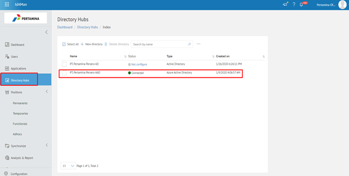

3. Pilih User.

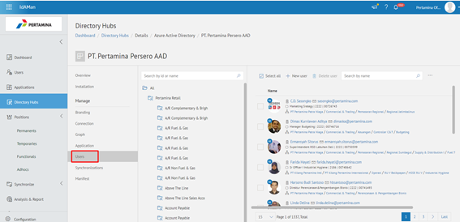

4. Klik pada icon titik tiga di pojok kanan, kemudian klik Import Users Partner.

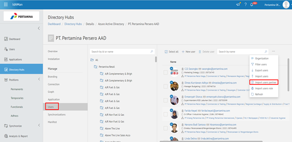

5. Klik Upload untuk mengupload file form register dengan format .xlsx .

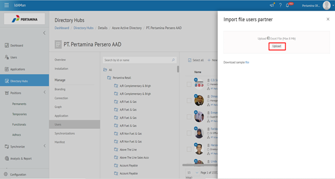

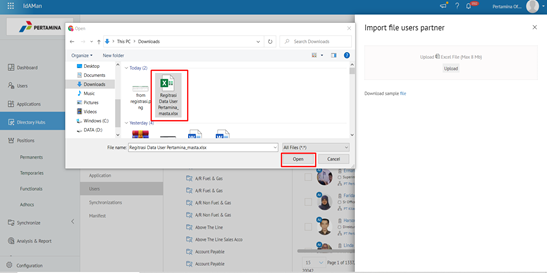

6. Tunggu proses selesai. Kemudian klik Detail.

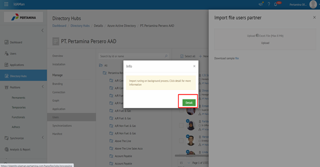

7. Untuk melihat apakah prosesnya berhasil, klik tab Succeeded dan tampilan Hangfire Dashboard akan seperti berikut.

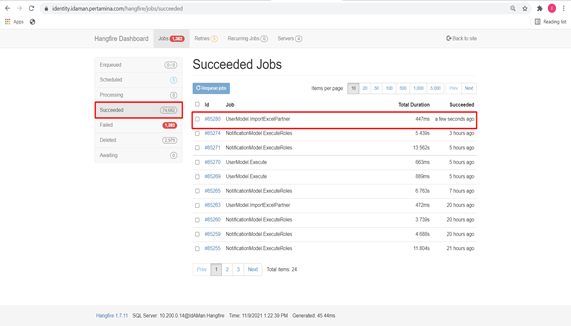

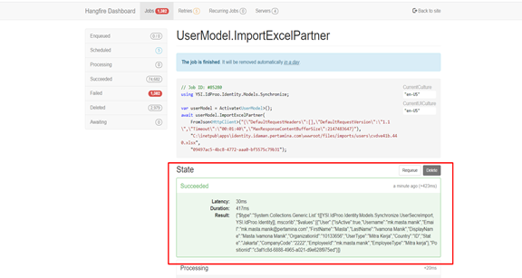

8. Lakukan pengecekan kembali user yang telah diimport pada menu Users lalu cari dengan email atau username user, kemudian klik 2 kali.

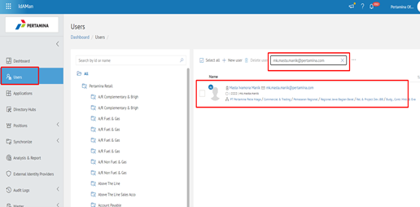

9. Lakukan pengecekan pada bagian Organization untuk memastikan data telah terupdate. Klik Position Id user untuk cek apakah parentnya sudah sesuai atau belum.

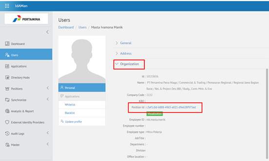

10. Cek parent user dengan klik Menu User.

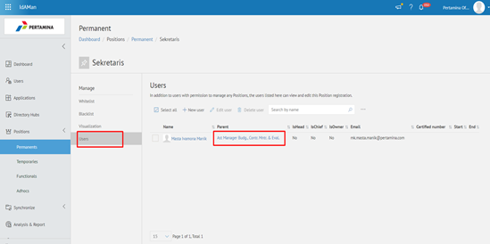

11. Selanjutnya tambahkan Whitelist dengan klik +New whitelist.

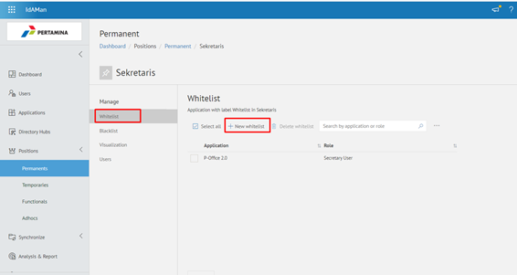

12. Pilih E-Corr 2.0 kemudian pada dropdown Application list pilih E-Corr 2.0, kemudian pada dropdown Roles centang Member User dan Secretary User. Setelah itu klik Submit.

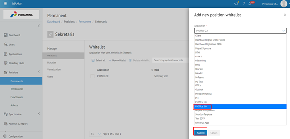

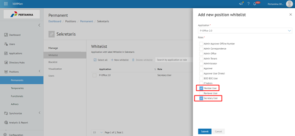

13. Kemudian klik +New whitelist kembali. Pada dropdown Application list pilih Universal Apps, kemudian pada kolom Roles centang Member lalu klik Submit.

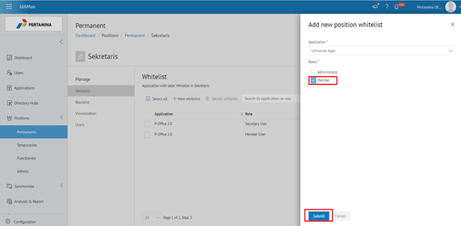

14. Selanjutnya Buka Aplikasi E-Corr untuk melakukan Secretary Mapping. Kemudian pilih Menu Resources lalu pilih Secretary > Mapping.

15. Klik +Add Mapping.

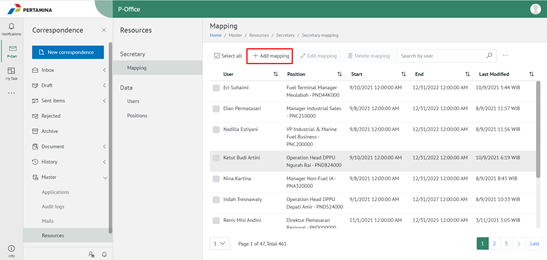

16. Klik kolom Users dan cari dengan email atau username user tersebut. Setelah muncul, klik nama user tersebut.

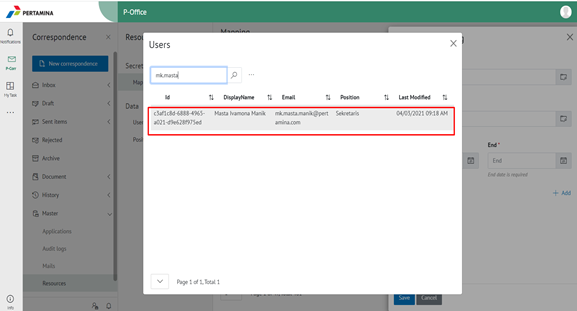

17. Selanjutnya klik kolom Position dan masukkan nama atau email pejabat atasan user tersebut, lalu search dan klik ketika muncul nama pejabatnya.

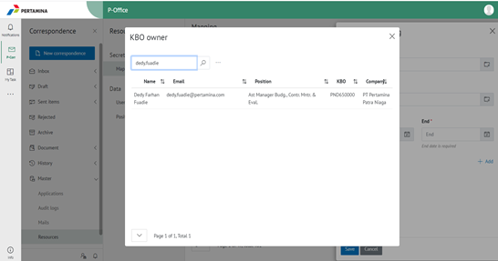

18. Selanjutnya isikan kolom Start untuk tanggal mulai sekretaris tersebut di-mapping, dan kolom End untuk tanggal akhir masa berlaku mapping sekretaris tersebut.

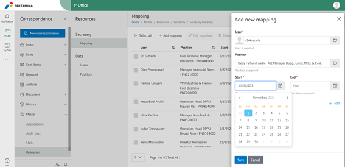

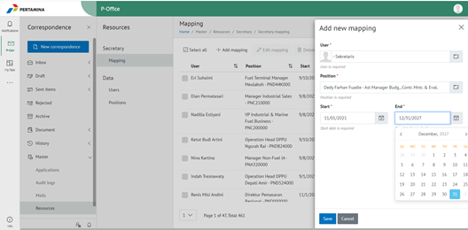

19. Klik Save .

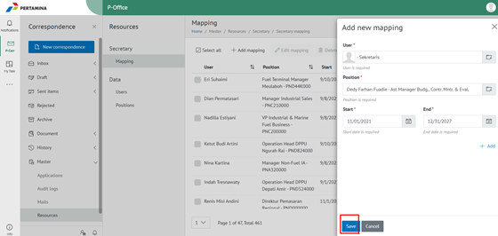

20. Pastikan kembali user sudah ada di E-Corr. Klik Data – Users lalu cari dengan email atau username user.

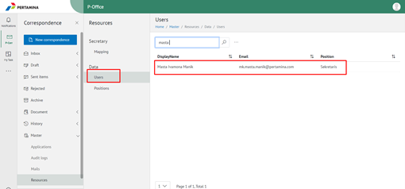
