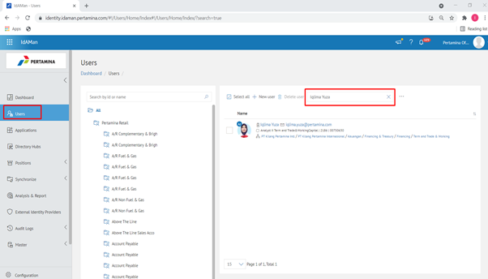
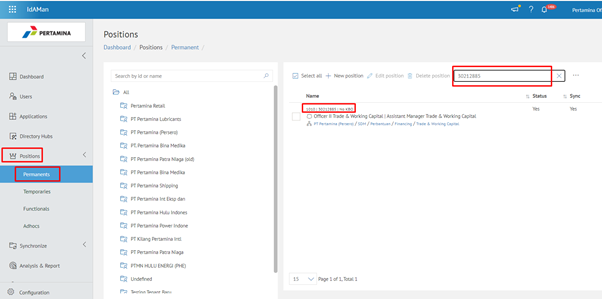
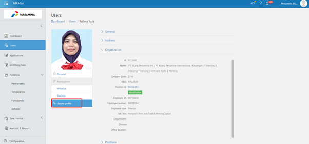
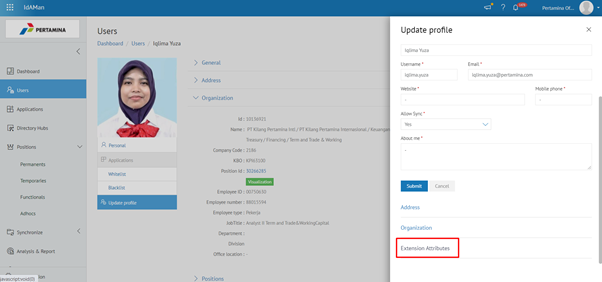
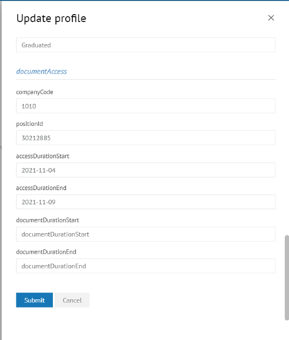
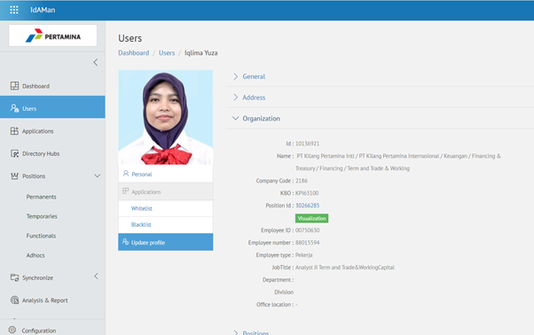
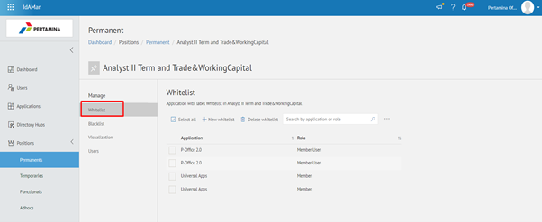
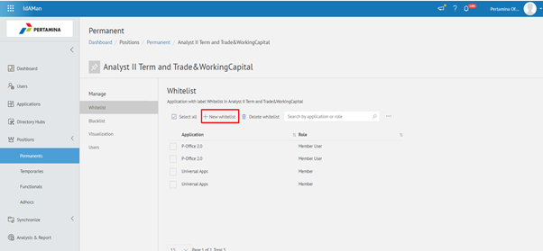
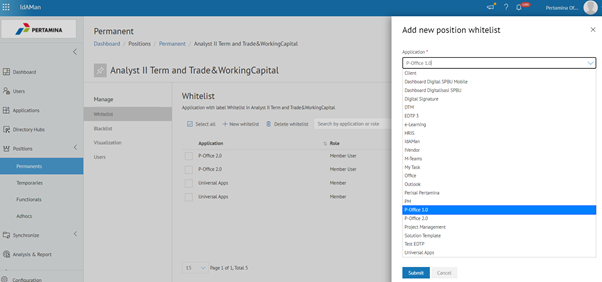
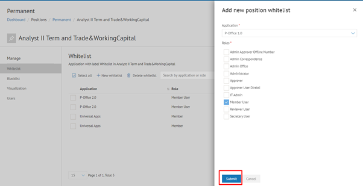

**Request Akses E-Corr 1.0**

Permasalahan ini terjadi ketika user meminta untuk dibukakan akses ke E-Corr 1.0. Sebelum akses dapat diberikan, user harus memberikan informasi yang diperlukan untuk dapat dibukakan aksesnya ke E-Corr 1.0. Informasi yang diperlukan antara lain:
akun, company code tujuan, jabatan tujuan, lama periode akses, serta melampirkan persetujuan atasan jabatan yang dituju (dapat berupa email approval). Untuk informasi company code tujuan dan jabatan tujuan adalah data user sebelum endstate ke E-Corr 2.0.

Untuk mengatasi permasalahan tersebut, user harus melengkapi informasi yang diperlukan untuk dapat diisikan ke bagian Extension Attributes. Berikut langkah-langkah untuk setting akses E-Corr 1.0:

1. Pastikan sudah mendapat info detail akun user, company code tujuan , jabatan tujuan, dan lama periode akses.
2. Buka Aplikasi Idaman, kemudian cari akun user dengan klik Menu Users > isikan nama atau email user di kolom search > enter > klik 2 kali.

3. Check kembali informasi data Position ID dan Company Code yang diberikan user, pastikan telah sesuai. Cek Position ID di menu Position > Permanents.

4. Setelah itu, kembali ke Profile User, kemudian klik Update Profile.

5. Klik Extension Attributes.

6. Isi form documentAccess sesuai data yang diberikan user.

a. Isikan data company code user pada kolom companyCode.

b. Isikan data position ID user pada kolom PositionId.

c. Isikan awal periode akses pada kolom accessDurationStart ( Format YYMMDD ).

d. Isikan akhir periode akses pada kolom accessDurationEnd ( Format YYMMDD ) .

7. Klik Submit.

8. Cek kembali pada Profile User pada menu Users lalu cari dengan email atau username user.

9. Pada Profile User, Klik Organization - klik Position Id.

10. Maka akan tampil menu Positions - Permanents – Whitelist.

11. Pada list Whitelist klik + New whitelist.

12. Kemudian klik dropdown Application dan pilih E-Corr 1.0.

13. Klik Roles Member User kemudian Submit.

