**Saat Sign Pertamina Sign Muncul PopUp Account Not Register**

- Permasalahan tersebut terjadi karena faktor user belum melakukan registrasi (enroll) pada Pertamina Sign melalui menu **My personal – Pertamina Sign**, dengan statusnya belum issued.

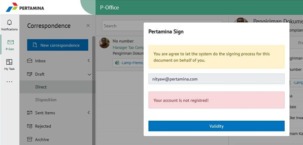

1. Unduh aplikasi Microsoft Authenticator pada Google Playstore atau App Store dan silakan lakukan instalasi aplikasi.

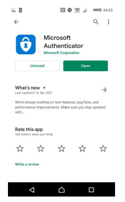

2. Login ke aplikasi E-Corr kemudian pilih My personal pada pojok kanan atas.

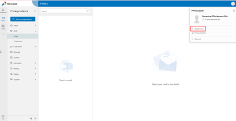

3. Pilih menu Pertamina Sign.

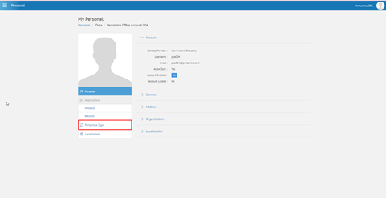

4. Silakan melengkapi form registrasi dengan mengisi phone number, verification method diisi dengan Authenticator. Untuk create initial atau paraf tanda tangan silakan klik **button create initial** lalu draw, setelah selesai klik button create. Setelah form registrasi terisi silakan klik button **proceed**.

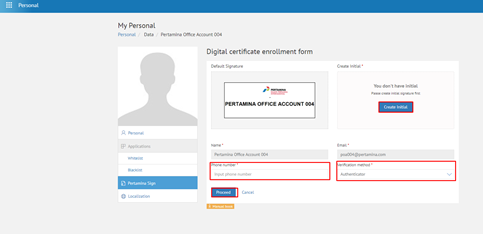

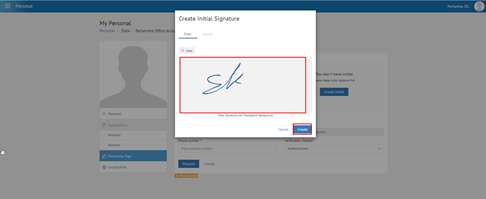

5. Maka akan muncul popup verify User, silakan user scan QR code menggunakan Microsoft Authenticator dan memasukkan One Time Password (OTP).

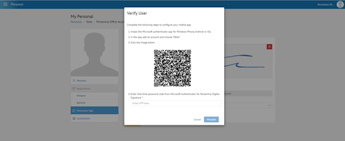

Untuk penggunaan Microsoft Authenticator, berikut langkah-langkahnya:

a. Membuka aplikasi Microsoft Authenticator yang telah diinstall kemudian add account dengan klik button titik 3 pada pojok kanan atas dan klik + add account.

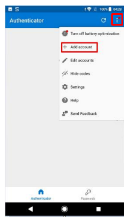

b. Pilih Other (Google, Facebook, etc).

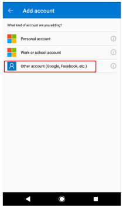

c. Maka akan tampil kamera aktif dan lakukan scan QR Code .

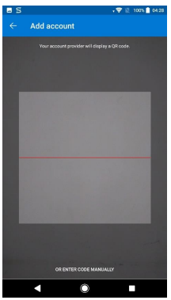

d. Secara otomatis account Authenticator untuk Pertamina Digital Signature sudah ada pada halaman utama aplikasi.

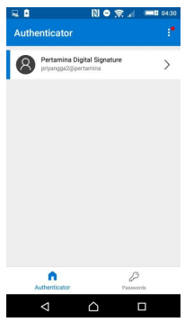

6. Pada My personal – Pertamina Sign, silakan user memilih **Generate Certificate**.

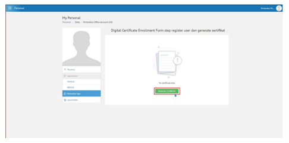

7. Pada popup verify user certificate silahkan masukkan OTP yang terdapat pada Microsoft Authenticator.

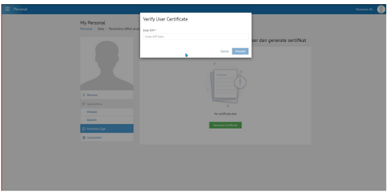

8. Buka aplikasi Microsoft Authenticator.

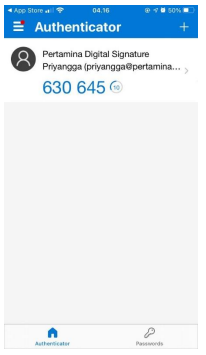

9. Pada Microsoft Authenticator akan muncul angka yang merupakan OTP. Kemudian masukkan OTP tersebut (OTP yang dimasukkan tanpa spasi) pada field OTP.

10. Pada Pertamina Sign user masuk ke halaman detail dari sertifikat digital (Pertamina Sign).

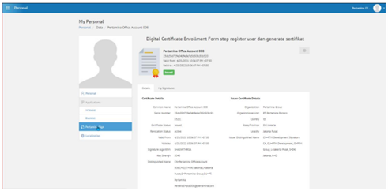
