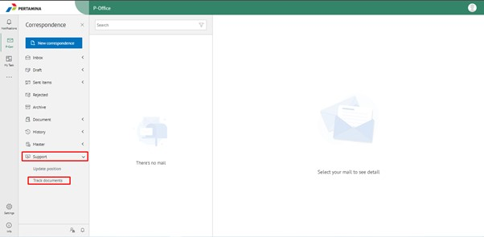
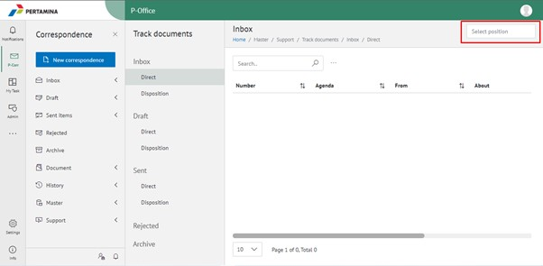
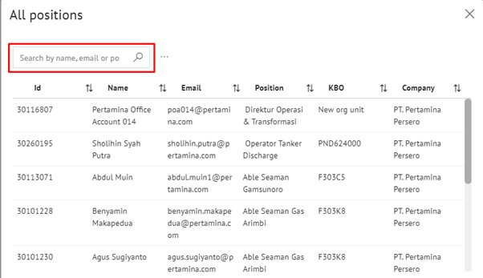
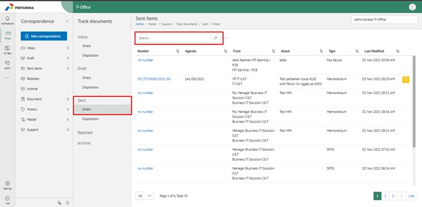
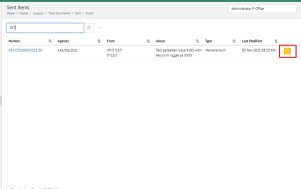
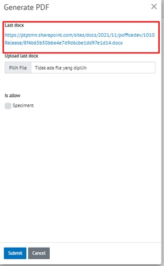
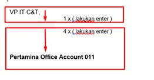
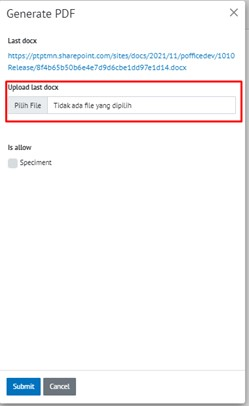
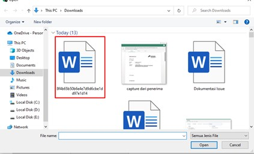
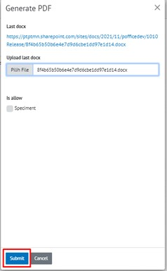

Permasalahan tersebut terjadi karena user konseptor atau reviewer melakukan edit surat/template di menu Draft – Direct dan menghapus jarak spasi antara nama jabatan dan nama pejabat, yang seharusnya dari nama jabatan ke tag spesimen adalah spasi 1x dan dari tag spesimen ke tag nama pejabat adalah spasi 4x

**PERBAIKAN MASALAH**
- Untuk mengatasi masalah tersebut, admin bisa mengunduh dokumen tersebut dengan format .docx dan memperbaiki jarak spesimen tersebut. Berikut ini Langkah-langkah untuk memperbaiki jarak spesimen tanda tangan antara nama jabatan dan nama pejabat:

1. Buka aplikasi P-Office lalu klik menu **Support – Track documents**.

2. Klik **Select positions** yang berada di pojok kanan atas.

3. Masukan nama reviewer/approver yang mempunyai kendala spesimen tidak ada jarak antara nama jabatan dan nama pejabat.

4. Klik Sent – Direct lalu cari surat yang akan diperbaiki, untuk mencari surat tersebut bisa dilakukan dengan nomor surat atau perihal surat.

5. Setelah surat ditemukan, klik icon dokumen berwarna kuning di pojok kanan.

6. Klik link dibawah **Last docx** dan secara otomatis surat terunduh dengan format docx.

7. Buka dokumen yang sudah diunduh, selanjutnya tekan enter 1 x antara nama jabatan dan tag spesimen lalu tekan enter 4x antara tag dan nama pejabat.

8. Save dokumen tersebut dengan menekan **CTRL+S**.

9. Pada form Generate PDF silakan upload kembali dokumen tersebut dengan klik button Pilih File lalu pilih dokumen surat yang sudah diperbaiki dan cheklist speciment apabila surat tersebut akan dimunculkan spesiment tanda tangan, lalu klik button **Submit**.

    

