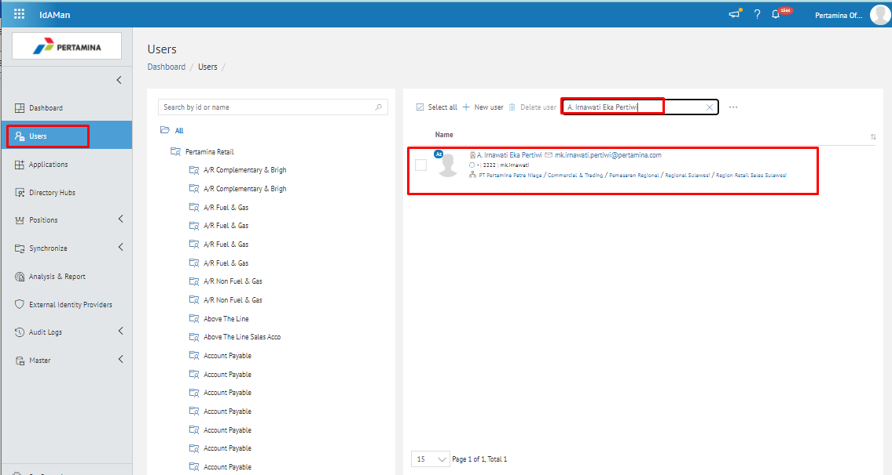
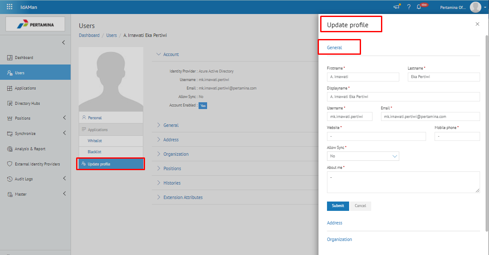
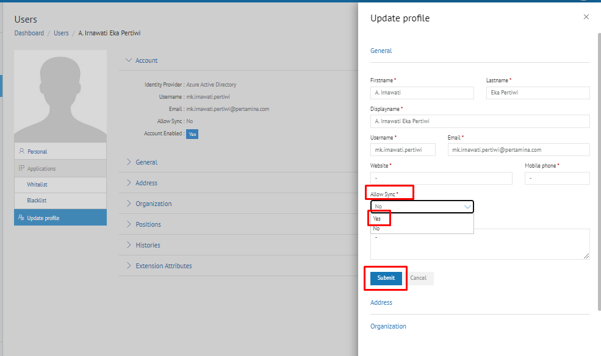
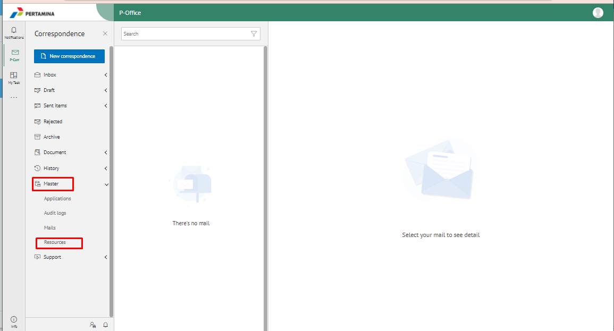
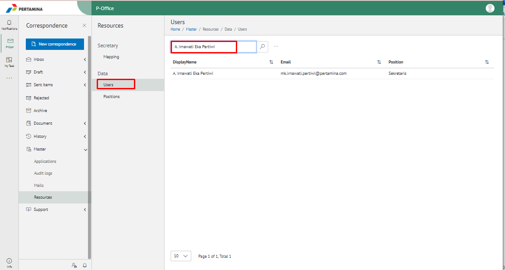

Permasalahan tersebut terjadi karena faktor data user pada aplikasi Idaman belum *sync* di E-Corr 2.0, sehingga harus melakukan pengecekan pada aplikasi Idaman kemudian pilih **Update Profile** dan pilih **Allow sync** menjadi **Yes**

- Untuk mengatasi permasalahan tersebut user harus melakukan *setting* pada aplikasi Idaman - **Update Profile**. Berikut langkah-langkah melakukan *setting* pada aplikasi Idaman :

1.	Pastikan sudah mengetahui nama atau email *user* yang mengalami kendala tersebut
2.	Buka aplikasi Idaman, kemudian tab menu *Users* kemudian *search user by name*, setelah menemukan maka **double klik**

3.	Pilih **Update Profile** yang terdapat di bagian kanan bawah, maka akan muncul popup Update Profile dan pilih General

4.	Kemudian **Select Allow Sync** dan pilih **Yes** dan **Submit**

5.	Maka data user sudah terdapat di E-Corr 2.0 dan untuk memastikan, buka aplikasi E-Corr 2.0, lalu pilih menu **Master-Resource**

6.	Kemudiaan tab **Data-User** dan silakan search by name user tersebut, lalu Enter

7.	Maka akan terdapat nama user, email user dan jabatan user, dan user sudah dapat ditambahkan sebagai reviewer/approver. 