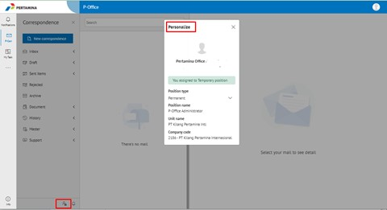
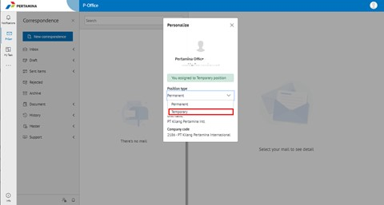
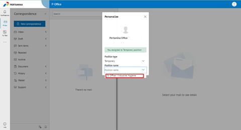

<

- Pastikan pejabat sementara (Pjs) sudah aktif.
- Login ke **P-Office**, klik icon **Personalize** yang terdapat pada bagian kanan bawah, maka akan muncul popup Personalize.  

- Kemudian select **Position Type** dan pilih **Temporay**.

- Lalu lanjutkan select pada bagian **Position Name**, pilih jabatan Pjs yang ingin diakses.

