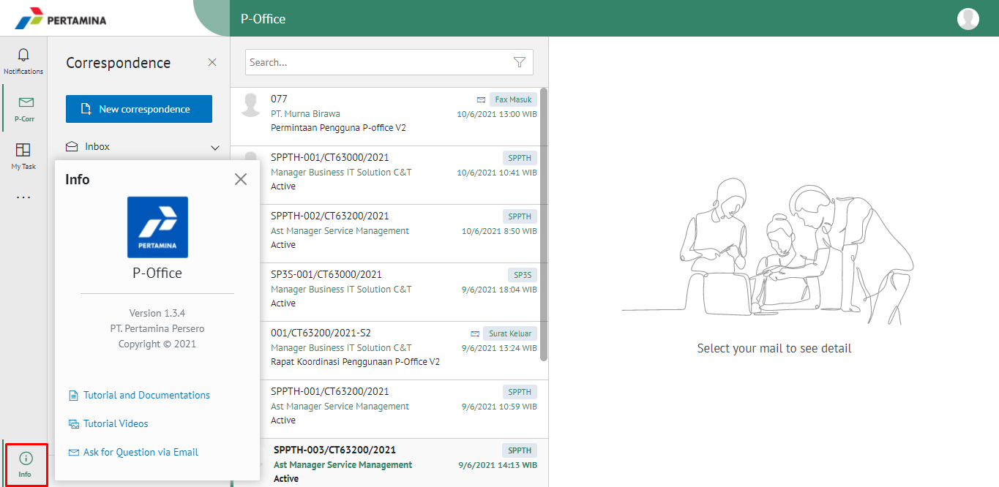

**Role yang sesuai**

- IT Admin

IT Admin dapat melihat informasi aplikasi. Informasi yang ditampilkan yaitu alamat email, nama perusahaan, unit organisasi, nama organisasi, kota, provinsi dan lisensi detail.

## **E-Corr Versi Web**

Langkah - langkah untuk melihat informasi aplikasi via Web adalah sebagai berikut:

1.  Klik menu **Info**

2.  Sistem akan menampilkan informasi aplikasi antara lain version, tutorial and documentations, tutorial videos, ask for question via email
