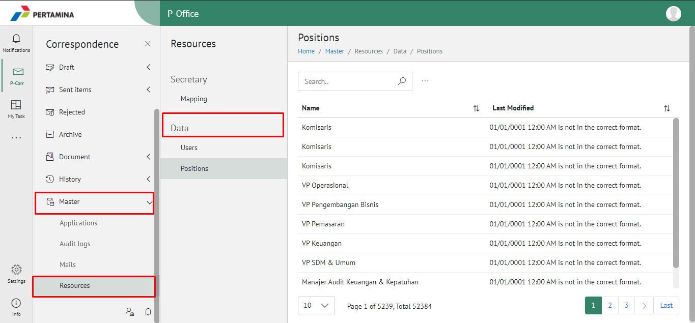
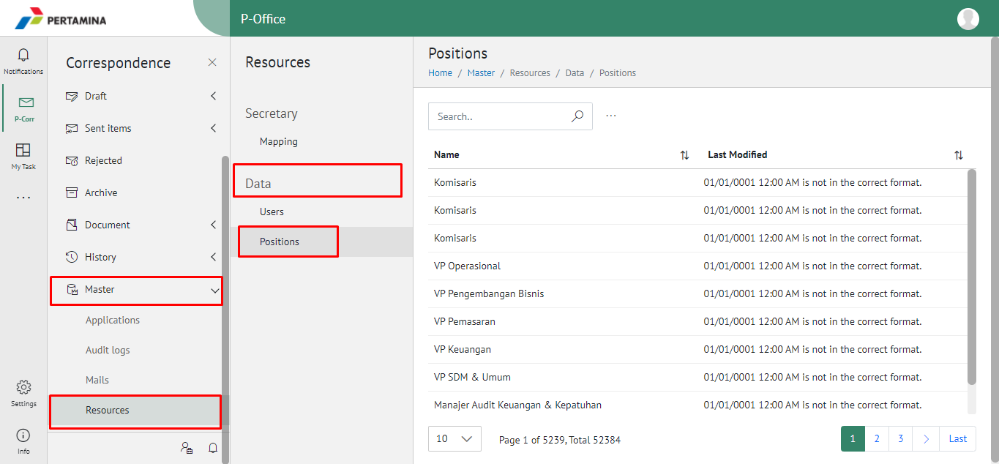
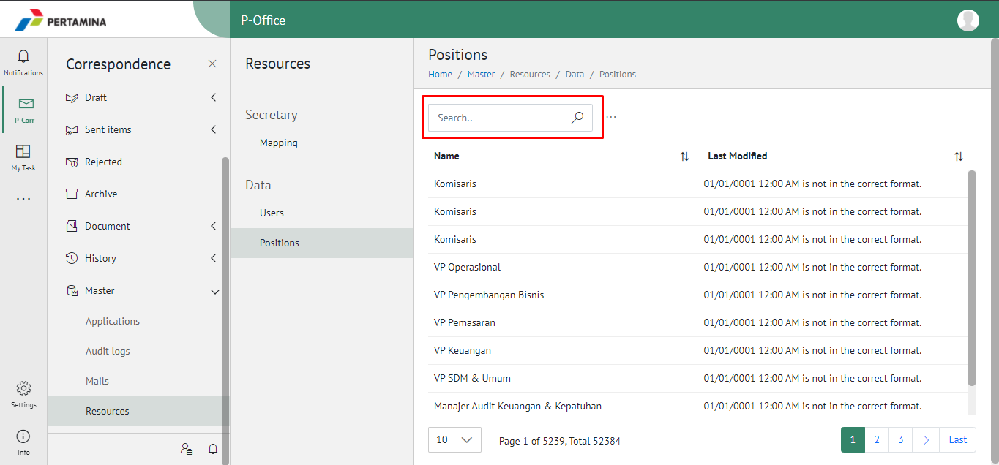

**Role yang sesuai**

- IT Admin

IT Admin dapat mengelola jabatan pada aplikasi E-Corr yang sudah didaftarkan pada manajemen user. Informasi yang ditampilkan yaitu nama jabatan dan unit organisasi. Pengelolaan jabatan yang dilakukan oleh admin E-Corr antara lain adalah sebagai berikut :

- Melihat daftar jabatan pada aplikasi
- Mencari daftar jabatan pada aplikasi

## **E-Corr Versi Web**

Langkah - langkah untuk melihat daftar jabatan pada aplikasi E-Corr via Web adalah sebagai berikut:

#### **Melihat Daftar Jabatan pada Aplikasi**

1.  Pilih menu **Master** dan pilih submenu **Resource - Data - Positions**

2.  Sistem menampilkan daftar user pada aplikasi E-Corr

#### **Mencari Jabatan pada Aplikasi**

1.  Pilih menu **Master** dan pilih submenu **Resource - Data - Positions**

2.  Ketikkan kata kunci pada kolom pencarian kemudian klik **Enter**

3.  Sistem menampilkan hasil pencarian berdasarkan kata kunci
