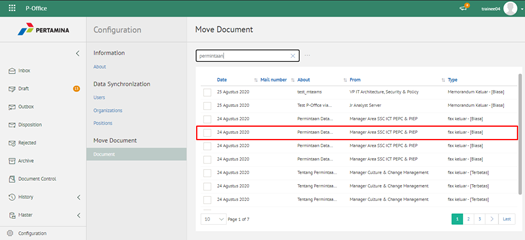
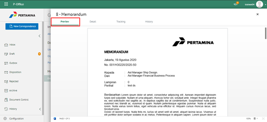
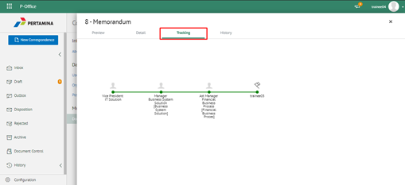
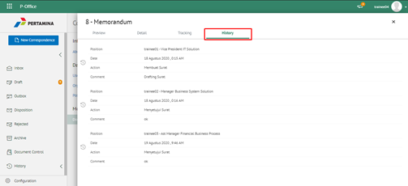
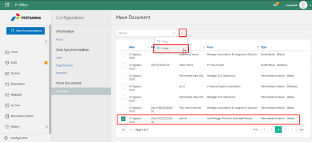
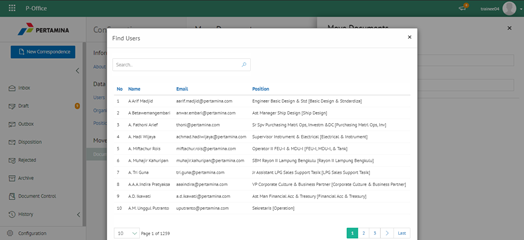
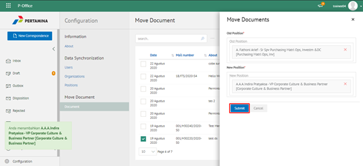

**Role yang sesuai**

- IT Admin

IT Admin dapat mengelola pemindahan / move dokumen pada unit kerja satu ke unit kerja yang lain. Hal ini bertujuan jika unit kerja yang mengalami perubahan dan dokumen di unit kerja lama akan dipindahkan ke unit kerja yang baru. Pengelolaan pemindahan  dokumen yang dilakukan oleh admin P-Office antara lain adalah sebagai berikut :

- Melihat daftar dokumen
- Mencari dokumen
- Melihat Informasi Dokumen
- Melakukan pemindahan dokumen ke unit kerja lain

## **P-Office Versi Web**

Langkah - langkah untuk mengelola perpindahan dokumen pada unit satu ke unit kerja lain pada aplikasi P-Office via Web adalah sebagai berikut:

#### **Melihat Daftar Dokumen**

1.    Pilih menu **Configuration** dan pilih submenu **Move Document - Document**

2.    Sistem menampilkan daftar dokumen pada halaman **Move Document**

#### **Mencari Dokumen**

1.    Pilih menu **Configuration** dan pilih submenu **Move Document - Document**

2.    Ketikkan kata kunci pada kolom pencarian kemudian klik **Enter**

3.    Sistem menampilkan hasil pencarian berdasarkan kata kunci

#### **Melihat Informasi Dokumen**

1.   Pilih menu **Configuration** dan pilih submenu **Move Document - Document**. Pilih salah satu dokumen yang akan dilihat informasinya

##### Preview Surat

1. Pada tab **Preview**, ditampilkan _preview_ surat yang sudah dibuat. Preview surat disesuaikan dengan template berdasarkan jenis surat.

##### Detail Surat

1. Pada tab **Detail**, terdapat informasi asal surat, perihal, file lampiran, kategori surat, resume, rekomendasi, nomor surat, klasifikasi surat, tanggal surat dan tujuan

##### Tracking Surat

1. Pada tab **Tracking**, ditampilkan informasi _tracking_ surat dalam bentuk _chart_

##### History Surat

1. Pada tab **History**, ditampilkan riwayat surat masuk yang terdapat informasi jabatan, tanggal, tindakan dan komentar

#### **Melakukan Pemindahan Dokumen ke Unit Kerja Lain**

1.    Pilih menu **Configuration** dan pilih submenu **Move Document - Document**

2.    Pilih dokumen yang akan dipindahkan ke unit kerja lain dan klik tombol **Move**

3.    Sistem menampilkan _pop up_ **Move Document**

4.    Pilih jabatan lama dimana dokumen berasal pada _field_ **Jabatan Lama.** Pilih jabatan baru pada *field* **Jabatan Baru** untuk memilih tujuan dokumen yang akan dipindahkan

5.    Pilih **Submit** untuk memindahkan dokumen ke unit kerja yang baru

