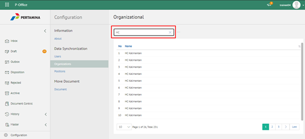

**Role yang sesuai**

- IT Admin

IT Admin dapat mengelola unit organisasi pada aplikasi P-Office yang sudah didaftarkan di idProo. Informasi yang ditampilkan yaitu nama unit organisasi. Pengelolaan unit organisasi yang dilakukan oleh admin P-Office antara lain adalah sebagai berikut :

- Melihat daftar unit organisasi pada aplikasi
- Mencari daftar unit organisasi pada aplikasi

## **P-Office Versi Web**

Langkah - langkah untuk melihat daftar unit organisasi pada aplikasi P-Office via Web adalah sebagai berikut:

#### **Melihat Daftar Unit Organisasi pada Aplikasi**

1. Pilih menu **Configuration** dan pilih submenu **Syncronization - Organization**

2. Sistem menampilkan daftar user pada aplikasi P-Office. Admin P-Office juga dapat melihat daftar unit kerja dalam bentuk hirarki dengan klik pada icon **Tree**

3. Sistem menampilkan unit organisasi dalam bentuk hirarki

#### **Mencari Unit Organisasi pada Aplikasi**

1. Pilih menu **Configuration** dan pilih submenu **Syncronization - Organization**

2. Ketikkan kata kunci pada kolom pencarian kemudian klik **Enter**

3. Sistem menampilkan hasil pencarian berdasarkan kata kunci
