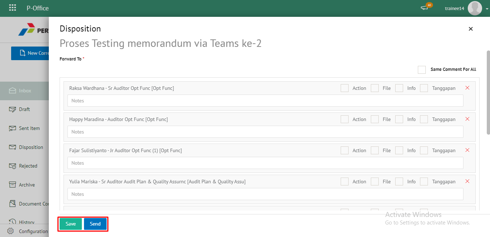
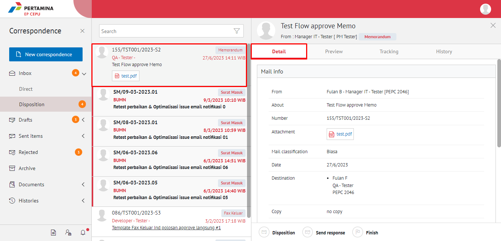
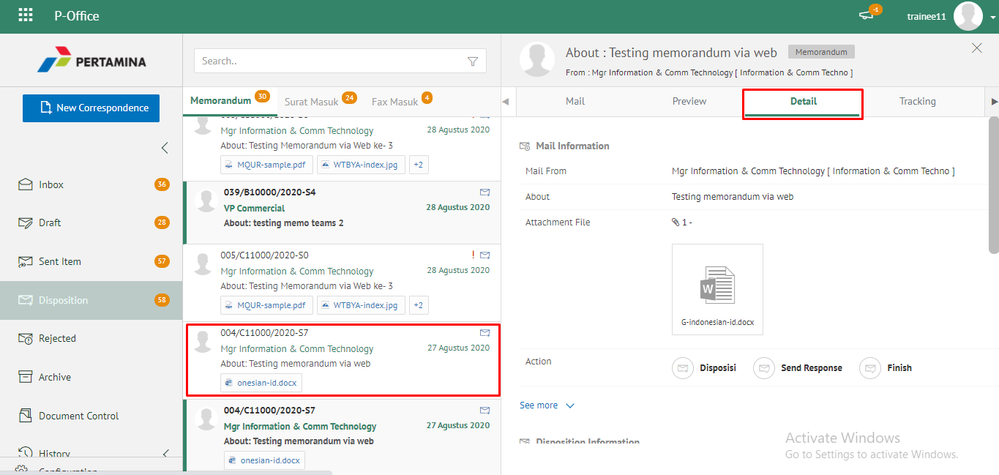
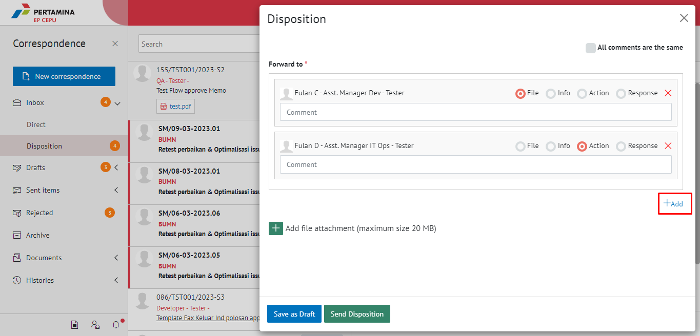
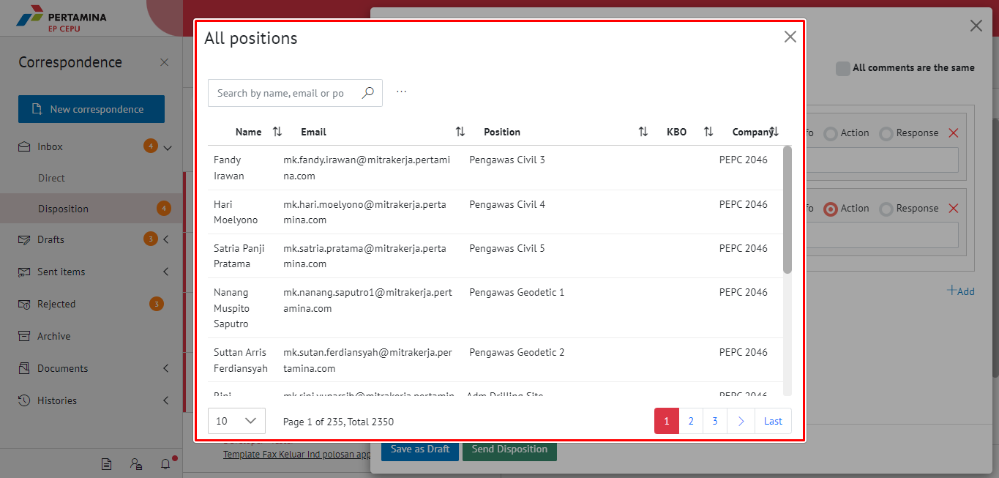
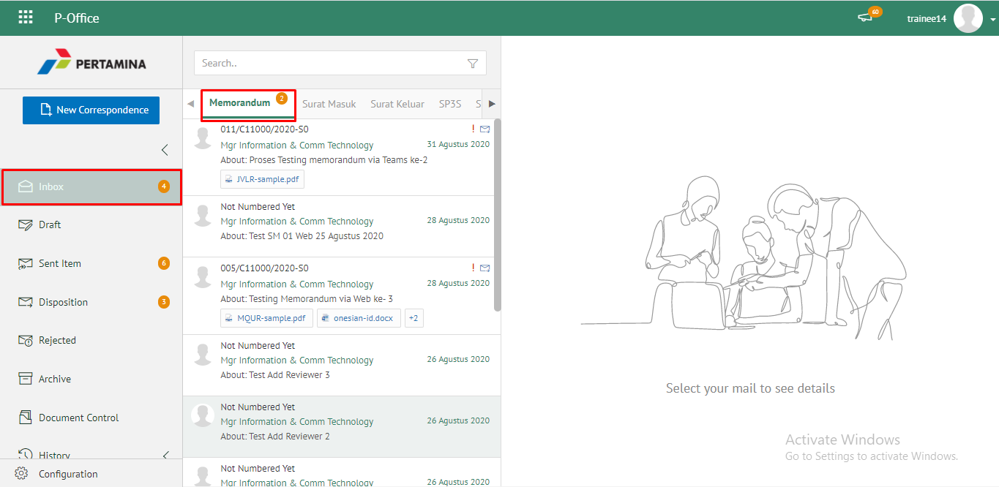

**Role yang sesuai**

- _Approver User_
- _Reviewer User_

_User_ dapat melakukan _custom_ penerima disposisi terhadap pejabat penerima yang akan menerima perintah disposisi. Secara _default_ pejabat yang akan menerima disposisi adalah pejabat yang ada dibawahnya. Tetapi terdapat _case_ jika _user_ membutuhkan _custom_ penerima disposisi sehingga disediakan fitur untuk memilih pejabat selain pejabat yang ada dibawahnya.

## **E-Corr Versi Web**

Langkah-langkah untuk melakukan Custom disposisi memorandum via Web adalah sebagai berikut

1. Klik menu **Inbox** dan pilih label **Memorandum**

2. Pilih memorandum yang akan didisposisikan kemudian pilih tab **Detail**

3. Klik tombol **Disposition**

4. Sistem menampilkan form disposisi. Klik icon "+" pada field **Forward To**. Isikan informasi disposisi dan perintah untuk masing-masing penerima disposisi.

5. Sistem menampilkan daftar pejabat yang dapat dipilih untuk didisposikan

6. Isikan perintah dan keterangan pada masing - masing penerima disposisi. Tambahkan lampiran disposisi jika diperlukan. Fitur **Save Comment For All Untuk Semua** dapat digunakan _user_ untuk memberikan komentar yang sama untuk masing-masing pejabat penerima disposisi. Klik **Save as draft** untuk menyimpan perubahan dan klik **Send disposition** untuk mengirim disposisi.

