**Role yang sesuai**

- _Approver User_
- _Reviewer User_

_User_ dapat melakukan _custom_ penerima disposisi terhadap pejabat penerima yang akan menerima perintah disposisi. Secara _default_ pejabat yang akan menerima disposisi adalah pejabat yang ada dibawahnya. Tetapi terdapat _case_ jika _user_ membutuhkan _custom_ penerima disposisi sehingga disediakan fitur untuk memilih pejabat selain pejabat yang ada dibawahnya.

## **P-Office Versi Web**

Langkah-langkah untuk melakukan Custom disposisi memorandum via Web adalah sebagai berikut

1. Klik menu **Inbox** dan pilih label **Memorandum**

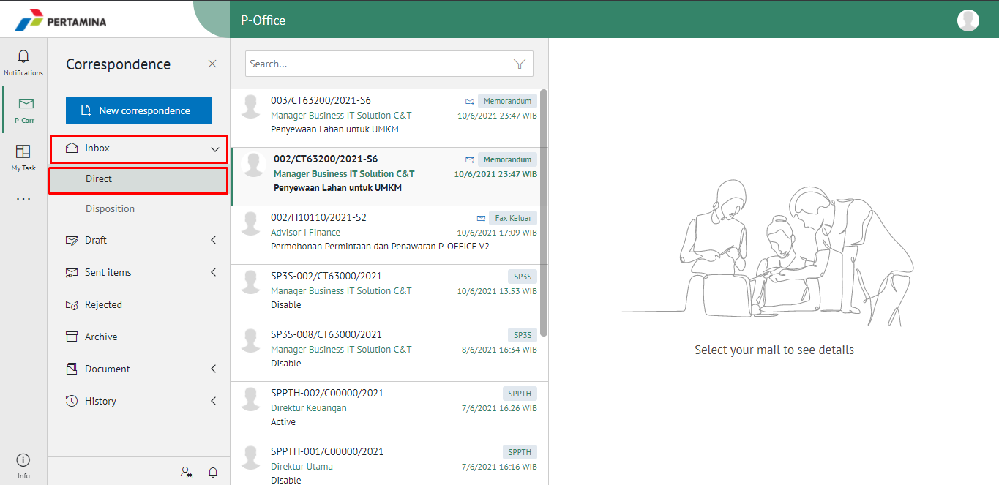

2. Pilih memorandum yang akan didisposisikan kemudian pilih tab **Detail**

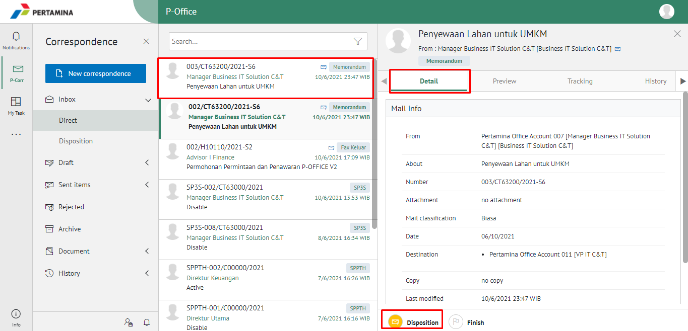

3. Klik tombol **Disposition**

4. Sistem menampilkan form disposisi. Klik icon "+" pada field **Forward To**. Isikan informasi disposisi dan perintah untuk masing-masing penerima disposisi.

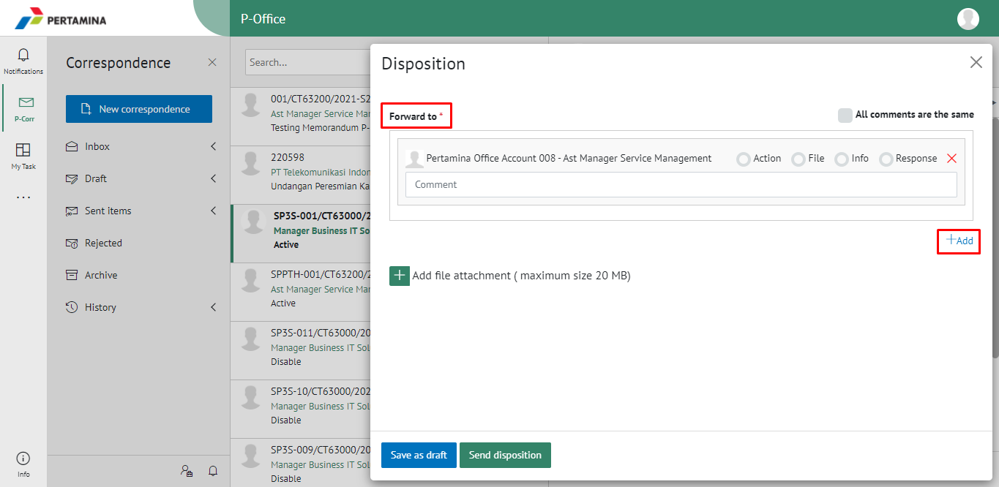

5. Sistem menampilkan daftar pejabat yang dapat dipilih untuk didisposikan

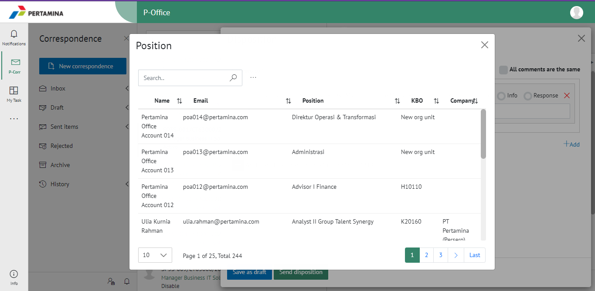

6. Isikan perintah dan keterangan pada masing - masing penerima disposisi. Tambahkan lampiran disposisi jika diperlukan. Fitur **Save Comment For All Untuk Semua** dapat digunakan _user_ untuk memberikan komentar yang sama untuk masing-masing pejabat penerima disposisi. Klik **Save as draft** untuk menyimpan perubahan dan klik **Send disposition** untuk mengirim disposisi.

## **P-Office Versi Teams**

Langkah-langkah untuk Custom disposisi Memorandum via Teams adalah sebagai berikut :

1. Klik menu **Inbox** dan pilih tab **Memorandum**

2. Pilih memorandum yang akan didisposisikan kemudian pilih tab **Detail**

3. Klik tombol **Disposition** dan pilih **Send**

4. Sistem menampilkan form disposisi. Klik icon "+" pada field **Forward To**. Isikan informasi disposisi dan perintah untuk masing-masing penerima disposisi.

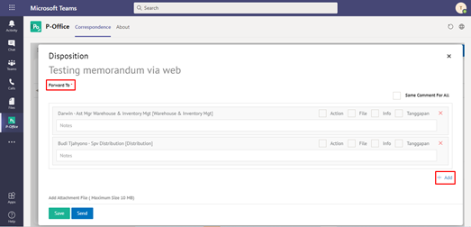

5. Sistem menampilkan daftar pejabat yang dapat dipilih untuk didisposikan

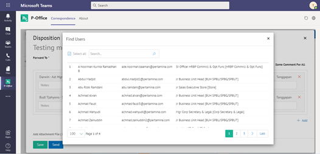

6. Isikan perintah dan keterangan pada masing - masing penerima disposisi. Tambahkan lampiran disposisi jika diperlukan. Fitur **Save Comment For All Untuk Semua** dapat digunakan _user_ untuk memberikan komentar yang sama untuk masing-masing pejabat penerima disposisi. Klik **Save** untuk menyimpan perubahan dan klik **Send** untuk mengirim disposisi.

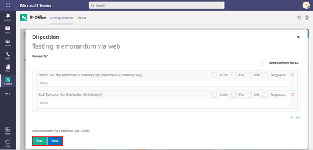

## **P-Office Versi Android dan iOS**

Langkah-langkah untuk Custom disposisi Memorandum via Android dan iOS adalah sebagai berikut :

1. Klik menu **Inbox** dan pilih label **Memorandum**

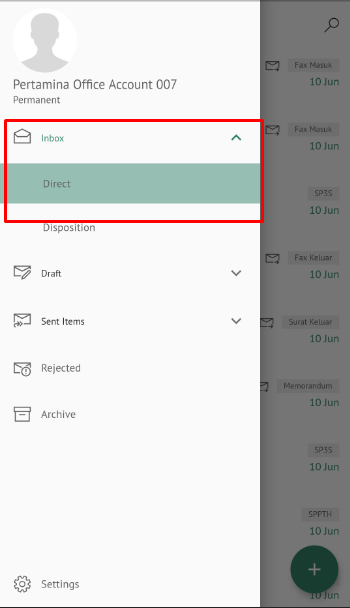 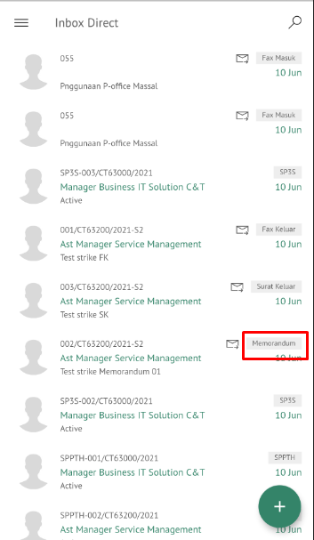

2. Pilih memorandum yang akan didisposisikan kemudian pilih icon **Option**

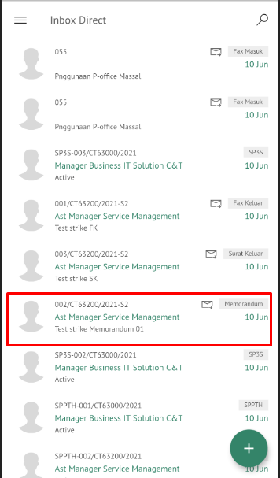 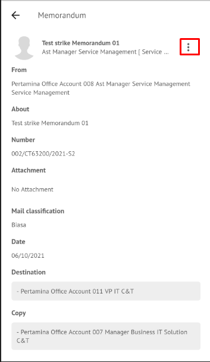

3. Klik tombol **Disposisi** kemudian sistem akan menampilkan form disposisi. Isikan informasi disposisi dan perintah untuk masing-masing penerima disposisi.

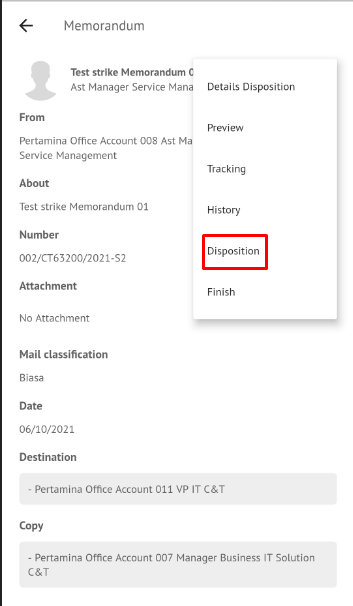 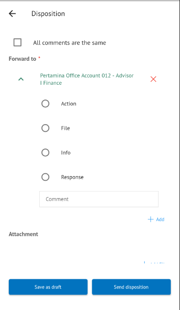

4. Sistem menampilkan form disposisi. Klik icon “+” pada field **Forward To**. Isikan informasi disposisi dan perintah untuk masing-masing penerima disposisi.

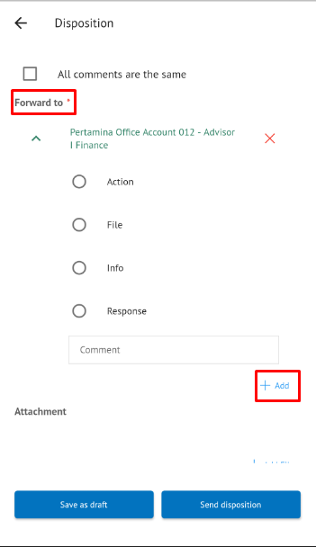

5. Sistem menampilkan daftar pejabat yang dapat dipilih untuk didisposikan

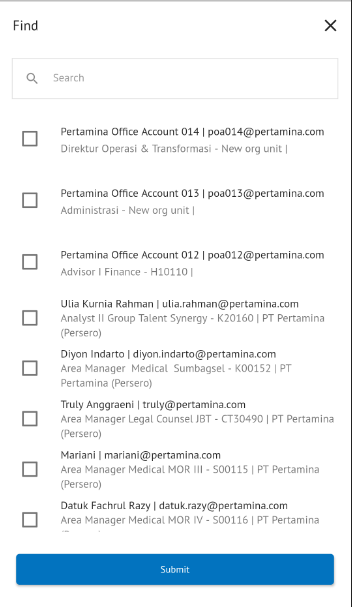

6. Isikan perintah dan keterangan pada masing-masing penerima disposisi. Tambahkan lampiran disposisi jika diperlukan. Fitur **Save Comment For All Untuk Semua** dapat digunakan _user_ untuk memberikan komentar yang sama untuk masing-masing pejabat penerima disposisi. Klik **Save a draft** untuk menyimpan perubahan dan klik **Send disposition** untuk mengirim disposisi.

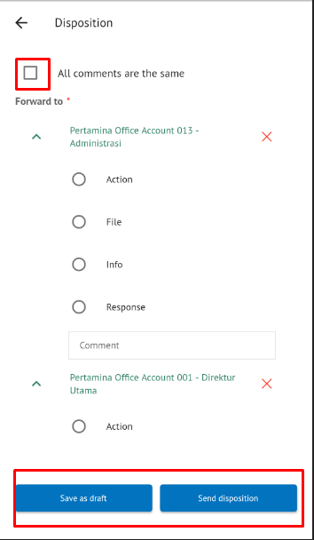
