**Role yang sesuai**

- _Approver User_
- _Reviewer User_

_User_ menerima memorandum yang sudah dikirimkan pejabat internal Pertamina pada menu **"Inbox - Memorandum"**. Memorandum dapat didisposisikan kepada pejabat yang dipilih atau pejabat yang ada dibawahnya. Disposisi memorandum dapat dilakukan dengan dua cara yaitu melalui menu **Inbox** jika memorandum yang diterima merupakan memorandum yang ditujukan kepada tujuan pejabat internal Pertamina dan telah disetujui atau ditanda tangani oleh pejabat pengirim atau melalui menu **Disposisi** jika memorandum sudah dilakukan tindak lanjut oleh pejabat pemilik KBO dan pemilik KBO akan mendisposisikan ke pejabat selanjutnya atau pejabat yang ada dibawahnya.

## **E-Corr Versi Web**

Langkah-langkah untuk mendisposisikan memorandum via Web adalah sebagai berikut

#### Disposisi melalui Menu Inbox

1. Klik menu **Inbox** dan pilih label **Memorandum**

2. Pilih memorandum yang akan didisposisikan kemudian pilih tab **Detail**

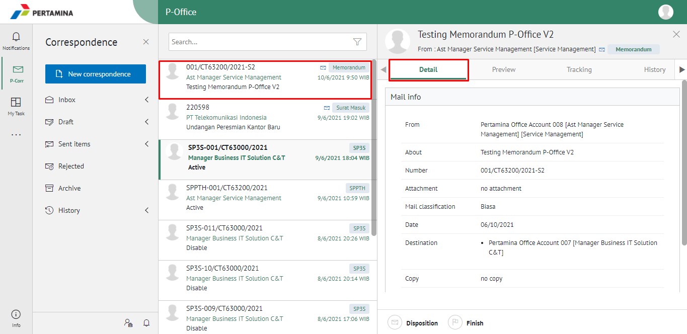

3. Klik tombol **Disposition**

4. Sistem menampilkan form disposisi. Isikan informasi disposisi dan perintah untuk masing-masing penerima disposisi.

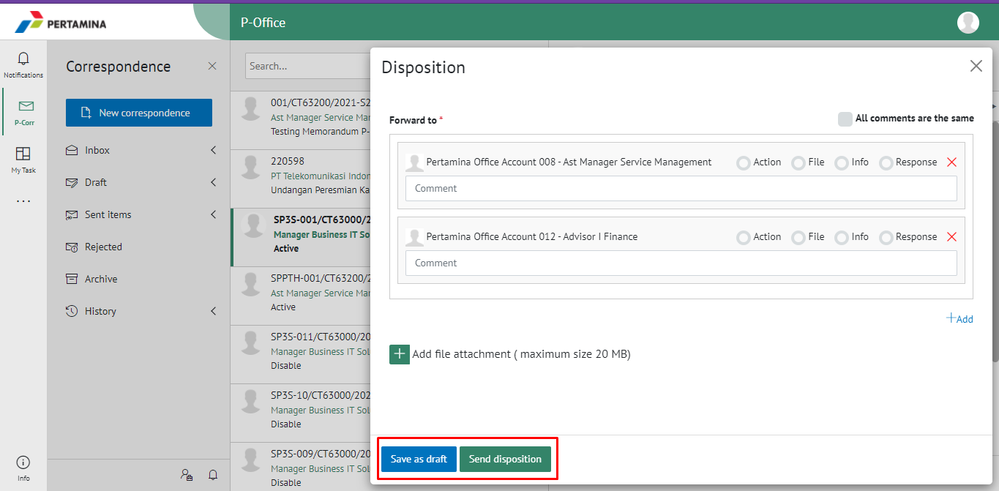

5. Klik **Save as draft** untuk menyimpan draft disposisi memorandum dan memorandum akan tersimpan di menu **"Draft - Memorandum"**. Klik **Send disposition** untuk mengirim disposisi ketujuan dan disposisi memorandum akan tersimpan di menu **"Sent Item - Disposisi"**.

#### Disposisi melalui Menu Inbox

1. Klik menu **Disposition** dan pilih label **Memorandum**

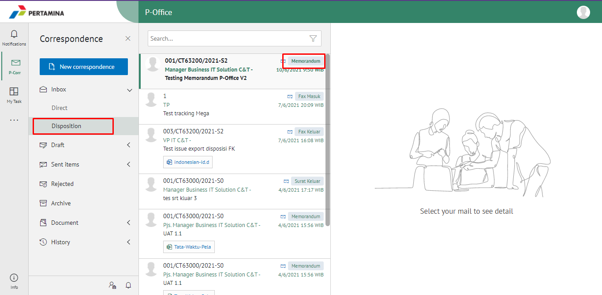

2. Pilih memorandum yang akan didisposisikan kemudian pilih tab **Detail**

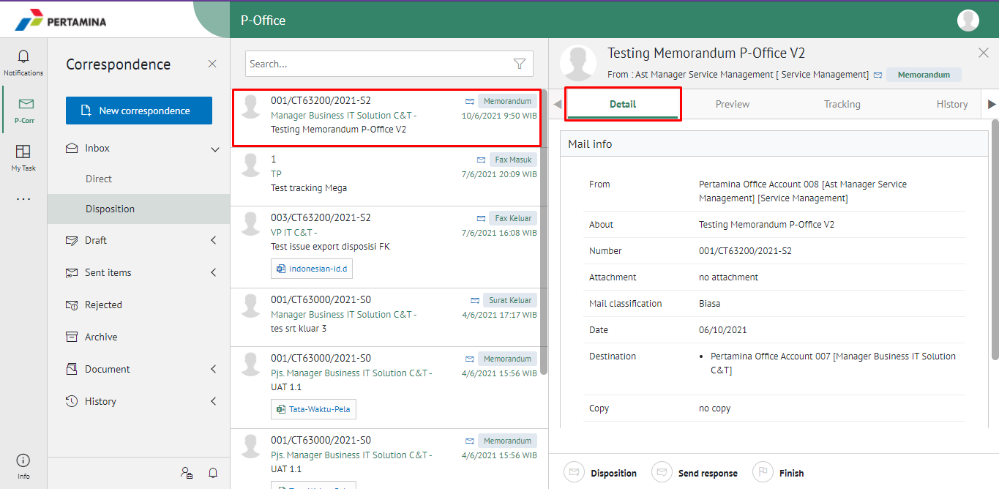

3. Klik tombol **Disposition**

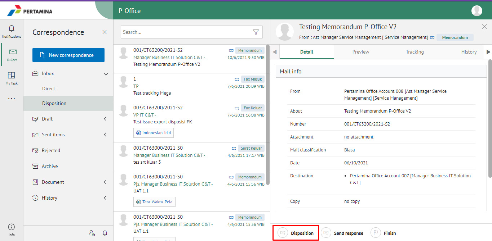

4. Sistem menampilkan form disposisi. Isikan informasi disposisi dan perintah untuk masing-masing penerima disposisi.

5. Klik **Save a draft** untuk menyimpan draft disposisi memorandum dan memorandum akan tersimpan di menu **"Draft - Memorandum"**. Klik **Send disposition** untuk mengirim disposisi ketujuan dan disposisi memorandum akan tersimpan di menu **"Sent Item - Disposisi"**.

## **E-Corr Versi Android dan iOS**

Langkah-langkah untuk mendisposisikan Memorandum adalah sebagai berikut :

**Disposisi melalui Menu Inbox**

1. Klik menu **Inbox** dan pilih label **Memorandum**

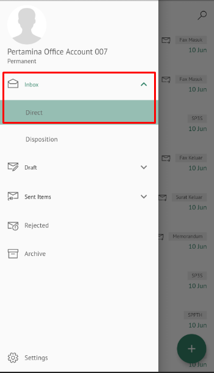 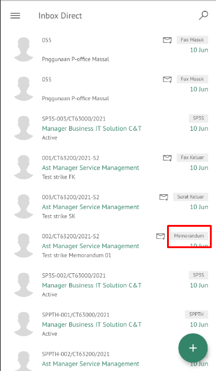

2. Pilih memorandum yang akan didisposisikan kemudian pilih icon **Option**

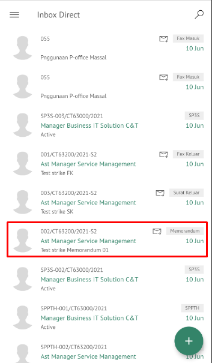 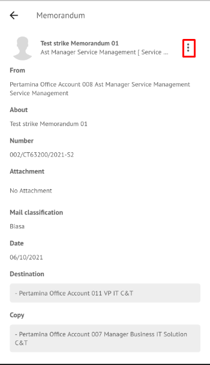

3. Klik tombol **Disposisi** kemudian sistem akan menampilkan form disposisi. Isikan informasi disposisi dan perintah untuk masing-masing penerima disposisi.

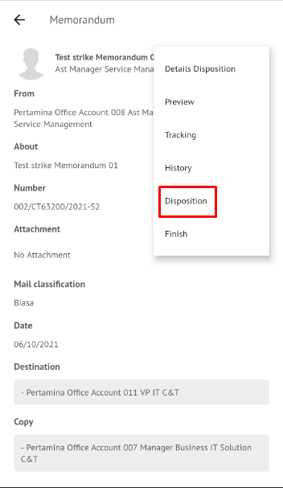 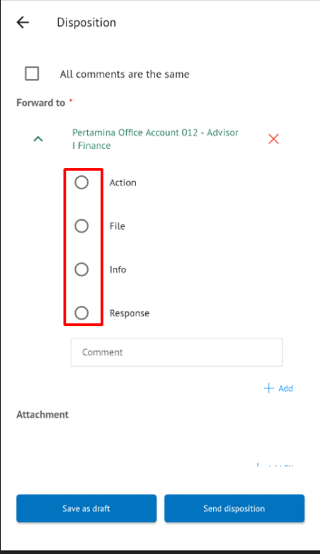

4. Klik **Save as draft** untuk menyimpan draft disposisi memorandum dan memorandum akan tersimpan di menu “**Draft – Memorandum**”. Klik **Send disposition** untuk mengirim disposisi ketujuan dan disposisi memorandum akan tersimpan di menu “**Sent Item – Disposisi**”.

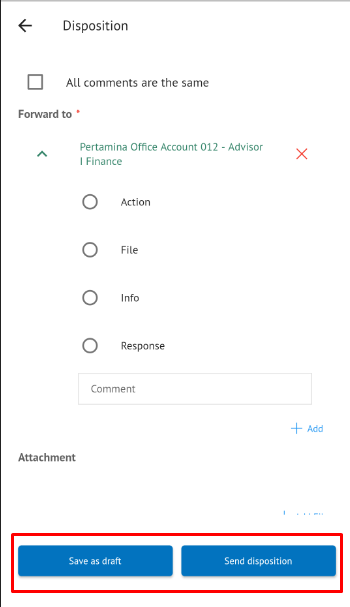
