**Role yang sesuai**

- _Member User_ (Pekerja)

_Member User_ dapat melakukan _drafting_ memorandum pada aplikasi E-Corr. _Drafting_ memorandum dilakukan jika _user_ akan meneruskan dan melakukan perubahan pada memorandum yang sudah disimpan pada menu **Draft**

## **E-Corr Versi Web**

Langkah-langkah untuk drafting memorandum via Web adalah sebagai berikut :

1. Klik menu **Draft** dan pilih label **Memorandum**

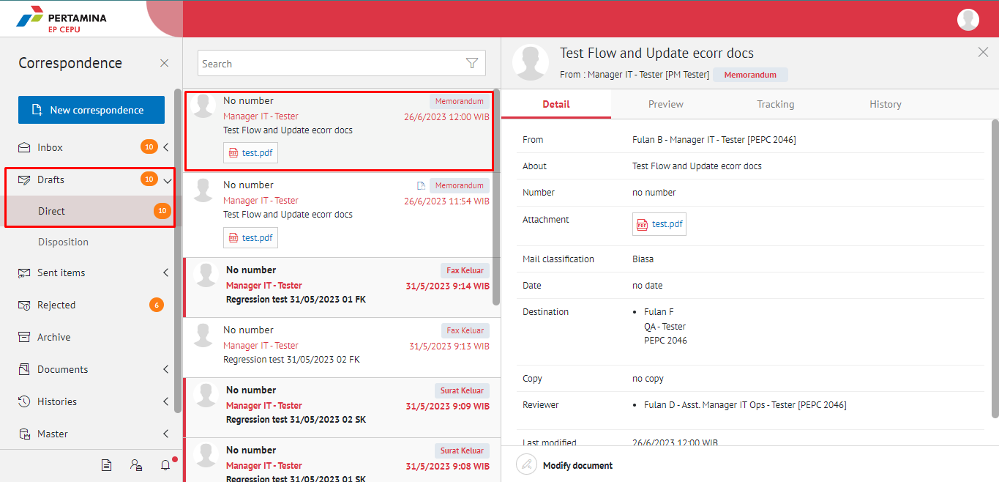

2. Pilih memorandum yang akan diubah. Pilih tab **Detail** kemudian klik **Modify document**

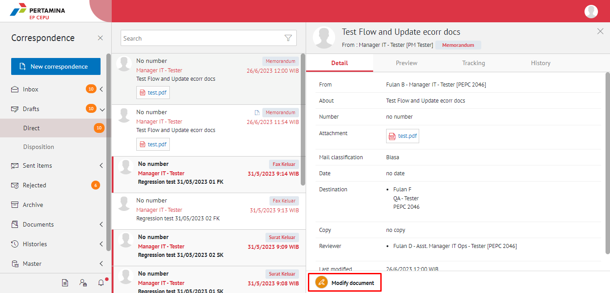

3. Sistem akan menampilkan _form_ **Edit Correspondence**

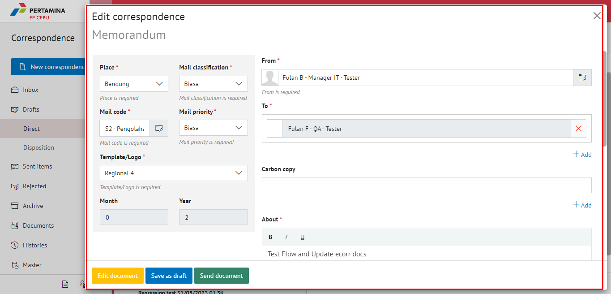

4. Lakukan perubahan pada _form_. Klik **Save as draft** untuk menyimpan perubahan pada _form_ memorandum. Surat yang disimpan akan tersimpan di menu **"Draft - Memorandum"**

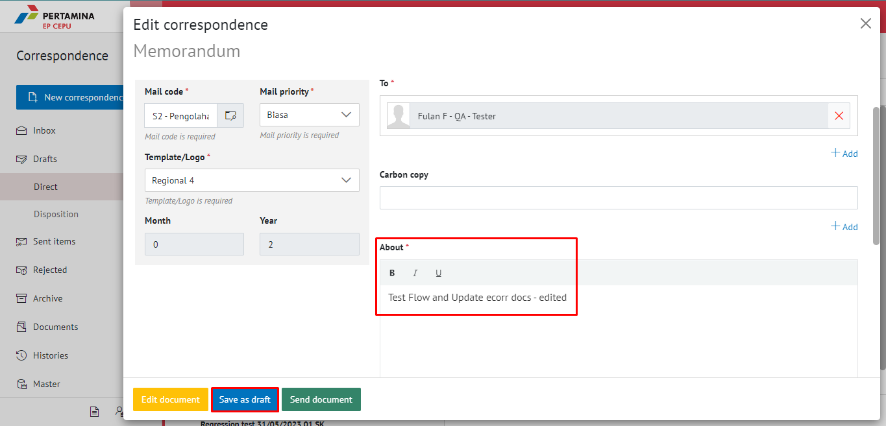

5. Klik **Edit document** untuk mengubah isi memorandum

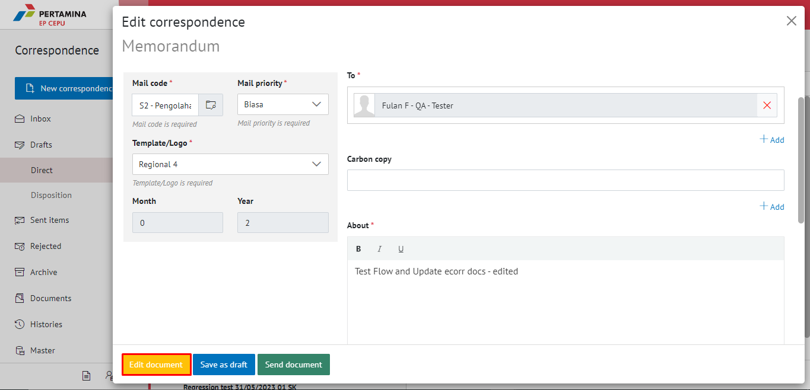

6. Sistem menampilkan tampilan _preview_ memorandum dalam bentuk Word.

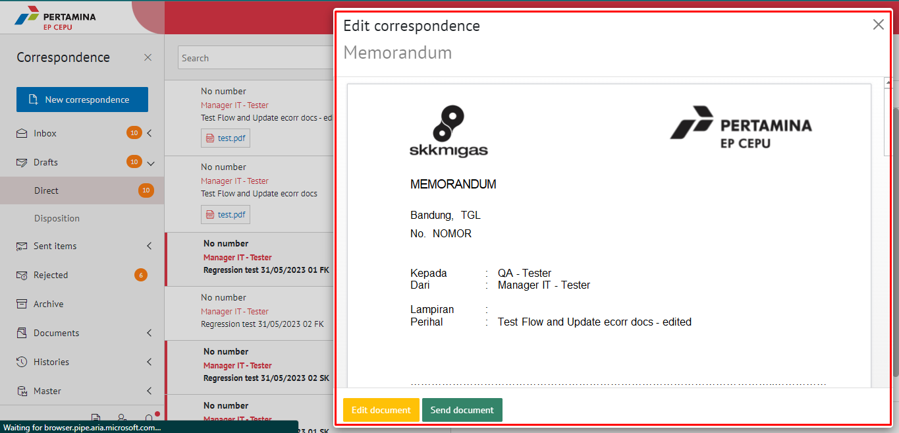

**[Edit] Word Desktop**

Langkah - langkah untuk mengubah isi memorandum melalui Word Desktop adalah sebagai berikut

1. Klik **Open in Desktop App** untuk mengubah melalui aplikasi Microsoft Word

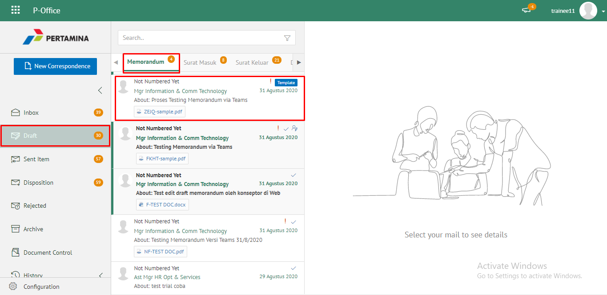

2. Lakukan perubahan pada isi surat. Klik **Close** pada aplikasi dan isi surat akan otomatis tersimpan

**[Edit] Ubah Online**

Langkah - langkah untuk mengubah isi memorandum secara online adalah sebagai berikut

1. Ketika Klik _button_ **Edit online** maka secara otomatis akan membuka dokumen dan bisa mengubah isi surat secara _online_

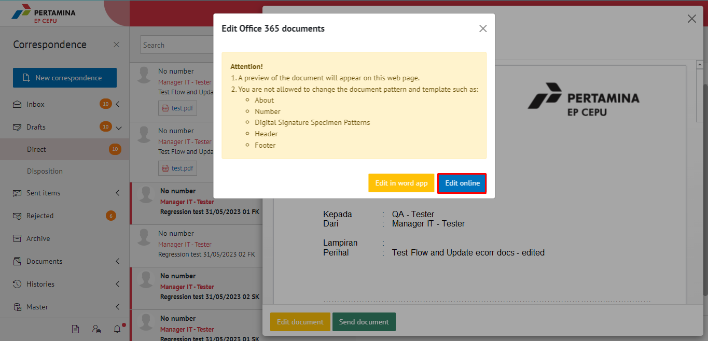

2. Lakukan perubahan pada isi surat

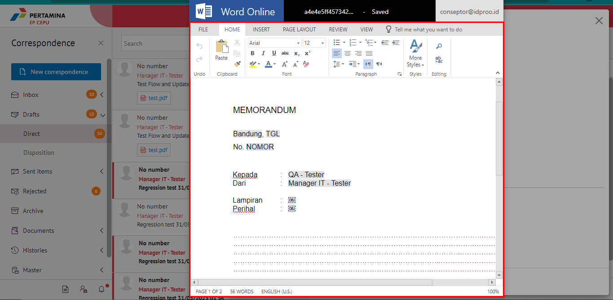

3. Isi surat akan otomatis tersimpan. Jika surat akan disimpan sebagai draft, maka klik **Yes**

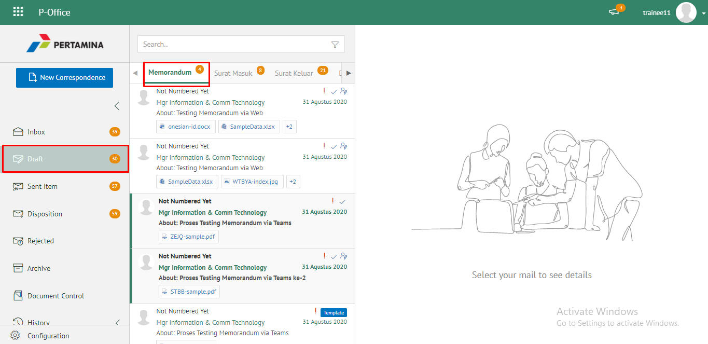

4. Surat yang sudah selesai diubah maka akan tersimpan di menu **"Draft - Memorandum"**

## **E-Corr Versi Android dan iOS**

Langkah-langkah untuk drafting memorandum via Android dan iOS adalah sebagai berikut :

1. Klik menu **Draft** dan pilih label **Memorandum**

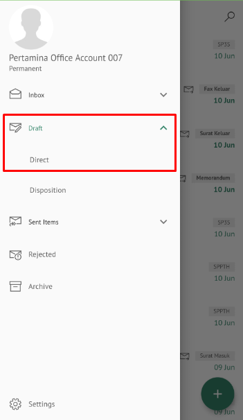 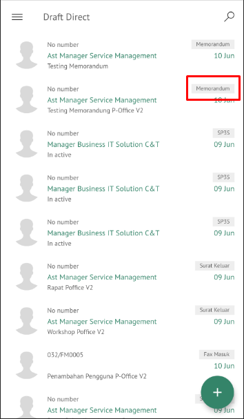

2. Pilih memorandum yang akan diubah. Pilih icon **Option** kemudian klik **Edit**

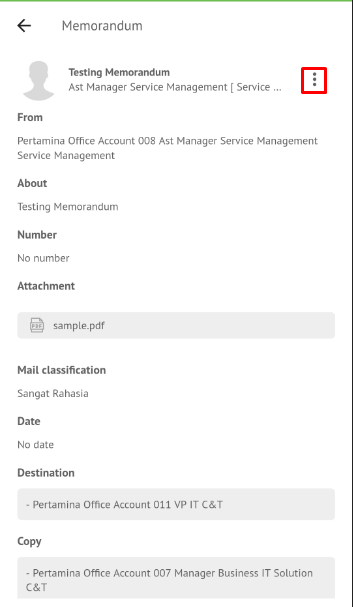
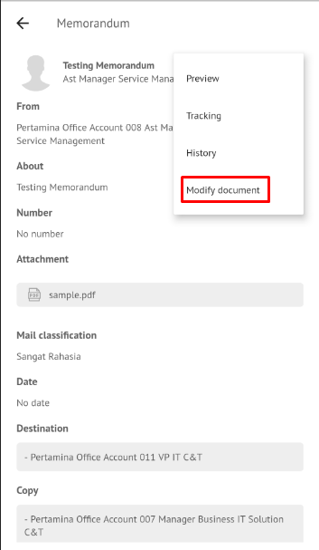

3. Lakukan perubahan pada _form_ lalu klik **Next** sampai **Save** kemudian pilih **Save Mail** untuk menyimpan perubahan pada _form_ memorandum. Surat yang disimpan akan tersimpan di menu “**Draft – Memorandum”**

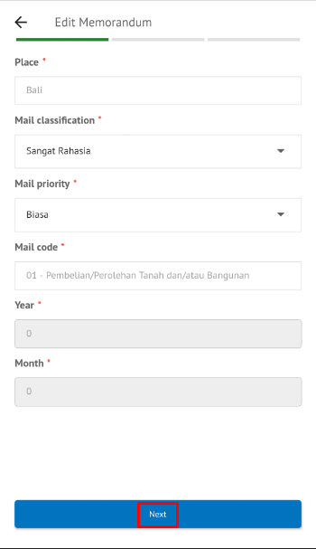 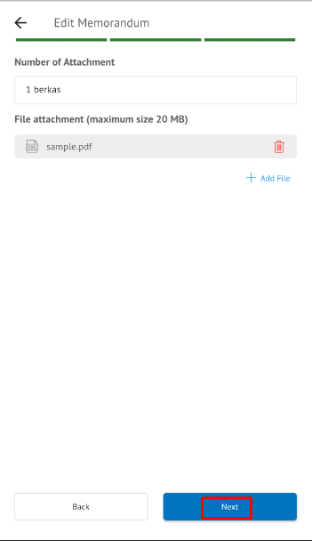
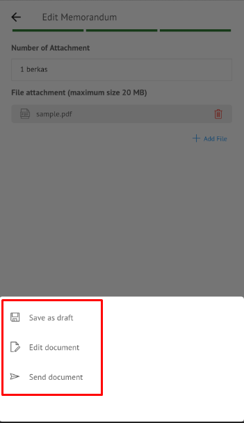

3. Klik **Edit document** untuk mengubah isi memorandum

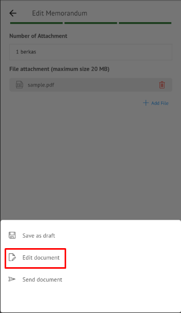

4. Sistem menampilkan tampilan _preview_ memorandum dalam bentuk Word yang dapat di edit. Untuk melakukan _editing_ terhadap isi surat klik **Edit/Send** kemudian sistem akan menampilkan _pop up_ konfirmasi **Word Online**

**[Edit] Ubah Online**

Langkah – langkah untuk mengubah isi memorandum secara _online_ adalah sebagai berikut.

1.    Klik **Edit Content** untuk mengubah isi surat secara _online_

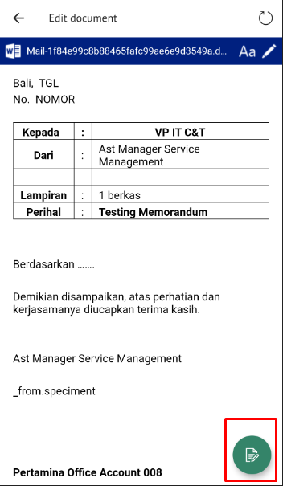

2. Lakukan perubahan pada isi surat.sistem akan menampilkan pop up E-Corr Editing Document pilih **Yes**

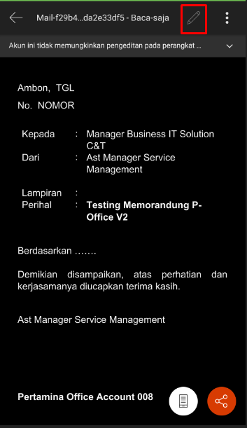 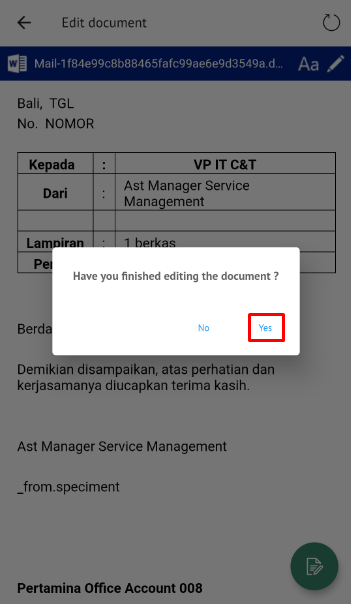

3. Isi surat akan otomatis tersimpan. Jika surat akan disimpan sebagai draft, maka klik **Close**.

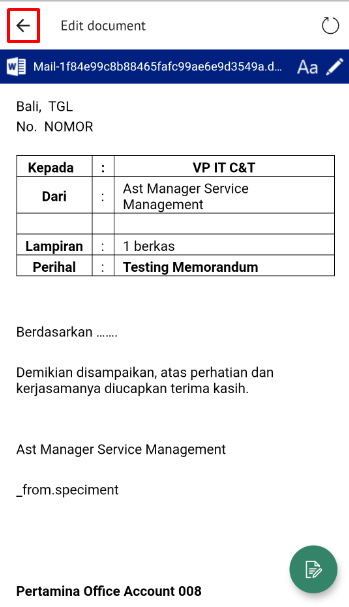

4. Surat yang sudah selesai diubah maka akan tersimpan di menu “**Draft – Memorandum”**

**Kirim Memorandum**

Langkah – langkah untuk mengirim memorandum adalah sebagai berikut.

1. Pada tampilan _preview_ memorandum, klik **Send document** untuk mengirim surat ke pejabat tujuan

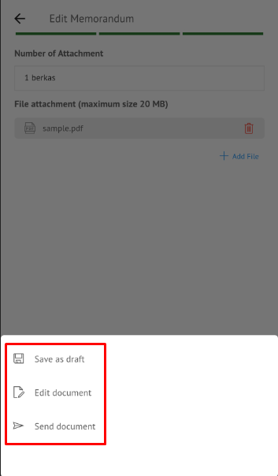

2. Sistem menyimpan perubahan dan memorandum akan tersimpan di menu “**Sent Item - Memorandum**”

