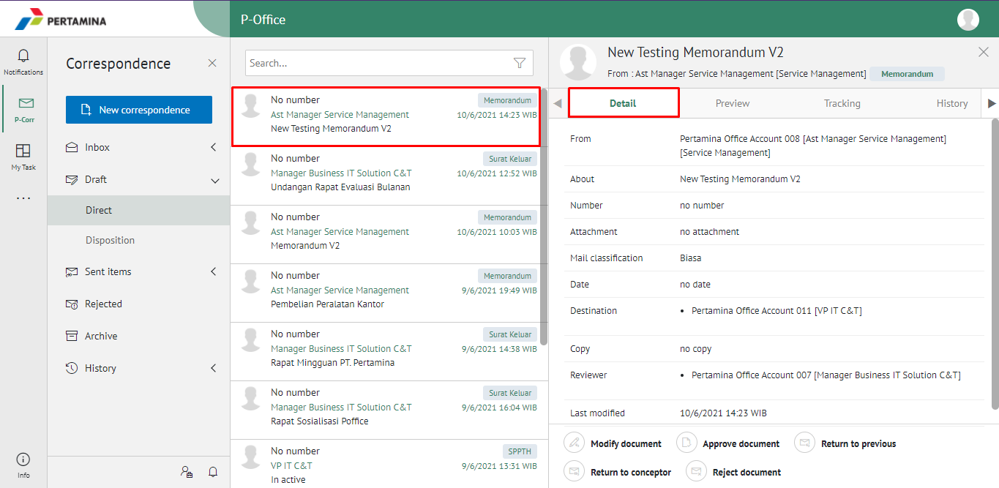
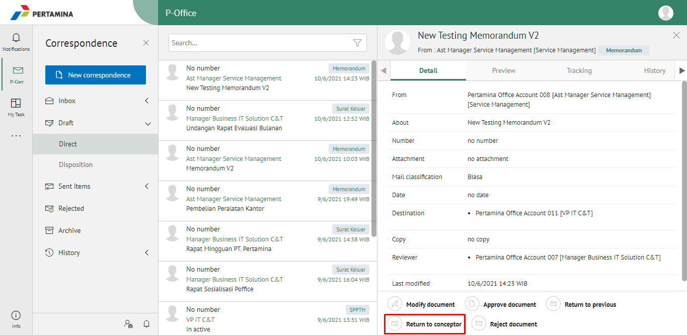
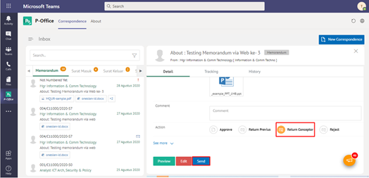
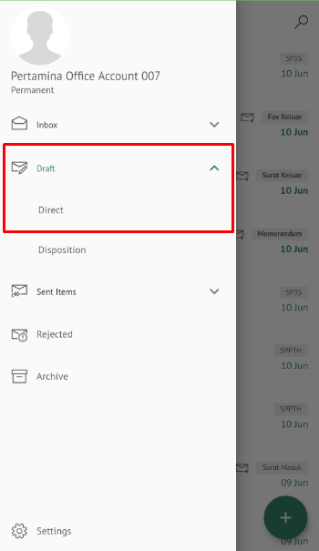
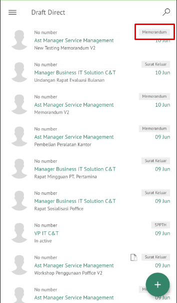
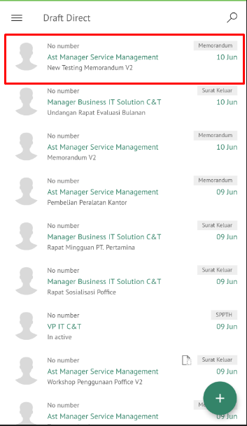
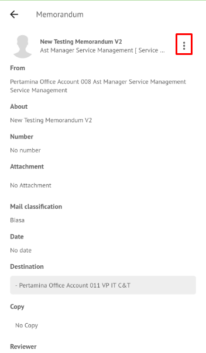
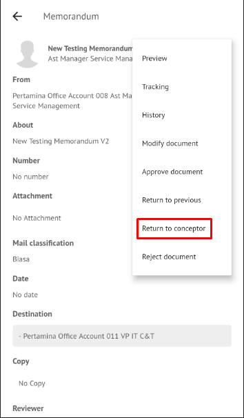
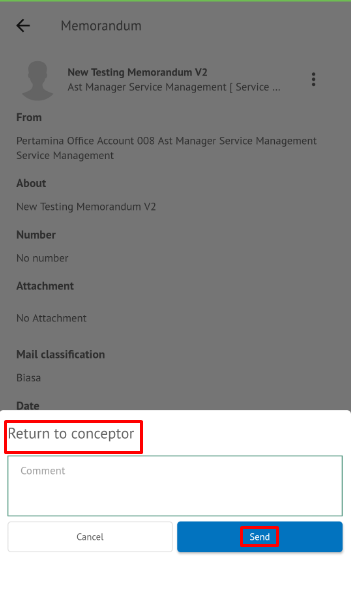

**Role yang sesuai**

- _Approver User_
- _Reviewer User_

User dapat mengembalikan memorandum ke konseptor jika hasil review belum/tidak sesuai.

## **P-Office Versi Web**

Langkah - langkah untuk mengembalikan memorandum ke konseptor via Web adalah sebagai berikut :

1. Klik menu **Draft** dan pilih label **Memorandum**

2. Pilih memorandum yang akan ditindak lanjuti kemudian pilih tab **Detail**

3. Klik tombol **Return Conceptor** dan pilih **Send**. Isikan komentar jika diperlukan

4. Sistem berhasil menyimpan perubahan. Memorandum yang sudah di kirim akan tersimpan di menu **Sent Item - Memorandum** dan konseptor akan menerima memorandum di menu **Rejected - Memorandum**

## **P-Office Versi Teams**

Langkah-langkah untuk mengembalikan Memorandum ke konseptor via Teams adalah sebagai berikut :

1. Klik menu **Inbox** dan pilih label **Memorandum**

2. Pilih memorandum yang akan ditindak lanjuti kemudian pilih tab **Detail**

3. Klik tombol **Return Conceptor** dan pilih **Send**. Isikan komentar jika diperlukan

4. Sistem berhasil menyimpan perubahan. Memorandum yang sudah di kirim akan tersimpan di menu **Sent Item - Memorandum** dan penerima pengembalian memorandum akan menerima memorandum di menu **Rejected - Memorandum**

## **P-Office Versi Android dan iOS**

Langkah-langkah untuk mengembalikan Memorandum ke konseptor via Android dan iOS adalah sebagai berikut :

1. Klik menu **Draft** dan pilih label **Memorandum**

 

2. Pilih memorandum yang akan ditindak lanjuti kemudian pilih icon **Option**

 

3. Klik tombol **Revise to Conceptor** dan pilih **Send** Isikan komentar jika diperlukan

 

4. Sistem berhasil menyimpan perubahan. Memorandum yang sudah di kirim akan tersimpan di menu **Sent Item - Memorandum** dan konseptor akan menerima memorandum di menu **Rejected – Memorandum**
