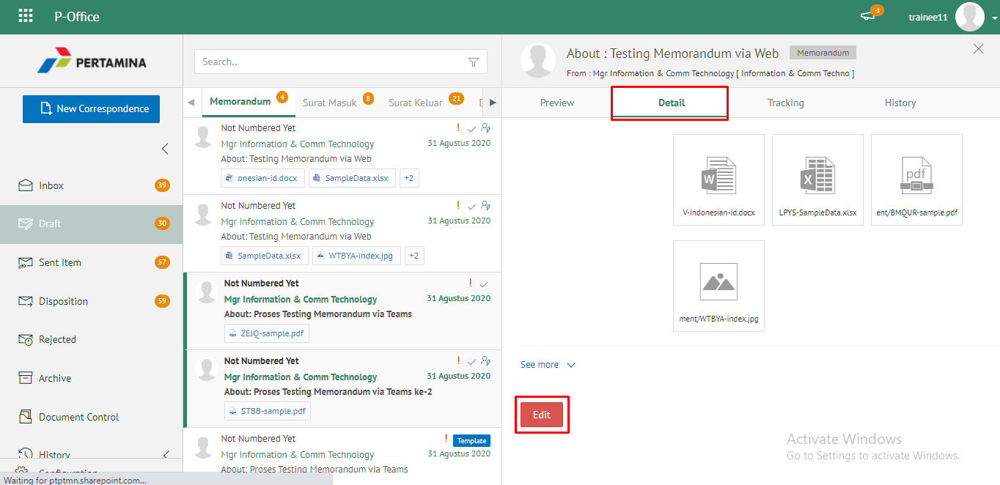
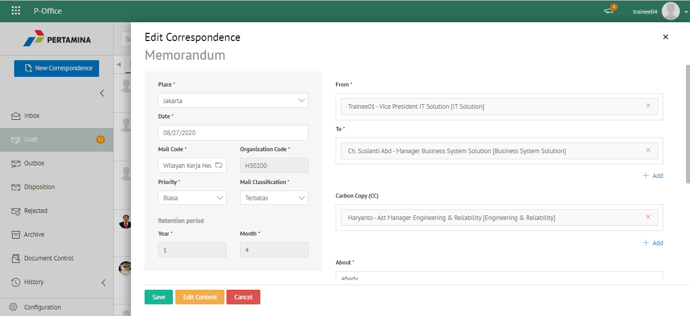
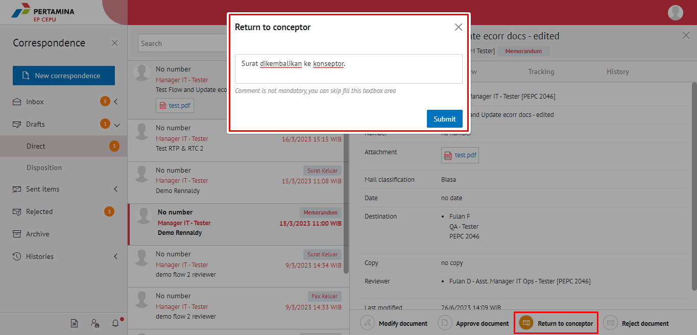

**Role yang sesuai**

- _Approver User_
- _Reviewer User_

User dapat mengembalikan memorandum ke konseptor jika hasil review belum/tidak sesuai.

## **E-Corr Versi Web**

Langkah - langkah untuk mengembalikan memorandum ke konseptor via Web adalah sebagai berikut :

1. Klik menu **Draft** dan pilih label **Memorandum**

2. Pilih memorandum yang akan ditindak lanjuti kemudian pilih tab **Detail**

3. Klik tombol **Return Conceptor** dan pilih **Submit**. Isikan komentar jika diperlukan

4. Sistem berhasil menyimpan perubahan. Memorandum yang sudah di kirim akan tersimpan di menu **Sent Item - Memorandum** dan konseptor akan menerima memorandum di menu **Rejected - Memorandum**

