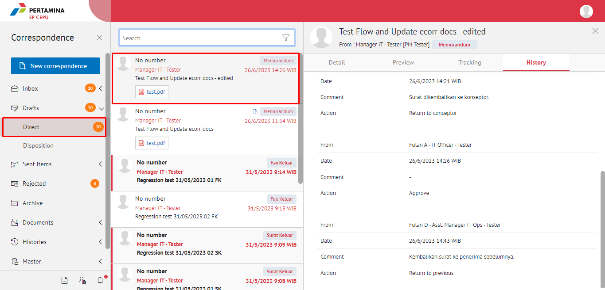

Role yang sesuai

- _Approver User_
- _Reviewer User_

_User_ dapat mengembalikan memorandum ke sebelumnya jika hasil review belum / tidak sesuai. Surat akan dikembalikan ke satu level _reviewer_ sebelumnya atau ke konseptor (apabila hanya ada satu _reviewer_).

## **E-Corr Versi Web**

Langkah-langkah untuk mengembalikan memorandum ke sebelumnya via Web adalah sebagai berikut :

1. Klik menu **Draft** lalu klik **Direct** dan pilih surat yang berlabel **Memorandum**

2. Pilih memorandum yang akan ditindak lanjuti kemudian pilih **Detail**

3. Klik tombol **Return Previous** dan pilih **Submit**. Isikan komentar jika diperlukan

4. Sistem berhasil menyimpan perubahan. Memorandum yang sudah di kirim akan tersimpan di menu **Sent Item - Direct** dan penerima pengembalian memorandum akan menerima memorandum di menu **Draft - Direct**

## **E-Corr Versi Android & IOS**

Langkah-langkah untuk mengembalikan memorandum ke sebelumnya via Android adalah sebagai berikut :

1. Klik menu **Draft** dan pilih label **Memorandum**

 

2. Pilih memorandum yang akan ditindak lanjuti.

3. Klik tombol **Edit** -- **Returent to Previous** dan pilih **Send**. Isikan komentar jika diperlukan

4. Sistem berhasil menyimpan perubahan. Memorandum yang sudah di kirim akan tersimpan di menu **Sent Item- Direct** dan penerima pengembalian memorandum akan menerima memorandum di menu **Rejected - dan berlabel memorandum**
