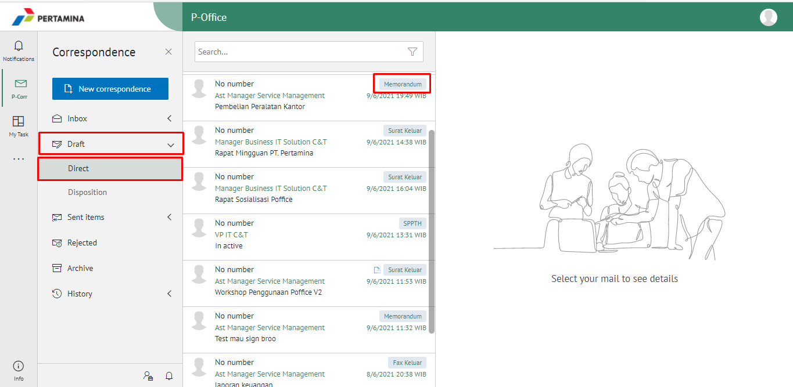
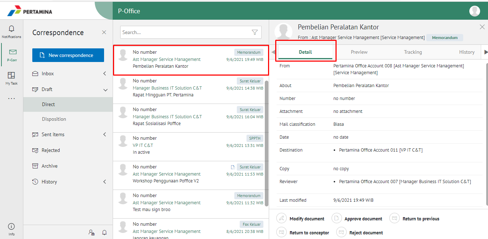
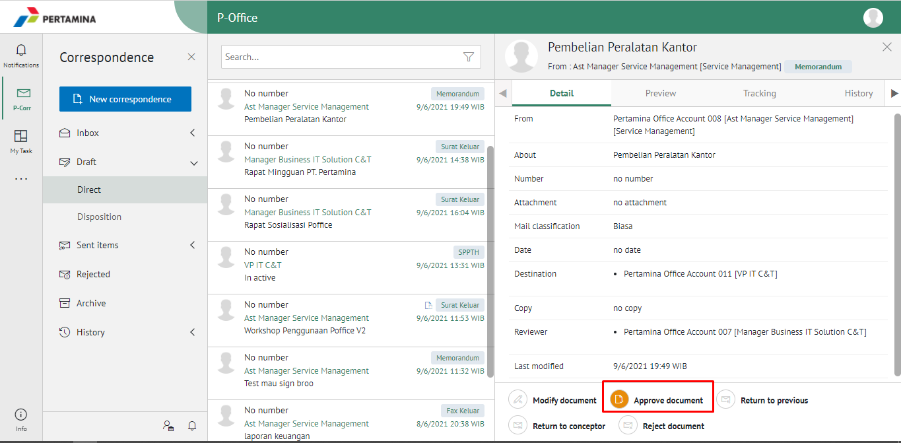
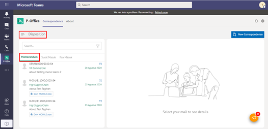
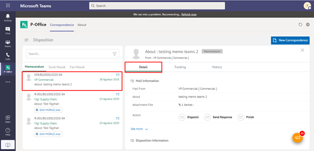
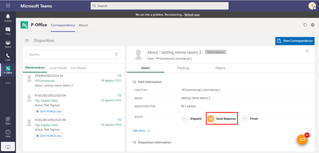
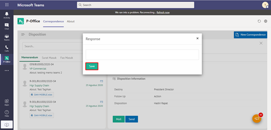
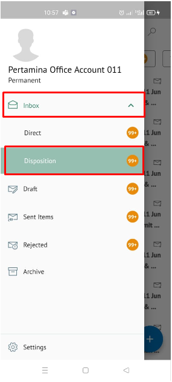
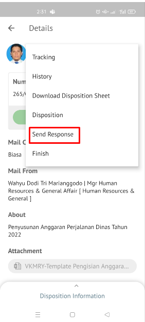
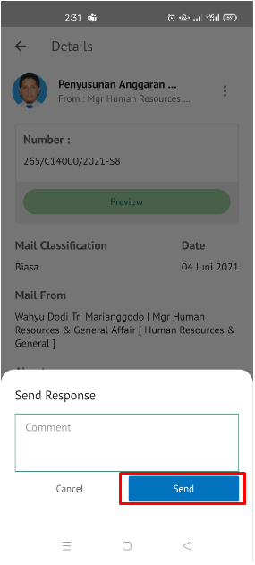

**Role yang sesuai**

- *Reviewer User*
- *Member User* (Pekerja)
- Sekretaris

*User* dapat mengirim tanggapan disposisi memorandum yang ditujukan untuk pejabat pengirim disposisi. Langkah-langkah untuk mengirim tanggapan disposisi memorandum adalah sebagai berikut

## **E-Corr Versi Web**

Langkah-langkah untuk mengirim tangnggapan disposisi memorandum via Web adalah sebagai berikut :

1. Klik menu **Draft** lalu pilih **Direct** dan pilih surat yang berlabel **Memorandum**

2. Pilih memorandum yang akan diselesaikan kemudian pilih tab **Detail**

1. Pilih tombol **Approve Document**

1. Sistem menampilkan pop up konfirmasi dan user harus mengisi keterangan kirim tanggapan disposisi kemudian klik **Sumbit**.

5. Sistem menyimpan perubahan dan informasi tanggapan disposisi akan tersimpan di detail disposisi.

## **E-Corr Versi Teams**

Langkah-langkah untuk mengirim tangnggapan disposisi memorandum via Teams adalah sebagai berikut :

1. Klik menu **Disposition** dan pilih tab **Memorandum**

2. Pilih memorandum yang akan diselesaikan kemudian pilih tab **Detail**

3. Pilih tombol **Send Response** kemudian klik **Send**

4. Sistem menampilkan pop up konfirmasi dan user harus mengisi keterangan kirim tanggapan disposisi kemudian klik **Save**.

5. Sistem menyimpan perubahan dan informasi tanggapan disposisi akan tersimpan di detail disposisi.

## **E-Corr Versi Android & IOS**

Langkah-langkah untuk Mengirim tanggapan disposisi memorandum via Teams adalah sebagai berikut :

1. Klik menu **Inbox** dan pilih tab **Disposition**

2. Pilih memorandum yang akan diselesaikan kemudian pilih icon **Option**

 

3. Pilih **Send Response** kemudian Sistem menampilkan pop up konfirmasi dan _user_ harus mengisi keterangan kirim tanggapan disposisi kemudian klik **Send**.

 

4. Sistem menyimpan perubahan dan informasi tanggapan disposisi akan tersimpan di detail disposisi.
