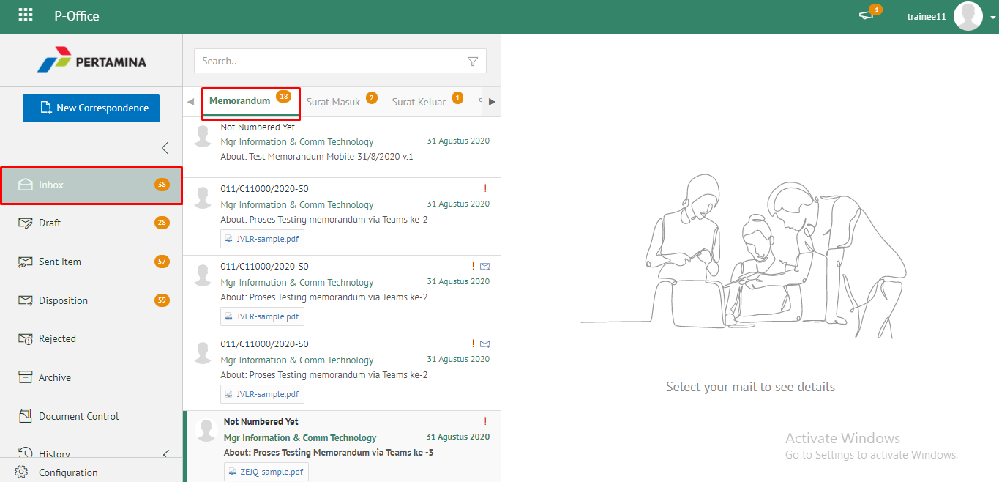
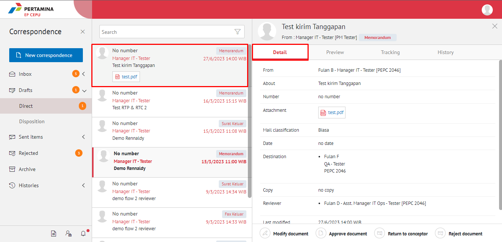
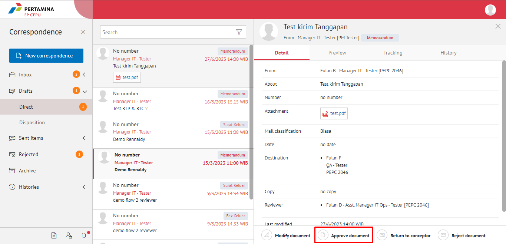
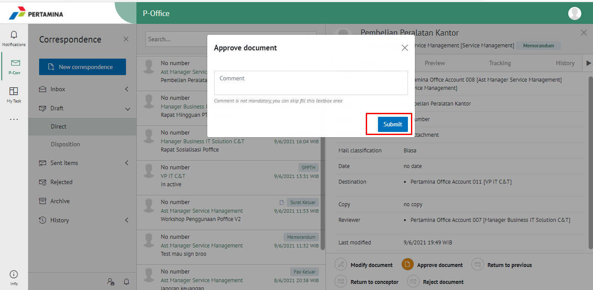

**Role yang sesuai**

- *Reviewer User*
- *Member User* (Pekerja)
- Sekretaris

*User* dapat mengirim tanggapan disposisi memorandum yang ditujukan untuk pejabat pengirim disposisi. Langkah-langkah untuk mengirim tanggapan disposisi memorandum adalah sebagai berikut

## **E-Corr Versi Web**

Langkah-langkah untuk mengirim tangnggapan disposisi memorandum via Web adalah sebagai berikut :

1. Klik menu **Draft** lalu pilih **Direct** dan pilih surat yang berlabel **Memorandum**

2. Pilih memorandum yang akan diselesaikan kemudian pilih tab **Detail**

3. Pilih tombol **Approve Document**

4. Sistem menampilkan pop up konfirmasi dan user harus mengisi keterangan kirim tanggapan disposisi kemudian klik **Sumbit**.

5. Sistem menyimpan perubahan dan informasi tanggapan disposisi akan tersimpan di detail disposisi.

