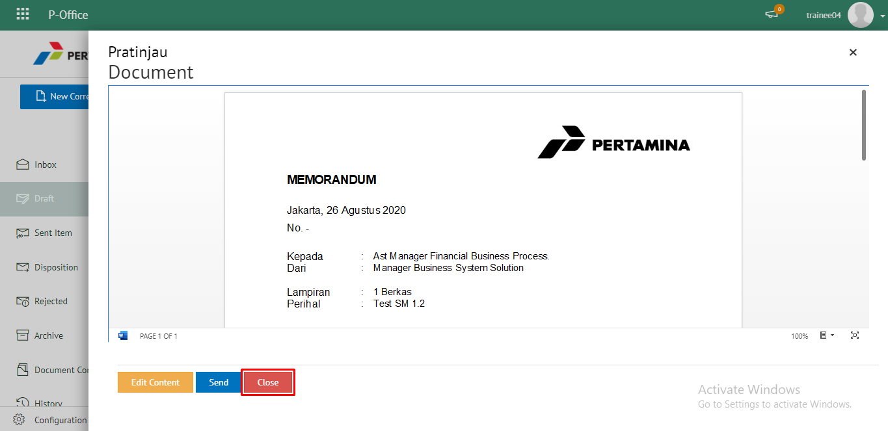
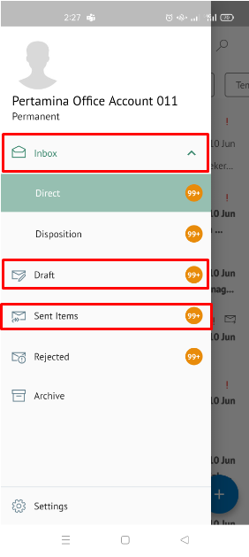
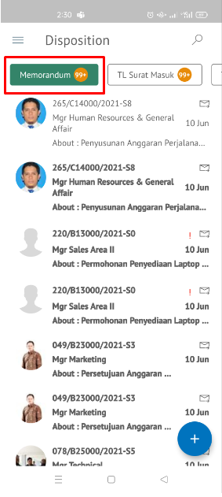

**Role yang sesuai**

- *Approver User*
- *Reviewer User*
- *Member User* (Pekerja)

*User* dapat melihat daftar memorandum pada pada menu **Inbox, Draft atau Sent Item** pada masing - masing akun. 

## **E-Corr Versi Web**

langkah untuk melihat daftar memorandum via Web adalah sebagai berikut

1. Klik menu **Inbox / Draft / Sent Item** dan pilih surat yang berlabel **Memorandum**

## **E-Corr Versi Android & IOS**

Langkah-langkah untuk melihat daftar memorandum via Android adalah sebagai berikut :

1. Klik menu **Inbox/Draft/Sent Items** dan pilih tab **Memorandum**

 
 

