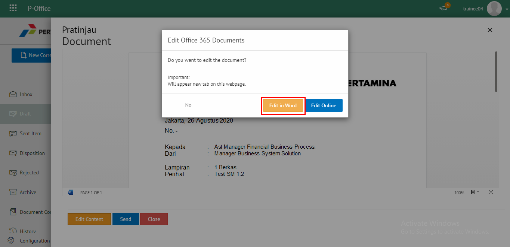
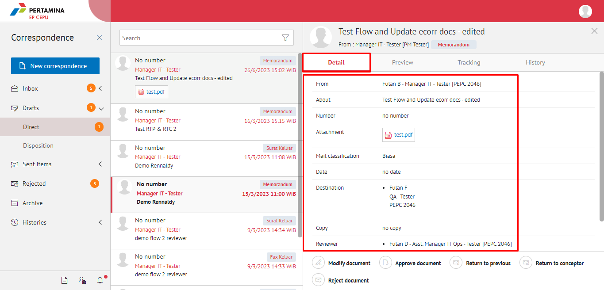
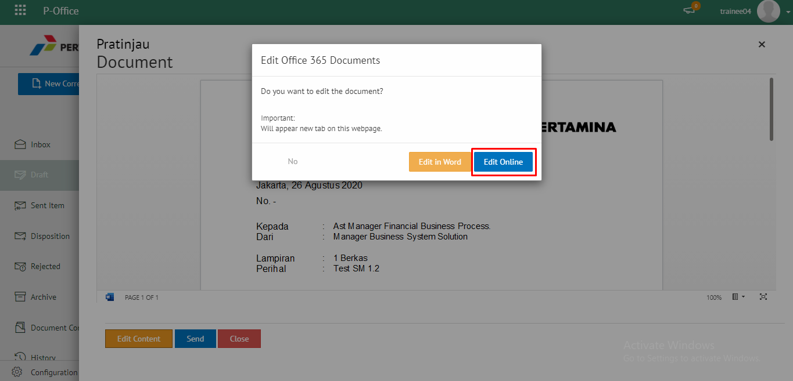
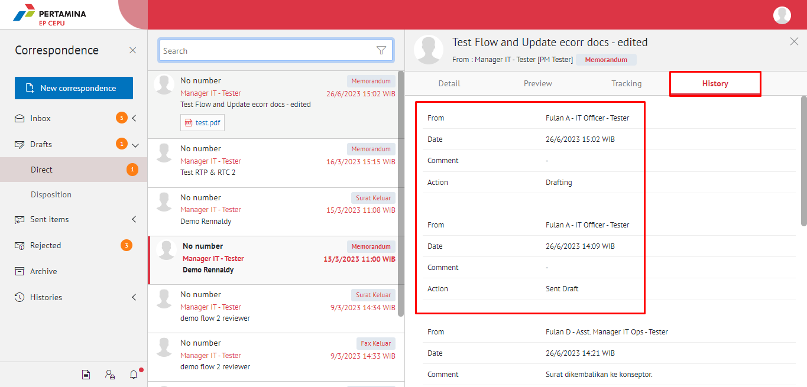

**Role yang sesuai**

- *Approver User*
- *Reviewer User*
- *Member User* (Pekerja)

_User_ dapat melihat informasi lengkap memorandum termasuk *preview* memorandum, detail memorandum, *tracking* memorandum dan *history* memorandum. 

## **E-Corr Versi Web**

Langkah - langkah untuk melihat informasi memorandum via Web adalah sebagai berikut

1. Klik menu **Inbox/Draft/Sent Item** lalu pilih **Direct**. Pilih salah satu memorandum yang akan dilihat informasinya

#### Preview Memorandum

Pada tab **Preview**, ditampilkan *preview* memorandum yang sudah dibuat. *Preview* memorandum disesuaikan dengan template berdasarkan jenis surat

#### Detail Memorandum

Pada tab **Detail**, terdapat informasi asal surat, perihal, file lampiran, nomor surat, klasifikasi surat, tanggal surat, tujuan surat dan *reviewer*

#### Tracking Memorandum

Pada tab Tracking, ditampilkan informasi *tracking* memorandum dalam bentuk *chart*

#### History Memorandum

Pada tab **History**, ditampilkan riwayat memorandum yang terdapat informasi jabatan, tanggal, tindakan dan komentar

