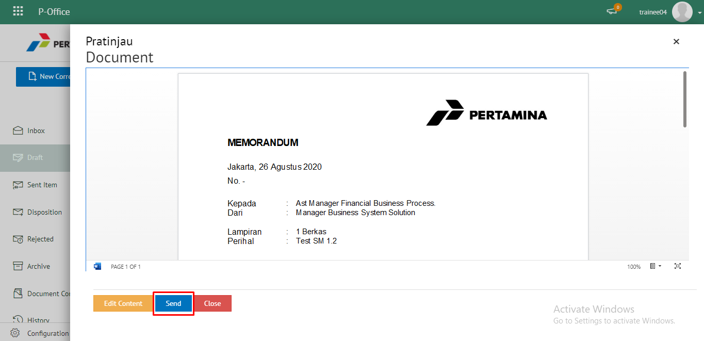
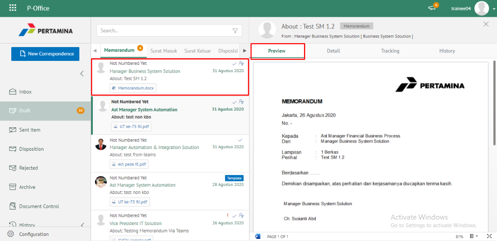
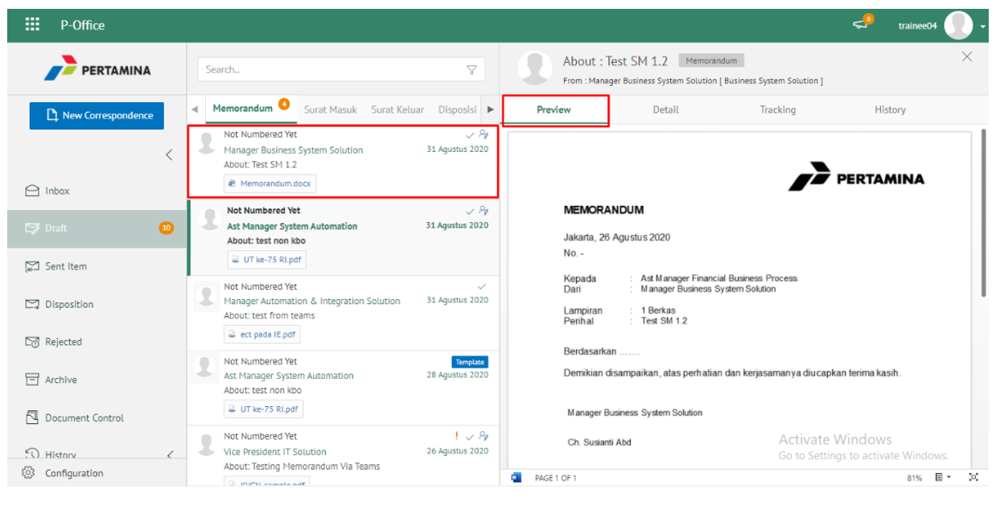
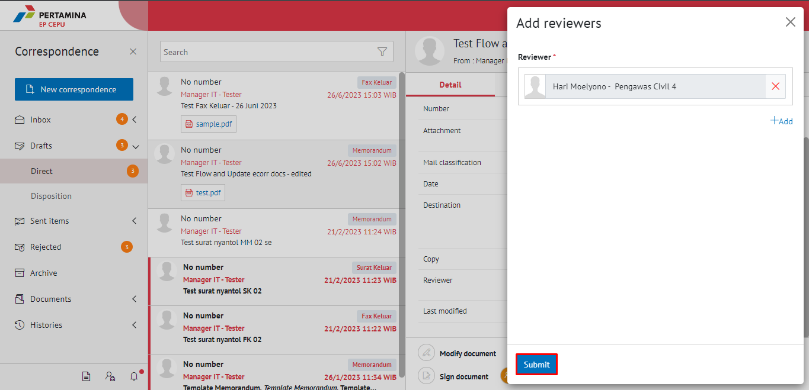

**Role yang sesuai**

- *Approver User*

*Approver User* dapat menambahkan reviewer kemudian memorandum akan diteruskan ke reviewer baru.

## **E-Corr Versi Web**

Langkah - langkah untuk menambah reviewer memorandum vvia Web adalah sebagai berikut :

1. Klik menu **Draft** dan pilih **Direct**

2. Pilih memorandum yang akan ditindak lanjuti kemudian pilih tab **Detail**

1. Apabila ingin menambahkan Reviewer tambahan, maka pada bagian Footer pada Tab **Detail**

4. Pilih field **Add Reviewers** untuk menambahkan reviewer baru, selanjutnya klik **+Add** dan Sistem akan menampilkan pejabat untuk dijadikan reviewer baru

5. Pilih **Submit** untuk mengirimkan kepada pejabat/reviewer yang dituju dan memorandum akan tersimpan di menu **"Sent Item - Direct - Memorandum"**. Untuk pejabat/reviewer baru akan menerima memorandum di menu **"Inbox - Memorandum"**

