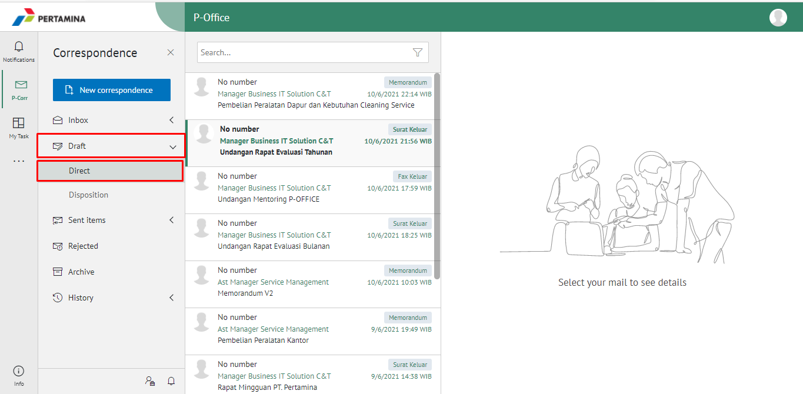
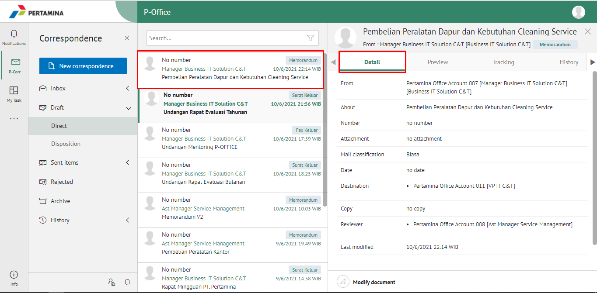
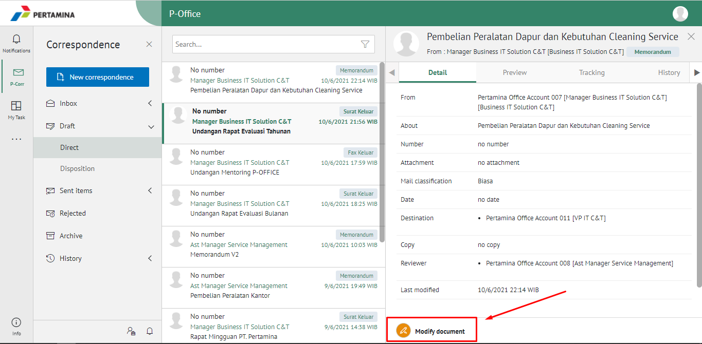
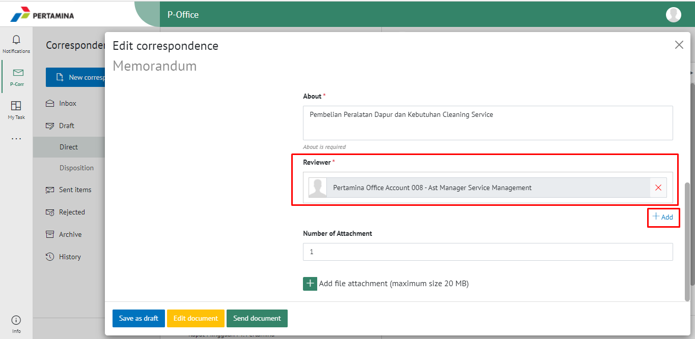
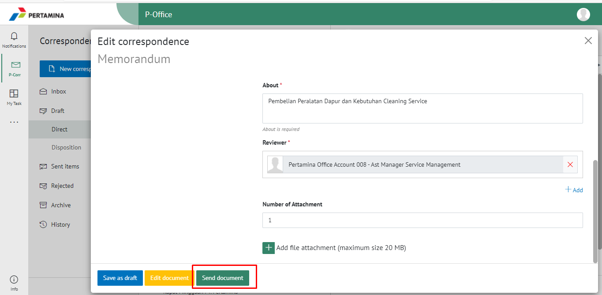
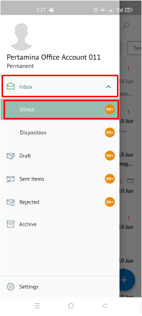
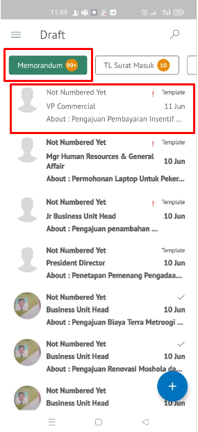
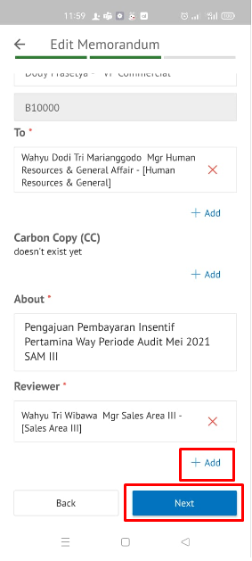

**Role yang sesuai**

- *Approver User*

*Approver User* dapat menambahkan reviewer kemudian memorandum akan diteruskan ke reviewer baru.

## **E-Corr Versi Web**

Langkah - langkah untuk menambah reviewer memorandum vvia Web adalah sebagai berikut :

1. Klik menu **Inbox** dan pilih **Direct**

2. Pilih memorandum yang akan ditindak lanjuti kemudian pilih tab **Detail**

1. Klik Button **Modify Document**

4. Scrool kebawah untuk melihat **Reviewer** lalu klik Button **+Add** Sistem akan menampilkan pejabat untuk dijadikan reviewer baru

5. Pilih **Send Documnet** untuk mengirimkan kepada pejabat/reviewer yang dituju dan memorandum akan tersimpan di menu **"Sent Item - Direct - Memorandum"**. Untuk pejabat/reviewer baru akan menerima memorandum di menu **"Inbox - Memorandum"**

## **E-Corr Versi Android & IOS**

Berikut ini video yang menjelaskan langkah - langkah untuk Menambahkan Reviewer baru **via Mobile**

1. Klik menu **Draft** dan pilih tab **Direct**

 

2. Pilih memorandum yang akan ditindak lanjuti kemudian pilih ikon **titik tiga** lalu pilih **Use Template**

 

2. Klik tombol **Add Reviewer** dan pilih pejabat yang akan melakukan review dengan meng-klik **Add Reviewer**

 

3. Sistem akan menampilkan pejabat untuk dijadikan reviewer baru lalu Pilih **Sumbit** untuk mengirimkan kepada pejabat/reviewer yang dituju dan memorandum akan tersimpan di menu “**Sent Item - Memorandum**”. Untuk pejabat/reviewer baru akan menerima memorandum di menu “**Inbox – Memorandum**”
