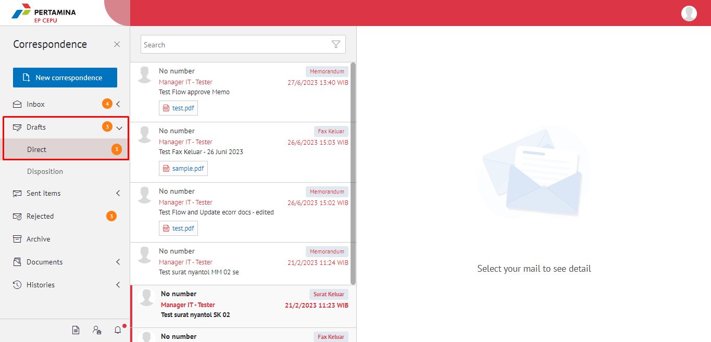
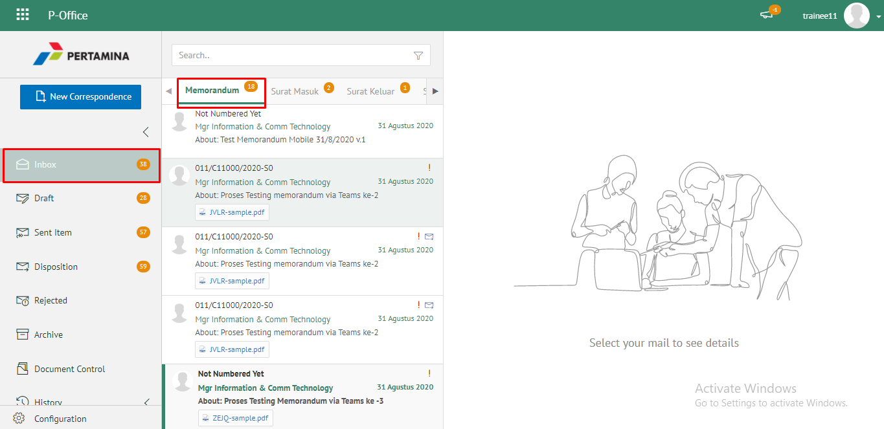
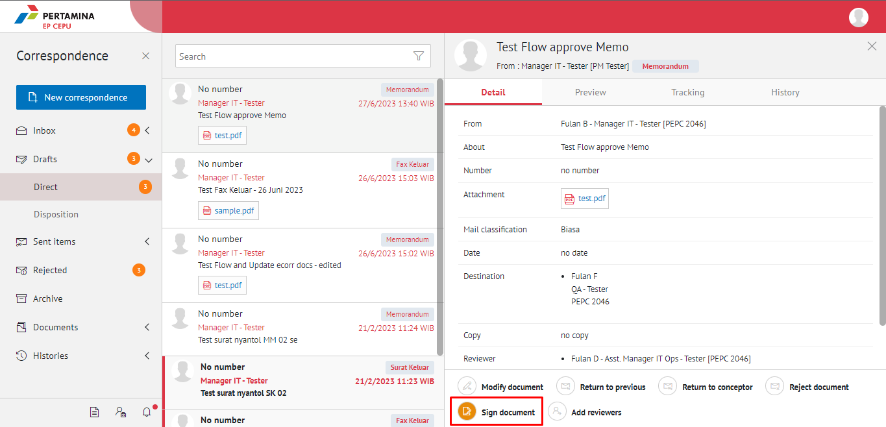
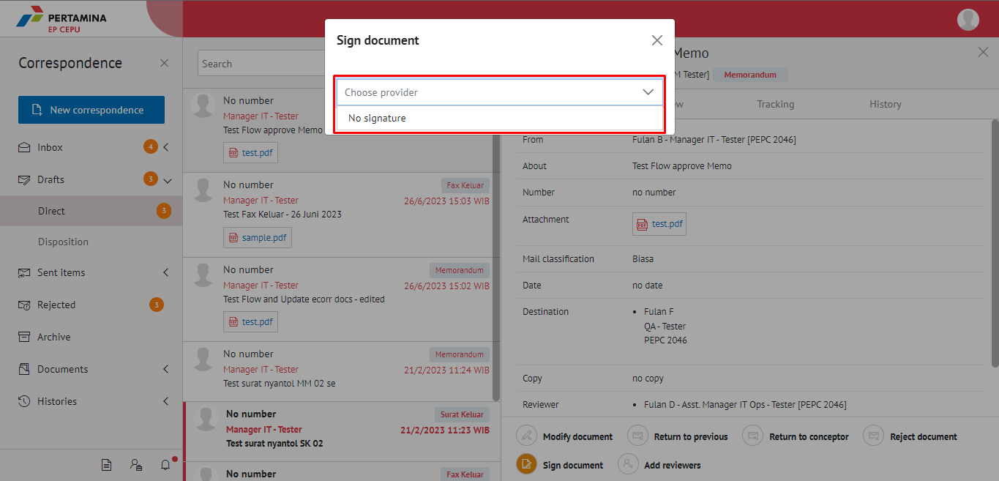
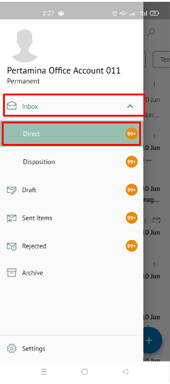
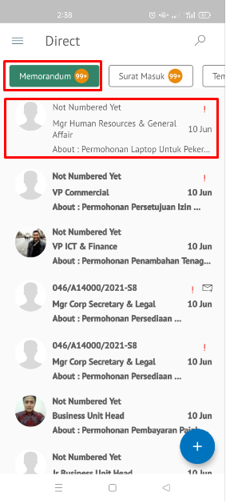
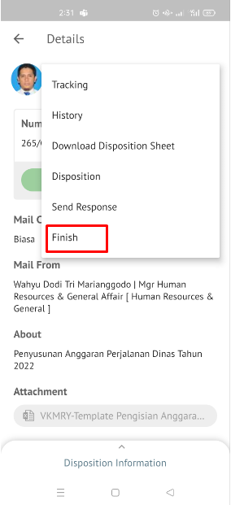

**Role yang sesuai**

- *Approver User*

*Approver User* dapat mengesahkan memorandum yang sudah dikirim dan direview oleh reviewer. Keluaran untuk tindak lanjut ini adalah untuk men-*generate* nomor memorandum kemudian memorandum dapat dikirimkan ke pejabat tujuan. 

## **E-Corr Versi Web**

Berikut langkah - langkah approver untuk mengesahkan memorandum **via Web**. Setelah memorandum disetujui dan disahkan maka nomor memorandum akan tergenerate secara otomatis

1. Klik menu **Draft** lalu pilih  **Direct**

1. Pilih memorandum yang akan ditindak lanjuti kemudian pilih tab **Detail**.

3. Klik **Sign Document** kemudian muncul popup dengan pilihan *No Signature* atau **P-Sign** dan klik **Submit**

 

4. Sistem menyimpan perubahan dan nomor memorandum akan ter-*generate* sesuai dengan nomor sementara pada detail. Memorandum yang sudah disetujui akan tersimpan di menu **"Sent Item - Direct"** pengirim sedangkan memorandum akan tersimpan di menu **"Inbox - Direct - pilih yang berlabel Memorandum"** pada penerima.
   

## **E-Corr Versi Android & IOS**

Berikut ini langkah - langkah approver untuk mengesahkan memorandum **via Mobile**. Setelah memorandum disetujui dan disahkan maka nomor memorandum akan tergenerate secara otomatis

1. Klik menu **Inbox**dan pilih tab **Direct**

2. Pilih memorandum yang akan ditindak lanjuti kemudian Pada detail pilih icon **titik Tiga** dan pilih **Finish** nomor surat akan ter-_generate_ jika _user_ menyetujui memorandum.

 

3. Memorandum yang sudah diselesaikan akan tersimpan di menu “**Sent Item - Memorandum**” pengirim sedangkan memorandum akan tersimpan di menu “**Inbox - Direct - Memorandum**” penerima