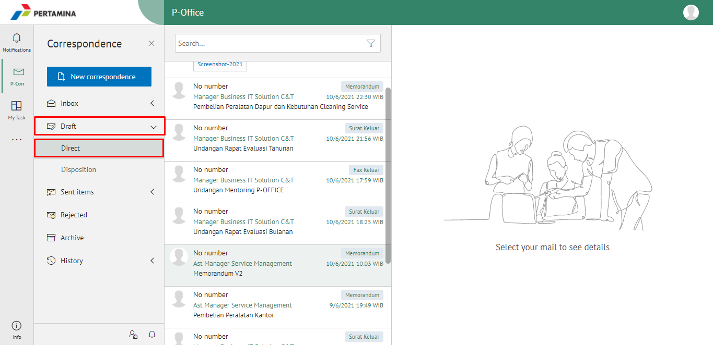
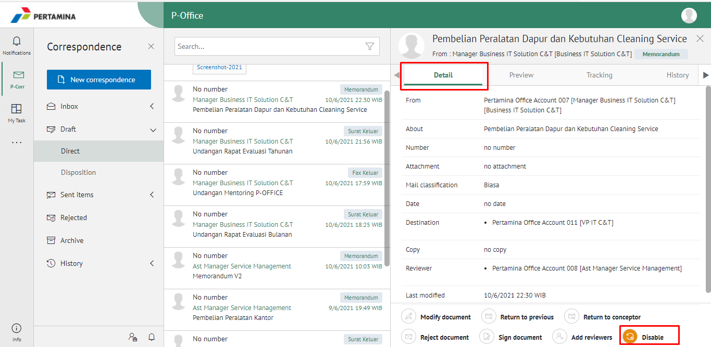
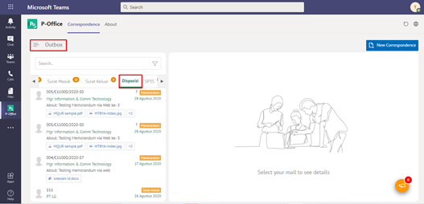
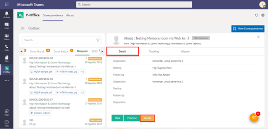
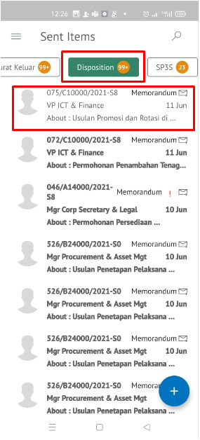
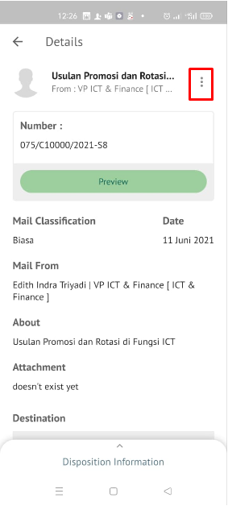
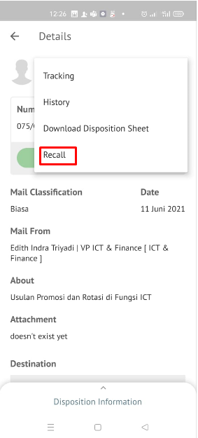
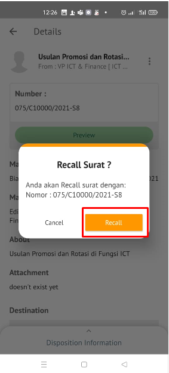

**Role yang sesuai**

- *Approver User*
- *Reviewer User*

*User* dapat melakukan *recall* / tarik disposisi memorandum yang sudah dikirim kepada pejabat penerima disposisi. Memorandum yang sudah dikirim ke pejabat penerima disposisi akan tersimpan di menu **"Sent Item Disposisi"**. 

## **E-Corr Versi Web**

Langkah - langkah untuk melakukan recall disposisi memorandum via Web adalah sebagai berikut

1. Klik menu **Sent Items** lalu pilih **Direct**

2. Pilih memorandum yang akan di-recall kemudian klik tab **Detail** kemudian klik Button ***Disable***. Memorandum yang sudah di-*disable* akan tersimpan di menu **"Draft - Direct"** penarik disposisi

## **E-Corr Versi Teams**

Langkah-langkah untuk recall Memorandum via Teams adalah sebagai berikut :

1. Klik menu **Sent Item** dan pilih tab **Disposisi**

2. Pilih memorandum yang akan di-recall kemudian klik tab **Detail** kemudian klik ***Recall***. Memorandum yang sudah di-*recall* akan tersimpan di menu **"Draft - Disposisi"** penarik disposisi

## **E-Corr Versi Android & IOS**

Langkah-langkah untuk Recall Memorandum via Android adalah sebagai berikut :

1. Klik menu **Sent Item** dan pilih tab **Disposisi**

 

2. Pilih memorandum yang akan di-_recall_ kemudian klik ikon **titik tiga** di **Detail** lalu pilih **_Recall_**. makan akan muncul popup konfirmasi dan pilih **Recall**

 
 

3. Memorandum yang sudah di-_recall_ akan tersimpan di menu “**Draft - Disposisi**” penarik disposisi