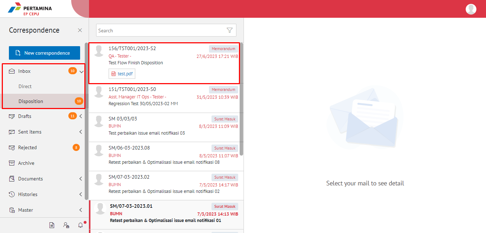
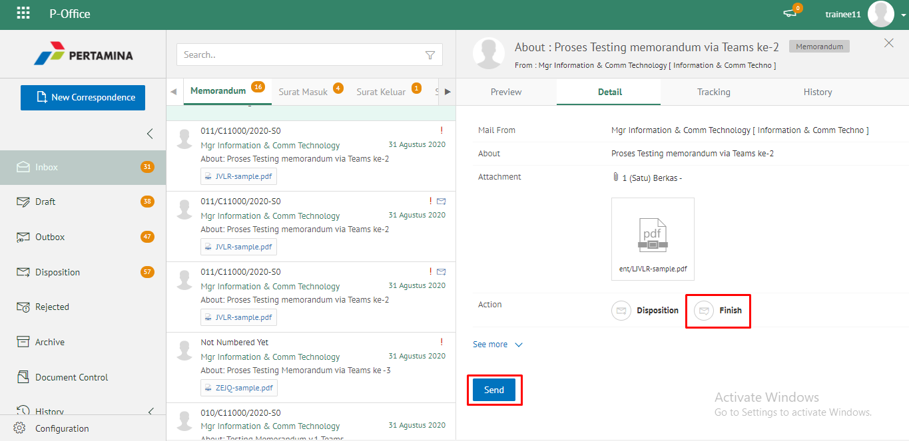
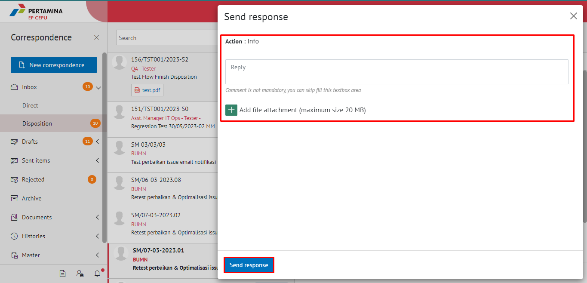
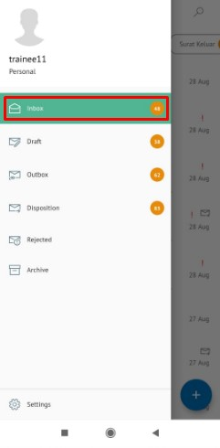
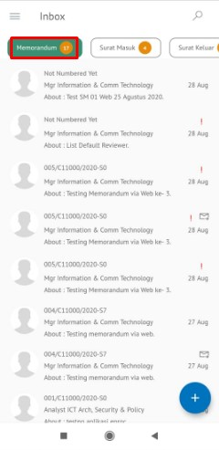
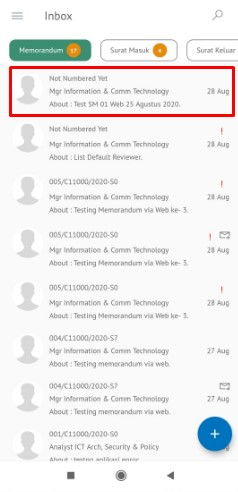
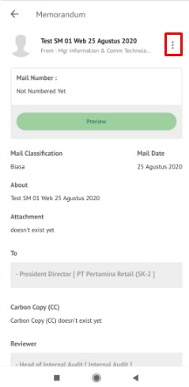
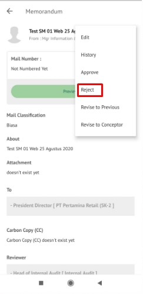
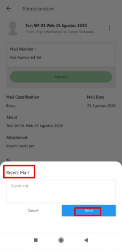

**Role yang sesuai**

- *Approver User*
- *Reviewer User*

Langkah - langkah untuk memberikan tanggapan pada memorandum adalah sebagai berikut

1. Klik menu **Inbox** - **Disposition** dan pilih jenis Memorandum yang di disposisikan 

2. Pilih memorandum yang akan ditolak kemudian pilih tab **Detail**

3. Klik tombol **Send Response** lalu isikan komentar pada action Send Response jika diperlukan. Lalu klik **Send Response**

4. Sistem menyimpan perubahan pada disposisi memorandum yang sudah di Response akan otomatis dan tetap akan tersimpan di menu **“Inbox – Disposition”** user Response dengan label **Sent Response**.

## **E-Corr Versi Android**

Langkah-langkah untuk merespon disposisi Memorandum adalah sebagai berikut :

1. Klik menu **Inbox** dan pilih tab **Memorandum**

 

2. Pilih memorandum yang akan ditolak kemudian **Detail** pilih ikon **tombol button**

 

3. Klik tombol **Reject** dan Isikan komentar jika diperlukan

 

4. Sistem menampilkan pop up konfirmasi dan _user_ harus mengisi keterangan tolak disposisi memorandum kemudian klik send.
Sistem Memorandum yang sudah di tolak akan tersimpan dimenu “**Rejected- Memorandum**” user penolak pada label “**Rejected**

## **E-Corr Versi IOS**

**Menolak Memorandum**

Langkah-langkah untuk menolak memorandum adalah sebagai berikut
1.	Klik menu **Inbox **dan pilih tab **Memorandum**

2.	Pilih memorandum yang akan ditindak lanjuti kemudian pilih icon **Option **dan pilih **Reject**

3.	Isikan komentar jika diperlukan kemudian klik **Send **untuk menyimpan perubahan

4.	Memorandum yang sudah di tolak akan tersimpan di menu “**Rejected - Memorandum**” user penolak dengan label **Rejected**